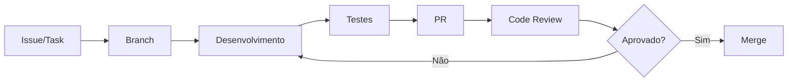

# Guia de Contribuição

## 📋 Índice

1. [Sobre Este Guia](#sobre-este-guia)
2. [Código de Conduta](#código-de-conduta)
3. [Como Contribuir](#como-contribuir)
4. [Ambiente de Desenvolvimento](#ambiente-de-desenvolvimento)
5. [Padrões de Código](#padrões-de-código)
6. [Processo de Pull Request](#processo-de-pull-request)
7. [Convenções de Commit](#convenções-de-commit)
8. [Testes](#testes)
9. [Documentação](#documentação)

---

## Sobre Este Guia

Este documento destina-se **exclusivamente** à equipe interna da Oryum Tech e colaboradores autorizados. O Visite Caçapava é um software proprietário e não aceita contribuições externas sem autorização prévia.

### Quem Pode Contribuir

- ✅ Desenvolvedores da equipe Oryum Tech
- ✅ Consultores autorizados sob NDA
- ✅ Parceiros com contrato de colaboração
- ❌ Contribuidores externos não autorizados

---

## Código de Conduta

### Princípios

1. **Profissionalismo**: Mantenha comunicação respeitosa e construtiva
2. **Colaboração**: Ajude colegas e compartilhe conhecimento
3. **Qualidade**: Priorize código limpo e bem documentado
4. **Responsabilidade**: Assuma ownership das suas contribuições
5. **Confidencialidade**: Proteja informações sensíveis do projeto

### Comportamento Esperado

- Feedback construtivo em code reviews
- Documentação clara das mudanças
- Comunicação proativa sobre bloqueios
- Respeito a deadlines e acordos

### Comportamento Inaceitável

- Commits sem revisão em branches principais
- Exposição de credenciais ou dados sensíveis
- Ignorar feedback de code review
- Alterações não documentadas

---

## Como Contribuir

### Fluxo de Trabalho



### Tipos de Contribuição

| Tipo | Descrição | Branch Prefix |
|------|-----------|---------------|
| Feature | Nova funcionalidade | `feature/` |
| Bugfix | Correção de bug | `fix/` |
| Hotfix | Correção urgente | `hotfix/` |
| Refactor | Refatoração de código | `refactor/` |
| Docs | Documentação | `docs/` |
| Chore | Manutenção/configuração | `chore/` |

### Processo Passo a Passo

1. **Verifique a issue/task** no sistema de gestão
2. **Crie uma branch** a partir de `main`
3. **Desenvolva** seguindo os padrões
4. **Teste** localmente
5. **Crie o PR** com descrição detalhada
6. **Aguarde review** e faça ajustes
7. **Merge** após aprovação

---

## Ambiente de Desenvolvimento

### Pré-requisitos

```bash
# Node.js (versão recomendada)
node --version  # >= 18.0.0

# npm
npm --version   # >= 9.0.0

# Git
git --version   # >= 2.40
```

### Setup Inicial

```bash
# Clone o repositório
git clone https://github.com/KallebyX/visitecacapava.git
cd visitecacapava

# Instale dependências
npm install

# Configure variáveis de ambiente
cp .env.example .env
# Edite .env com suas chaves de API

# Verifique a instalação
npm run dev
```

### Estrutura de Branches

```
main                    # Produção - protegida
├── develop            # Desenvolvimento - integração
│   ├── feature/*      # Features em desenvolvimento
│   ├── fix/*          # Correções de bugs
│   └── refactor/*     # Refatorações
├── release/*          # Preparação de releases
└── hotfix/*           # Correções urgentes em produção
```

### Variáveis de Ambiente

```env
# APIs de IA (solicite ao tech lead)
VITE_GEMINI_API_KEY=sua_chave
VITE_OPENAI_API_KEY=sua_chave

# Google Maps (opcional para desenvolvimento)
VITE_GOOGLE_MAPS_API_KEY=sua_chave
```

---

## Padrões de Código

### TypeScript

```typescript
// ✅ Bom: Tipagem explícita
interface UserProps {
  id: string;
  name: string;
  email: string;
}

function getUser(id: string): Promise<UserProps> {
  // ...
}

// ❌ Ruim: Tipagem implícita/any
function getUser(id): any {
  // ...
}
```

### React Components

```typescript
// ✅ Bom: Componente funcional com tipos
interface ButtonProps {
  label: string;
  onClick: () => void;
  variant?: 'primary' | 'secondary';
}

export function Button({ label, onClick, variant = 'primary' }: ButtonProps) {
  return (
    <button
      className={`btn btn-${variant}`}
      onClick={onClick}
    >
      {label}
    </button>
  );
}

// ❌ Ruim: Props sem tipos, inline styles
export function Button(props) {
  return (
    <button style={{color: 'blue'}} onClick={props.onClick}>
      {props.label}
    </button>
  );
}
```

### Naming Conventions

| Tipo | Convenção | Exemplo |
|------|-----------|---------|
| Componentes | PascalCase | `UserProfile.tsx` |
| Hooks | camelCase com `use` | `useAuth.ts` |
| Utilitários | camelCase | `formatDate.ts` |
| Constantes | SCREAMING_SNAKE_CASE | `MAX_UPLOAD_SIZE` |
| Tipos/Interfaces | PascalCase | `UserData` |
| CSS Classes | kebab-case | `user-profile` |

### Estrutura de Arquivos

```
components/
├── UserProfile/
│   ├── index.tsx           # Exportação principal
│   ├── UserProfile.tsx     # Componente
│   ├── UserProfile.test.tsx # Testes
│   └── types.ts            # Tipos locais
```

### Tailwind CSS

```tsx
// ✅ Bom: Classes organizadas
<div className="
  flex items-center justify-between
  p-4 mb-2
  bg-white rounded-lg shadow-md
  hover:shadow-lg transition-shadow
">

// ❌ Ruim: Classes desorganizadas
<div className="p-4 flex shadow-md bg-white mb-2 rounded-lg items-center hover:shadow-lg justify-between transition-shadow">
```

---

## Processo de Pull Request

### Criando um PR

1. **Título claro e descritivo**
   ```
   feat(gamification): adiciona sistema de conquistas diárias
   fix(auth): corrige loop de redirecionamento no login
   ```

2. **Descrição completa**
   ```markdown
   ## Descrição
   Implementa sistema de conquistas diárias para aumentar engajamento.

   ## Mudanças
   - Adiciona modelo `DailyChallenge` em types.ts
   - Cria componente `DailyChallenges`
   - Atualiza `GamificationContext` com nova lógica

   ## Como Testar
   1. Faça login como turista
   2. Acesse a página de desafios
   3. Verifique se os desafios diários aparecem

   ## Screenshots
   [Se aplicável]

   ## Checklist
   - [ ] Testes passando
   - [ ] Código revisado
   - [ ] Documentação atualizada
   ```

### Code Review

#### Para o Autor

- Responda todos os comentários
- Não faça push de novas mudanças durante review ativo
- Solicite re-review após ajustes

#### Para o Reviewer

- Revise em até 24h (PRs menores) ou 48h (PRs maiores)
- Seja específico nos comentários
- Sugira melhorias, não apenas aponte problemas
- Aprove explicitamente quando satisfeito

### Critérios de Merge

- [ ] Pelo menos 1 aprovação
- [ ] CI/CD passando
- [ ] Sem conflitos
- [ ] Testes cobrindo novas funcionalidades
- [ ] Documentação atualizada (se necessário)

---

## Convenções de Commit

### Formato

```
<tipo>(<escopo>): <descrição>

[corpo opcional]

[rodapé opcional]
```

### Tipos de Commit

| Tipo | Descrição |
|------|-----------|
| `feat` | Nova funcionalidade |
| `fix` | Correção de bug |
| `docs` | Documentação |
| `style` | Formatação (não afeta código) |
| `refactor` | Refatoração |
| `test` | Adição/correção de testes |
| `chore` | Manutenção |
| `perf` | Melhoria de performance |

### Escopos Comuns

```
auth, gamification, map, poi, route,
hotel, restaurant, admin, ui, api,
config, deps, ci
```

### Exemplos

```bash
# ✅ Bons commits
feat(gamification): adiciona badge "Explorador Noturno"
fix(map): corrige posicionamento de markers no Safari
docs(api): documenta endpoints de check-in
refactor(auth): simplifica lógica de validação de sessão
chore(deps): atualiza react-router-dom para v6.25

# ❌ Commits ruins
update code
fix bug
wip
changes
```

---

## Testes

### Estrutura de Testes

```
src/
├── components/
│   └── UserProfile/
│       ├── UserProfile.tsx
│       └── UserProfile.test.tsx  # Testes do componente
├── services/
│   └── backendService.test.ts    # Testes de serviço
└── utils/
    └── geolocation.test.ts       # Testes de utilitários
```

### Comandos

```bash
# Executar todos os testes
npm test

# Executar com coverage
npm run test:coverage

# Executar em modo watch
npm run test:watch

# Executar testes específicos
npm test -- UserProfile
```

### Padrões de Teste

```typescript
// Estrutura AAA (Arrange, Act, Assert)
describe('UserProfile', () => {
  it('should display user name correctly', () => {
    // Arrange
    const user = { id: '1', name: 'João Silva', email: 'joao@email.com' };

    // Act
    render(<UserProfile user={user} />);

    // Assert
    expect(screen.getByText('João Silva')).toBeInTheDocument();
  });

  it('should call onEdit when edit button is clicked', () => {
    // Arrange
    const onEdit = jest.fn();
    const user = { id: '1', name: 'João Silva', email: 'joao@email.com' };

    // Act
    render(<UserProfile user={user} onEdit={onEdit} />);
    fireEvent.click(screen.getByRole('button', { name: /editar/i }));

    // Assert
    expect(onEdit).toHaveBeenCalledTimes(1);
  });
});
```

### Coverage Mínimo

| Métrica | Mínimo |
|---------|--------|
| Statements | 70% |
| Branches | 60% |
| Functions | 70% |
| Lines | 70% |

---

## Documentação

### Quando Documentar

- [ ] Novas funcionalidades
- [ ] APIs públicas
- [ ] Mudanças em configuração
- [ ] Padrões/convenções novos
- [ ] Fluxos complexos

### Onde Documentar

| O Quê | Onde |
|-------|------|
| APIs | `/docs/api/` |
| Componentes | JSDoc no código |
| Arquitetura | `/docs/architecture/` |
| Processos | Este arquivo |
| Changelog | `/docs/CHANGELOG.md` |

### Formato de Documentação

```typescript
/**
 * Realiza check-in do usuário em um ponto de interesse.
 *
 * Valida a proximidade do usuário ao POI usando GPS e
 * atualiza os pontos e badges do usuário se válido.
 *
 * @param userId - ID do usuário realizando check-in
 * @param poiId - ID do ponto de interesse
 * @returns Resultado do check-in com novos badges desbloqueados
 *
 * @example
 * ```typescript
 * const result = await checkIn('user-123', 'poi-456');
 * if (result.success) {
 *   console.log('Novos badges:', result.newBadges);
 * }
 * ```
 */
async function checkIn(userId: string, poiId: string): Promise<CheckInResult> {
  // ...
}
```

---

## Recursos Úteis

### Links Internos

- [Arquitetura do Sistema](./architecture/ARCHITECTURE_OVERVIEW.md)
- [Padrões de Código](./backend/CODING_STANDARDS.md)
- [Referência da API](./api/API_REFERENCE.md)

### Ferramentas

- **VSCode**: IDE recomendada
- **ESLint**: Linting de código
- **Prettier**: Formatação
- **TypeScript**: Verificação de tipos

### Extensões VSCode Recomendadas

```json
{
  "recommendations": [
    "dbaeumer.vscode-eslint",
    "esbenp.prettier-vscode",
    "bradlc.vscode-tailwindcss",
    "formulahendry.auto-rename-tag",
    "christian-kohler.path-intellisense"
  ]
}
```

---

## Dúvidas e Suporte

- **Slack**: #visite-cacapava-dev
- **Email**: dev@oryumtech.com.br
- **Tech Lead**: [Nome do Tech Lead]

---

```
© 2025 Oryum Tech. Todos os direitos reservados.
Este documento é propriedade exclusiva da Oryum Tech.
Proibida a reprodução, distribuição ou uso sem autorização expressa.
```
