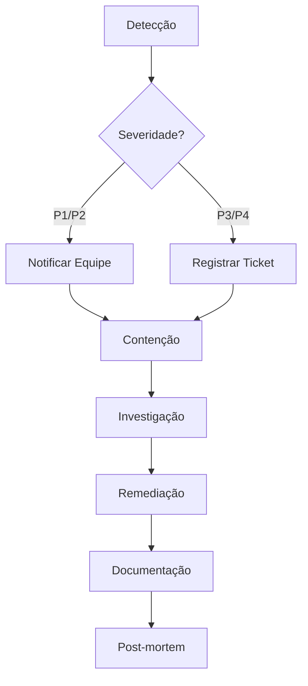

# Políticas de Segurança

## 📋 Índice

1. [Visão Geral](#visão-geral)
2. [Relatando Vulnerabilidades](#relatando-vulnerabilidades)
3. [Medidas de Segurança Implementadas](#medidas-de-segurança-implementadas)
4. [Configurações de Segurança](#configurações-de-segurança)
5. [Política de Dados](#política-de-dados)
6. [Controle de Acesso](#controle-de-acesso)
7. [Auditoria e Logs](#auditoria-e-logs)
8. [Plano de Resposta a Incidentes](#plano-de-resposta-a-incidentes)

---

## Visão Geral

A segurança é uma prioridade fundamental no desenvolvimento e operação do Visite Caçapava. Este documento descreve as políticas, práticas e procedimentos de segurança implementados para proteger os dados dos usuários e a integridade do sistema.

### Classificação de Dados

| Nível | Descrição | Exemplos |
|-------|-----------|----------|
| **Público** | Informações disponíveis publicamente | Dados de POIs, rotas turísticas |
| **Interno** | Uso restrito à equipe | Documentação técnica, métricas |
| **Confidencial** | Acesso controlado | Dados de usuários, analytics |
| **Restrito** | Acesso mínimo necessário | Chaves de API, credenciais |

---

## Relatando Vulnerabilidades

### Processo de Divulgação Responsável

Se você descobrir uma vulnerabilidade de segurança, por favor siga este processo:

1. **NÃO** divulgue publicamente a vulnerabilidade
2. Envie um relatório detalhado para: **security@oryumtech.com.br**
3. Inclua as seguintes informações:
   - Descrição da vulnerabilidade
   - Passos para reprodução
   - Impacto potencial
   - Sugestões de mitigação (se houver)

### Prazo de Resposta

| Severidade | Tempo de Resposta | Tempo de Correção |
|------------|-------------------|-------------------|
| Crítica | 24 horas | 7 dias |
| Alta | 48 horas | 14 dias |
| Média | 72 horas | 30 dias |
| Baixa | 7 dias | 60 dias |

### Escopo

Vulnerabilidades cobertas:
- ✅ Autenticação e autorização
- ✅ Injeção (XSS, SQL, Command)
- ✅ Exposição de dados sensíveis
- ✅ Configurações incorretas de segurança
- ✅ Vulnerabilidades em dependências

Fora do escopo:
- ❌ Ataques de engenharia social
- ❌ Ataques de negação de serviço (DoS)
- ❌ Spam ou phishing
- ❌ Vulnerabilidades em sistemas de terceiros

---

## Medidas de Segurança Implementadas

### 1. Validação Criptográfica de QR Codes

```typescript
// Implementação com HMAC-SHA256
const signature = HmacSHA256(payload, SECRET_KEY).toString();
```

**Características:**
- Assinatura HMAC-SHA256 para integridade
- Timestamp com validade de 24 horas
- Nonce para prevenir replay attacks
- Validação de coordenadas geográficas

### 2. Validação de Geolocalização

```typescript
// Validação de proximidade
const CHECKIN_RADIUS = 75; // metros
const DISCOVERY_RADIUS = 60; // metros
```

**Implementações:**
- Fórmula de Haversine para cálculo de distância
- Bounding box do município para validação
- Polígono geográfico para verificação precisa
- Detecção de spoofing de localização

### 3. Controle de Acesso (RBAC)

| Papel | Permissões |
|-------|------------|
| Turista | Visualizar POIs, fazer check-in, ver leaderboard |
| Hotel | Gerenciar check-ins, ver analytics do hotel |
| Restaurante | Gerenciar reviews, ver feedback |
| Secretaria | Acesso administrativo completo |

### 4. Proteção de Rotas

```typescript
// Componente ProtectedRoute
<ProtectedRoute allowedRoles={['secretaria']}>
  <AdminDashboard />
</ProtectedRoute>
```

### 5. Validação de Entrada

- Sanitização de inputs do usuário
- Validação de tipos TypeScript
- Escape de caracteres especiais
- Limite de tamanho de campos

---

## Configurações de Segurança

### Variáveis de Ambiente

```env
# NUNCA commitar estas variáveis
VITE_GEMINI_API_KEY=***
VITE_OPENAI_API_KEY=***
VITE_GOOGLE_MAPS_API_KEY=***
```

**Práticas:**
- Variáveis sensíveis no Vercel Dashboard
- Arquivo `.env` no `.gitignore`
- Rotação periódica de chaves
- Chaves diferentes por ambiente

### Headers de Segurança (Vercel)

```json
{
  "headers": [
    {
      "source": "/(.*)",
      "headers": [
        { "key": "X-Content-Type-Options", "value": "nosniff" },
        { "key": "X-Frame-Options", "value": "DENY" },
        { "key": "X-XSS-Protection", "value": "1; mode=block" },
        { "key": "Referrer-Policy", "value": "strict-origin-when-cross-origin" }
      ]
    }
  ]
}
```

### Content Security Policy

```
default-src 'self';
script-src 'self' 'unsafe-inline' vlibras.gov.br;
style-src 'self' 'unsafe-inline' fonts.googleapis.com;
img-src 'self' data: https:;
font-src 'self' fonts.gstatic.com;
connect-src 'self' api.openai.com generativelanguage.googleapis.com;
```

---

## Política de Dados

### Dados Coletados

| Categoria | Dados | Retenção |
|-----------|-------|----------|
| Perfil | Nome, email, avatar | Enquanto ativo |
| Atividade | Check-ins, pontos, badges | Enquanto ativo |
| Localização | Coordenadas GPS | Temporário |
| Analytics | Uso agregado | 2 anos |

### Armazenamento Atual (Demo)

```
⚠️ IMPORTANTE: Versão de demonstração usa Session Storage
- Dados não persistem entre sessões
- Não há transmissão para servidor externo
- Reset completo ao fechar navegador
```

### Armazenamento Futuro (Produção)

- Banco de dados PostgreSQL com encryption at rest
- Backup criptografado diário
- Replicação geográfica
- Compliance com LGPD

---

## Controle de Acesso

### Matriz de Permissões

| Recurso | Turista | Hotel | Restaurante | Secretaria |
|---------|---------|-------|-------------|------------|
| Ver POIs | ✅ | ✅ | ✅ | ✅ |
| Check-in | ✅ | ❌ | ❌ | ❌ |
| Ver Leaderboard | ✅ | ❌ | ❌ | ✅ |
| Gerenciar POIs | ❌ | ❌ | ❌ | ✅ |
| Ver Analytics | ❌ | 🔶 | 🔶 | ✅ |
| Gerenciar Usuários | ❌ | ❌ | ❌ | ✅ |

🔶 = Acesso limitado ao próprio estabelecimento

### Autenticação

**Atual (Demo):**
- Email/senha com validação local
- Session storage para estado

**Futuro (Produção):**
- JWT com refresh tokens
- OAuth 2.0 (Google, Facebook)
- 2FA opcional
- Rate limiting

---

## Auditoria e Logs

### Eventos Registrados

| Evento | Nível | Dados |
|--------|-------|-------|
| Login bem-sucedido | INFO | userId, timestamp, IP |
| Login falho | WARN | email, timestamp, IP |
| Check-in realizado | INFO | userId, poiId, coords |
| Check-in rejeitado | WARN | userId, poiId, motivo |
| Acesso admin | INFO | userId, recurso, ação |
| Erro de sistema | ERROR | stack trace, contexto |

### Retenção de Logs

- Logs de acesso: 90 dias
- Logs de erro: 180 dias
- Logs de auditoria: 2 anos
- Logs de segurança: 5 anos

---

## Plano de Resposta a Incidentes

### Níveis de Severidade

| Nível | Descrição | Resposta |
|-------|-----------|----------|
| **P1** | Crítico - Serviço indisponível | 15 min |
| **P2** | Alto - Funcionalidade comprometida | 1 hora |
| **P3** | Médio - Degradação parcial | 4 horas |
| **P4** | Baixo - Inconveniência menor | 24 horas |

### Procedimento de Resposta



### Contatos de Emergência

| Papel | Contato | Disponibilidade |
|-------|---------|-----------------|
| Security Lead | security@oryumtech.com.br | 24/7 |
| DevOps Lead | devops@oryumtech.com.br | 24/7 |
| CTO | cto@oryumtech.com.br | Horário comercial |

---

## Checklist de Segurança para Deploy

- [ ] Variáveis de ambiente configuradas no Vercel
- [ ] Chaves de API com escopo mínimo
- [ ] HTTPS forçado em todas as rotas
- [ ] Headers de segurança configurados
- [ ] CSP implementado
- [ ] Dependências atualizadas
- [ ] Scan de vulnerabilidades executado
- [ ] Backup de dados confirmado

---

## Versões Suportadas

| Versão | Suportada | Fim do Suporte |
|--------|-----------|----------------|
| 1.x.x | ✅ | A definir |
| < 1.0 | ❌ | N/A |

---

## Referências

- [OWASP Top 10](https://owasp.org/Top10/)
- [OWASP ASVS](https://owasp.org/www-project-application-security-verification-standard/)
- [LGPD - Lei Geral de Proteção de Dados](https://www.planalto.gov.br/ccivil_03/_ato2015-2018/2018/lei/l13709.htm)
- [CIS Controls](https://www.cisecurity.org/controls)

---

```
© 2025 Oryum Tech. Todos os direitos reservados.
Este documento é propriedade exclusiva da Oryum Tech.
Proibida a reprodução, distribuição ou uso sem autorização expressa.
```
