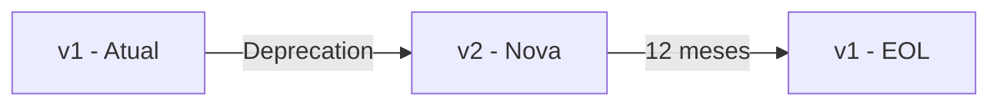

# Versionamento de API

## Estratégia de Versionamento

### Versão Atual

| API | Versão | Status |
|-----|--------|--------|
| Mock Service | v1.0.0 | Ativa (Demo) |
| REST API (futuro) | v1 | Planejada |

### Formato de Versionamento

O Visite Caçapava seguirá o padrão de versionamento via URL:

```
https://api.visitecacapava.com.br/v1/pois
https://api.visitecacapava.com.br/v2/pois
```

### Política de Versionamento



## Ciclo de Vida de Versões

| Fase | Duração | Ações |
|------|---------|-------|
| **Active** | Indeterminado | Suporte completo, novas features |
| **Deprecated** | 12 meses | Bug fixes apenas, aviso em headers |
| **EOL** | - | Sem suporte, retorna 410 Gone |

## Headers de Deprecação

Quando uma versão for deprecada:

```http
HTTP/1.1 200 OK
Deprecation: true
Sunset: Sat, 01 Jan 2027 00:00:00 GMT
Link: <https://api.visitecacapava.com.br/v2>; rel="successor-version"
```

## Mudanças que Requerem Nova Versão

### Mudanças Breaking (Nova versão major)

- ❌ Remover endpoint
- ❌ Remover campo obrigatório de resposta
- ❌ Alterar tipo de dado de campo
- ❌ Alterar comportamento de endpoint
- ❌ Alterar códigos de erro

### Mudanças Non-Breaking (Versão atual)

- ✅ Adicionar novo endpoint
- ✅ Adicionar campo opcional em resposta
- ✅ Adicionar parâmetro opcional em request
- ✅ Adicionar novo código de erro
- ✅ Melhorar mensagens de erro

## Compatibilidade

### Forward Compatibility

Clientes devem:
- Ignorar campos desconhecidos em respostas
- Não depender da ordem de campos
- Usar valores default para campos opcionais ausentes

### Backward Compatibility

API deve:
- Manter campos existentes
- Manter comportamento documentado
- Manter códigos de status HTTP

## Documentação por Versão

Cada versão terá sua própria documentação:

```
/docs/api/v1/
├── openapi.yaml
├── reference.md
└── changelog.md

/docs/api/v2/
├── openapi.yaml
├── reference.md
└── changelog.md
```

## Migração Entre Versões

### Guia de Migração v1 → v2 (Exemplo)

```markdown
## Mudanças

### Endpoints Alterados
- `GET /pois` → Adiciona campo `category`
- `POST /checkin` → Requer `location` object

### Endpoints Removidos
- `GET /pois/nearby` → Use `GET /pois?near=lat,lng`

### Novos Endpoints
- `GET /challenges` → Sistema de desafios

### Exemplo de Migração

```diff
// Request antigo
- POST /v1/checkin
- { "poiId": "123", "lat": -30.5, "lng": -53.4 }

// Request novo
+ POST /v2/checkin
+ { "poiId": "123", "location": { "lat": -30.5, "lng": -53.4 } }
```

---

```
© 2025 Oryum Tech. Todos os direitos reservados.
```
