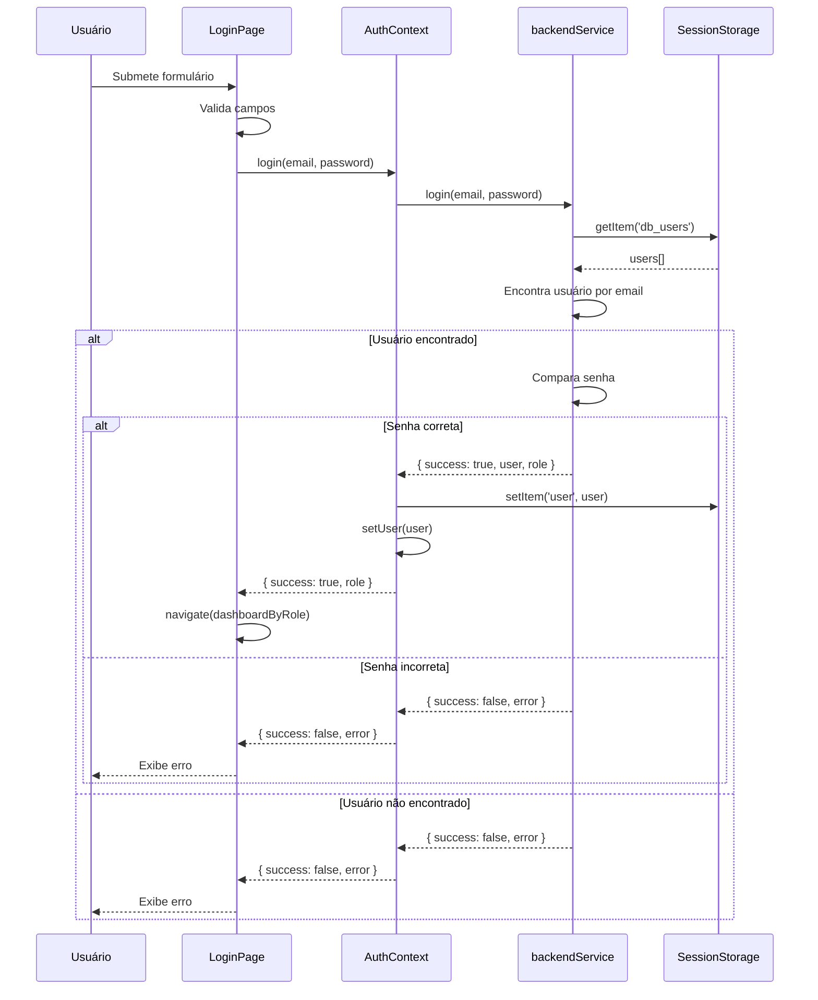
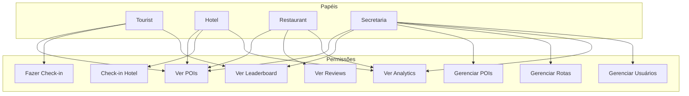
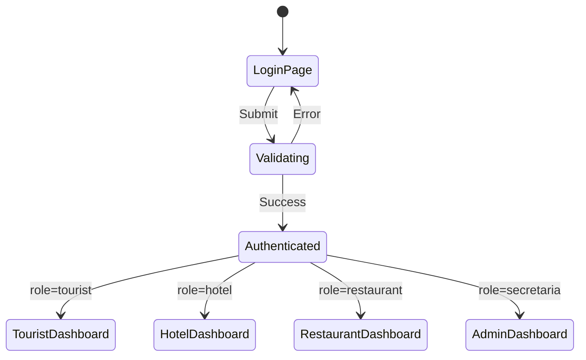
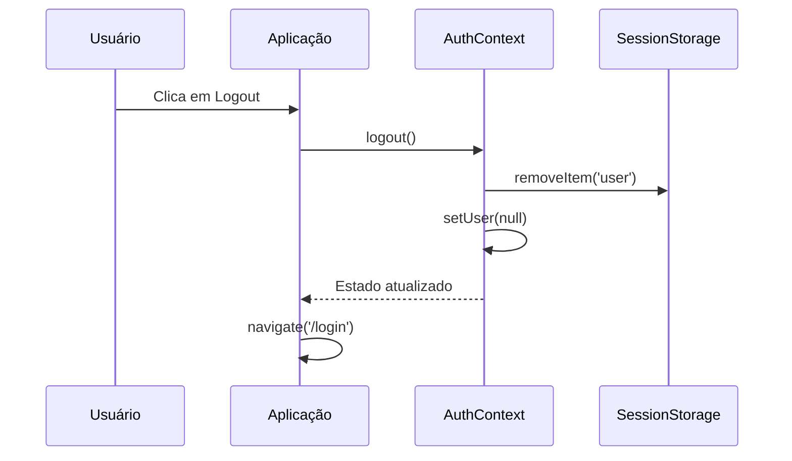
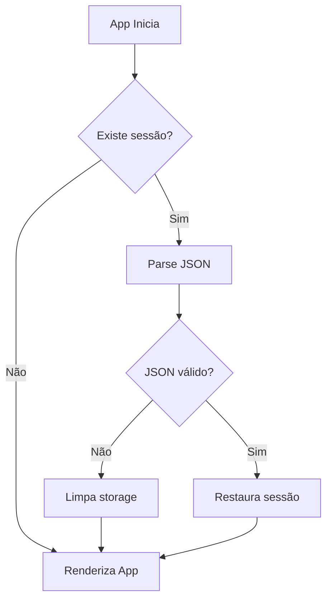
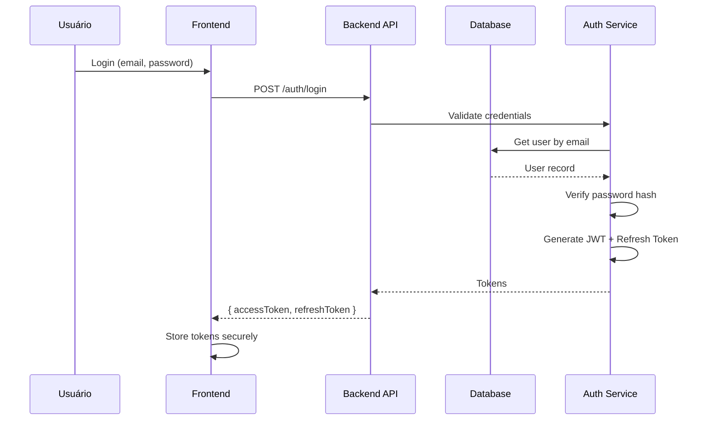
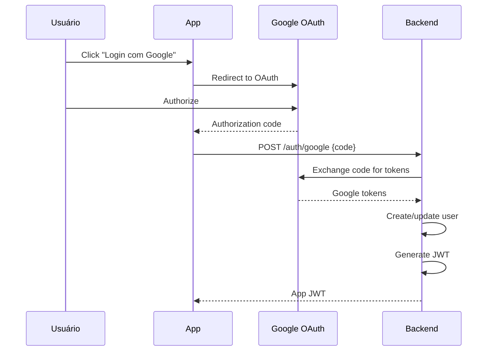

# Autenticação e Autorização

## 📋 Índice

1. [Visão Geral](#visão-geral)
2. [Sistema de Autenticação](#sistema-de-autenticação)
3. [Sistema de Autorização (RBAC)](#sistema-de-autorização-rbac)
4. [Fluxos de Autenticação](#fluxos-de-autenticação)
5. [Proteção de Rotas](#proteção-de-rotas)
6. [Segurança](#segurança)
7. [Implementação Futura](#implementação-futura)

---

## Visão Geral

### Estado Atual (MVP)

O sistema atual utiliza autenticação simplificada baseada em Session Storage, adequada para demonstração. **Esta implementação NÃO é segura para produção.**

```
⚠️ AVISO DE SEGURANÇA

A implementação atual é apenas para demonstração:
- Senhas não são hasheadas
- Não há tokens JWT
- Sessão armazenada no cliente
- Vulnerável a ataques XSS

Para produção, implementar autenticação real conforme seção
"Implementação Futura".
```

### Papéis do Sistema

| Papel | Identificador | Descrição |
|-------|---------------|-----------|
| Turista | `tourist` | Usuário principal com gamificação |
| Hotel | `hotel` | Estabelecimento de hospedagem |
| Restaurante | `restaurant` | Estabelecimento gastronômico |
| Secretaria | `secretaria` | Administração do turismo |

---

## Sistema de Autenticação

### AuthContext

O contexto de autenticação gerencia o estado do usuário logado.

```typescript
// context/AuthContext.tsx

interface AuthContextType {
  user: User | null;
  isAuthenticated: boolean;
  login: (email: string, password: string) => Promise<LoginResult>;
  logout: () => void;
}

interface LoginResult {
  success: boolean;
  role?: UserRole;
  error?: string;
}
```

### Fluxo de Login



### Implementação

```typescript
// Método de login no AuthContext
const login = async (email: string, password: string): Promise<LoginResult> => {
  try {
    const result = await backendService.login(email, password);

    if (result.success && result.user) {
      setUser(result.user);
      sessionStorage.setItem('user', JSON.stringify(result.user));

      return {
        success: true,
        role: result.user.role
      };
    }

    return {
      success: false,
      error: result.error || 'Credenciais inválidas'
    };
  } catch (error) {
    return {
      success: false,
      error: 'Erro ao realizar login'
    };
  }
};

// Método de logout
const logout = () => {
  setUser(null);
  sessionStorage.removeItem('user');
};
```

### Persistência de Sessão

```typescript
// Verificação de sessão ao carregar aplicação
useEffect(() => {
  const storedUser = sessionStorage.getItem('user');
  if (storedUser) {
    try {
      const user = JSON.parse(storedUser);
      setUser(user);
    } catch {
      sessionStorage.removeItem('user');
    }
  }
  setLoading(false);
}, []);
```

---

## Sistema de Autorização (RBAC)

### Matriz de Permissões



### Tabela de Permissões Detalhada

| Recurso | Tourist | Hotel | Restaurant | Secretaria |
|---------|:-------:|:-----:|:----------:|:----------:|
| **POIs** |
| Visualizar | ✅ | ✅ | ✅ | ✅ |
| Criar | ❌ | ❌ | ❌ | ✅ |
| Editar | ❌ | ❌ | ❌ | ✅ |
| Excluir | ❌ | ❌ | ❌ | ✅ |
| **Rotas** |
| Visualizar | ✅ | ✅ | ✅ | ✅ |
| Criar | ❌ | ❌ | ❌ | ✅ |
| Editar | ❌ | ❌ | ❌ | ✅ |
| Excluir | ❌ | ❌ | ❌ | ✅ |
| **Gamificação** |
| Check-in POI | ✅ | ❌ | ❌ | ❌ |
| Ver Leaderboard | ✅ | ❌ | ❌ | ✅ |
| Ver Badges | ✅ | ❌ | ❌ | ✅ |
| **Hotel** |
| Check-in Hóspedes | ❌ | ✅ | ❌ | ✅ |
| Ver Estatísticas | ❌ | ✅ | ❌ | ✅ |
| **Restaurante** |
| Ver Reviews | ❌ | ❌ | ✅ | ✅ |
| Responder Reviews | ❌ | ❌ | ✅ | ✅ |
| **Admin** |
| Dashboard | ❌ | ❌ | ❌ | ✅ |
| Analytics | ❌ | 🔶 | 🔶 | ✅ |
| Gerenciar Turistas | ❌ | ❌ | ❌ | ✅ |

🔶 = Acesso limitado ao próprio estabelecimento

---

## Fluxos de Autenticação

### Login Bem-Sucedido



### Logout



### Verificação de Sessão



---

## Proteção de Rotas

### ProtectedRoute Component

```typescript
// components/ProtectedRoute.tsx

interface ProtectedRouteProps {
  allowedRoles: UserRole[];
  children?: React.ReactNode;
}

function ProtectedRoute({ allowedRoles, children }: ProtectedRouteProps) {
  const { user, isAuthenticated } = useAuth();

  if (!isAuthenticated) {
    return <Navigate to="/login" replace />;
  }

  if (!allowedRoles.includes(user.role)) {
    return <Navigate to="/unauthorized" replace />;
  }

  return children ? <>{children}</> : <Outlet />;
}
```

### Uso em Rotas

```tsx
// App.tsx

<Routes>
  {/* Rota pública */}
  <Route path="/login" element={<LoginPage />} />

  {/* Rotas de Turista */}
  <Route element={<ProtectedRoute allowedRoles={['tourist']} />}>
    <Route element={<TouristLayout />}>
      <Route path="/" element={<HomePage />} />
      <Route path="/routes" element={<RoutesPage />} />
      <Route path="/profile" element={<ProfilePage />} />
      {/* ... */}
    </Route>
  </Route>

  {/* Rotas de Admin */}
  <Route element={<ProtectedRoute allowedRoles={['secretaria']} />}>
    <Route path="/admin" element={<AdminLayout />}>
      <Route index element={<AdminDashboard />} />
      <Route path="pois" element={<ManagePoisPage />} />
      {/* ... */}
    </Route>
  </Route>

  {/* Rotas de Hotel */}
  <Route element={<ProtectedRoute allowedRoles={['hotel']} />}>
    <Route path="/hotel" element={<HotelLayout />}>
      <Route index element={<HotelDashboard />} />
      {/* ... */}
    </Route>
  </Route>

  {/* Rotas de Restaurante */}
  <Route element={<ProtectedRoute allowedRoles={['restaurant']} />}>
    <Route path="/restaurant" element={<RestaurantLayout />}>
      <Route index element={<RestaurantDashboard />} />
      {/* ... */}
    </Route>
  </Route>
</Routes>
```

---

## Segurança

### Limitações Atuais

| Vulnerabilidade | Status | Mitigação |
|-----------------|--------|-----------|
| Senhas em texto plano | ⚠️ Demo | Hash com bcrypt em produção |
| XSS no Session Storage | ⚠️ Demo | HttpOnly cookies em produção |
| Sem rate limiting | ⚠️ Demo | Implementar no backend |
| Sem refresh tokens | ⚠️ Demo | JWT com refresh em produção |
| Sem CSRF protection | ⚠️ Demo | CSRF tokens em produção |

### Boas Práticas Implementadas

- ✅ Validação de entrada no frontend
- ✅ Controle de acesso por papel
- ✅ Limpeza de sessão no logout
- ✅ Verificação de papel em rotas protegidas

---

## Implementação Futura

### Arquitetura de Produção



### JWT Structure

```typescript
// Access Token (15 min)
{
  header: {
    alg: "RS256",
    typ: "JWT"
  },
  payload: {
    sub: "user-id",
    email: "user@email.com",
    role: "tourist",
    permissions: ["pois:read", "checkin:create"],
    iat: 1700000000,
    exp: 1700000900
  },
  signature: "..."
}

// Refresh Token (7 days)
{
  payload: {
    sub: "user-id",
    jti: "unique-token-id",
    iat: 1700000000,
    exp: 1700604800
  }
}
```

### OAuth 2.0 Integration



### Checklist de Produção

- [ ] Implementar hash de senha (bcrypt)
- [ ] Implementar JWT com refresh tokens
- [ ] Implementar OAuth 2.0 (Google, Facebook)
- [ ] Implementar 2FA opcional
- [ ] Rate limiting (100 req/min)
- [ ] CSRF tokens
- [ ] HttpOnly cookies
- [ ] Audit logging
- [ ] Session management no backend
- [ ] IP whitelisting para admin

---

```
© 2025 Oryum Tech. Todos os direitos reservados.
Este documento é propriedade exclusiva da Oryum Tech.
Proibida a reprodução, distribuição ou uso sem autorização expressa.
```
