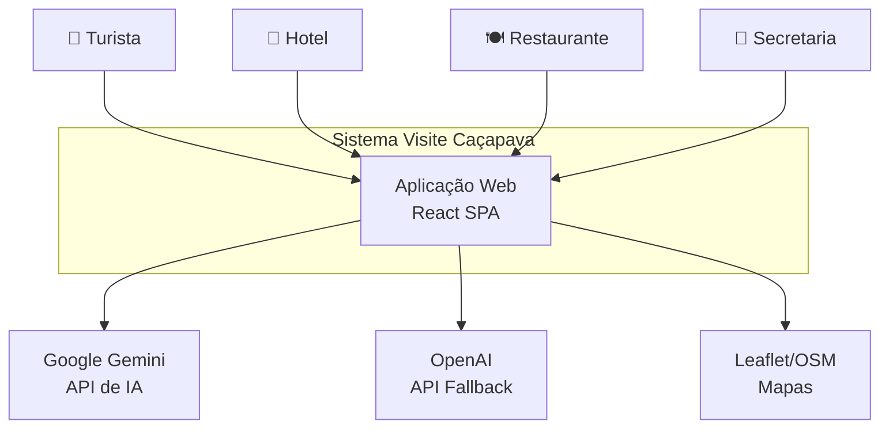
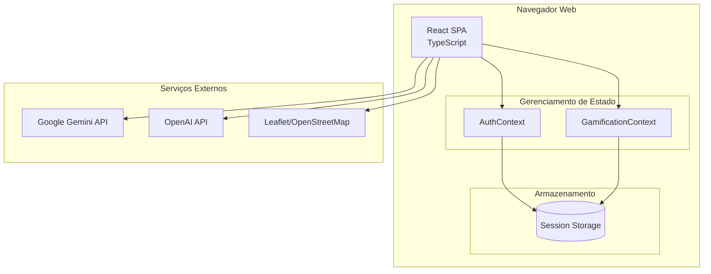
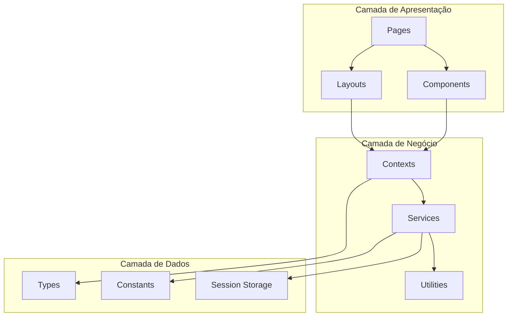
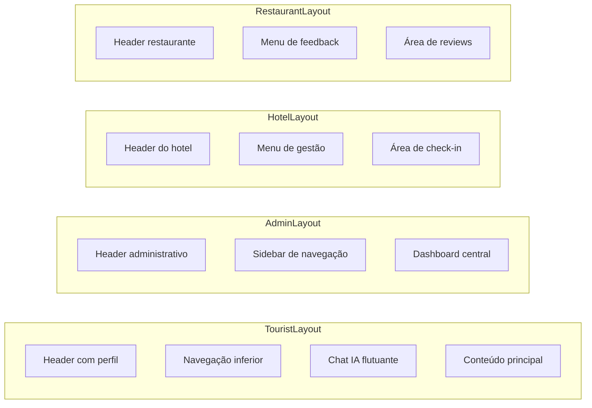
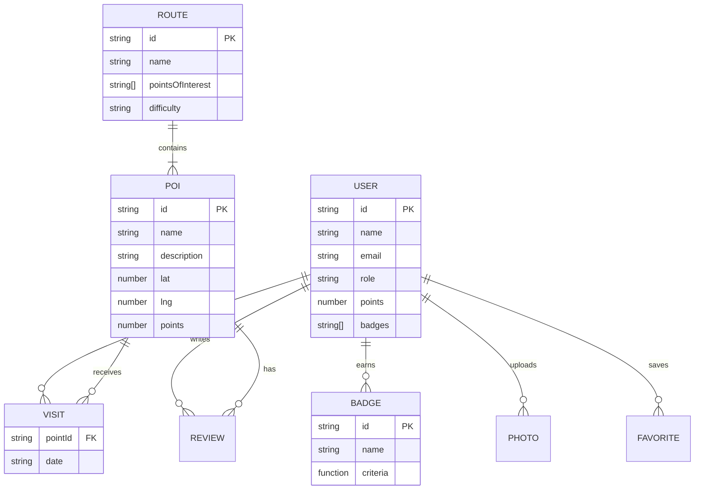
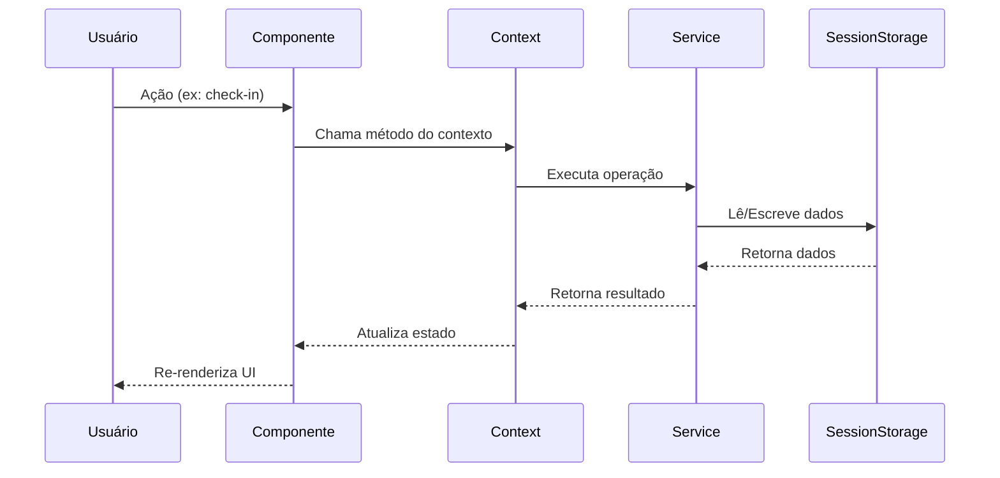
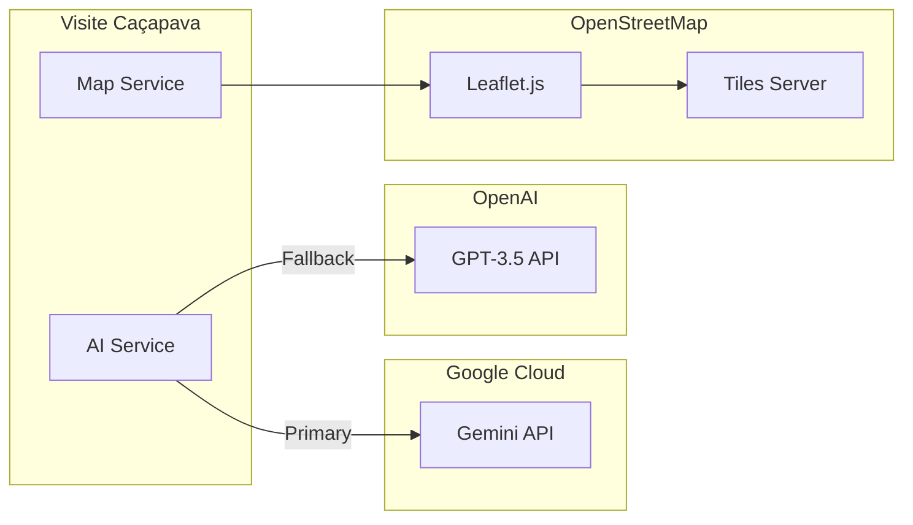
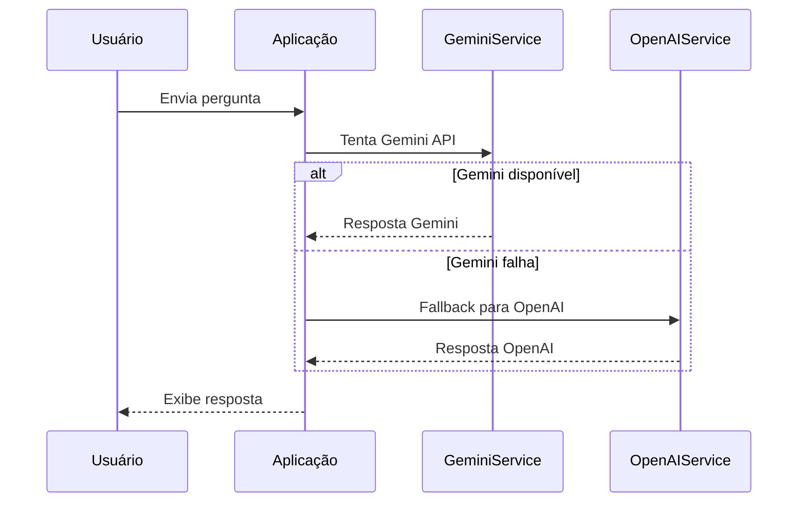
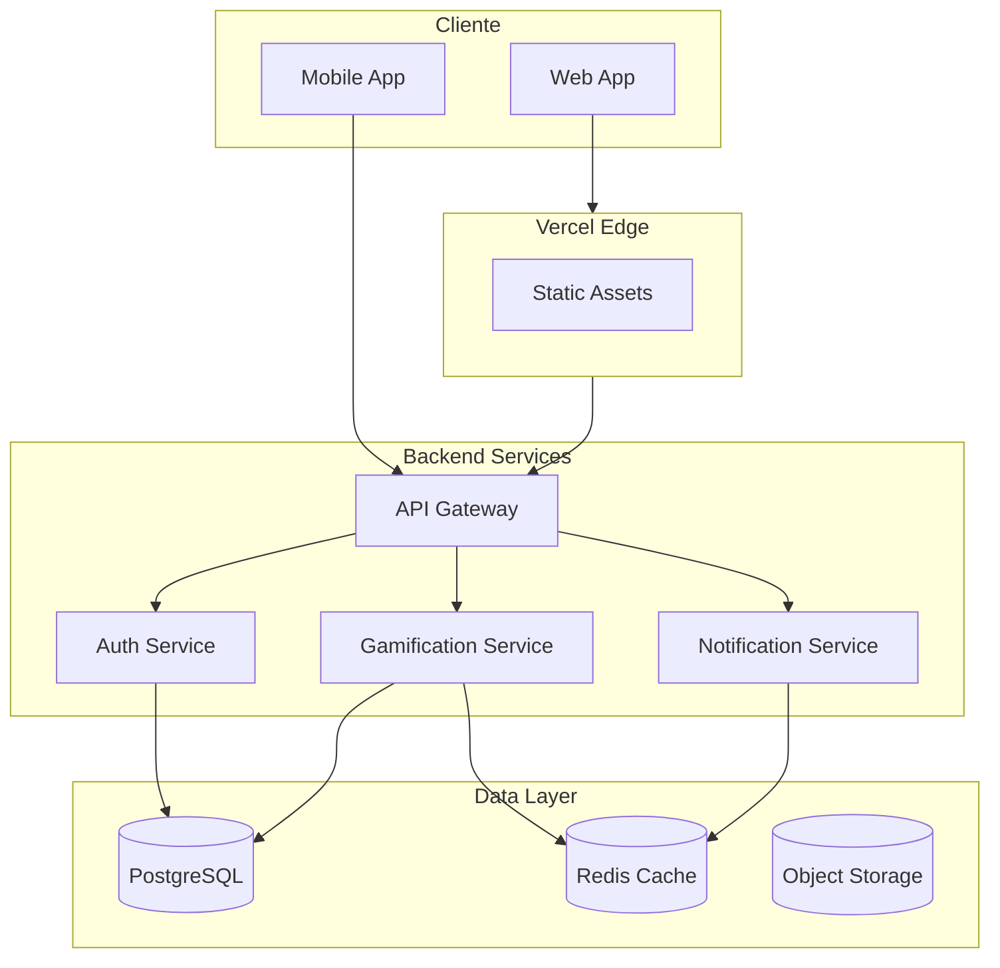

# Visão Geral da Arquitetura

## 📋 Índice

1. [Introdução](#introdução)
2. [Arquitetura de Alto Nível](#arquitetura-de-alto-nível)
3. [Padrões Arquiteturais](#padrões-arquiteturais)
4. [Componentes do Sistema](#componentes-do-sistema)
5. [Modelo de Dados](#modelo-de-dados)
6. [Integrações](#integrações)
7. [Decisões Arquiteturais](#decisões-arquiteturais)
8. [Escalabilidade](#escalabilidade)

---

## Introdução

### Propósito

Este documento descreve a arquitetura de software do **Visite Caçapava**, uma plataforma de turismo gamificada. O objetivo é fornecer uma visão abrangente do sistema para stakeholders técnicos e de negócio.

### Escopo

O documento cobre:
- Estrutura geral do sistema
- Componentes e suas interações
- Padrões de design utilizados
- Decisões arquiteturais e justificativas

### Definições

| Termo | Definição |
|-------|-----------|
| SPA | Single Page Application |
| POI | Point of Interest (Ponto de Interesse) |
| RBAC | Role-Based Access Control |
| Mock | Simulação de dados/serviços |

---

## Arquitetura de Alto Nível

### Diagrama C4 - Nível Contexto



### Diagrama C4 - Nível Container



### Tipo de Arquitetura

O Visite Caçapava utiliza uma arquitetura **Client-Side SPA (Single Page Application)** com:

- **Frontend**: React 18 com TypeScript
- **Backend**: Mock service (simulação local)
- **Persistência**: Session Storage do navegador
- **Deploy**: Vercel (serverless edge)

---

## Padrões Arquiteturais

### 1. Single Page Application (SPA)

```
Características:
├── Carregamento único da aplicação
├── Navegação client-side (React Router)
├── Atualizações parciais do DOM
└── Estado mantido em memória
```

**Benefícios:**
- Experiência de usuário fluida
- Menor carga no servidor
- Capacidade offline parcial

### 2. Component-Based Architecture

```
Hierarquia de Componentes:
App.tsx
├── Layouts/
│   ├── TouristLayout
│   ├── AdminLayout
│   ├── HotelLayout
│   └── RestaurantLayout
├── Pages/
│   └── [Páginas específicas por role]
└── Components/
    └── [Componentes reutilizáveis]
```

### 3. Context API Pattern

```typescript
// Estado global via Context
AuthContext
├── user: User | null
├── isAuthenticated: boolean
├── login(): Promise<Result>
└── logout(): void

GamificationContext
├── currentUser: User | null
├── checkIn(): Promise<Result>
└── getVisitedIds(): Set<string>
```

### 4. Service Layer Pattern

```
Camada de Serviços:
services/
├── backendService.ts    # Mock CRUD operations
├── geminiService.ts     # Primary AI
├── openaiService.ts     # Fallback AI
└── googleMapsService.ts # Map integration
```

### 5. Protected Routes Pattern

```typescript
// Controle de acesso por papel
<ProtectedRoute allowedRoles={['tourist']}>
  <TouristLayout>
    <Outlet />
  </TouristLayout>
</ProtectedRoute>
```

---

## Componentes do Sistema

### Diagrama de Componentes



### Componentes Principais

| Componente | Responsabilidade | Localização |
|------------|------------------|-------------|
| App.tsx | Roteamento e layout principal | /App.tsx |
| AuthContext | Autenticação e sessão | /context/AuthContext.tsx |
| GamificationContext | Lógica de gamificação | /context/GamificationContext.tsx |
| backendService | Operações CRUD mock | /services/backendService.ts |
| ProtectedRoute | Controle de acesso | /components/ProtectedRoute.tsx |

### Layouts por Papel



---

## Modelo de Dados

### Entidades Principais



### Fluxo de Dados



---

## Integrações

### Serviços Externos



### Fluxo de IA



---

## Decisões Arquiteturais

### ADR-001: Frontend SPA sem Backend Real

**Contexto**: Projeto MVP para demonstração

**Decisão**: Utilizar apenas frontend com mock service

**Justificativa**:
- Redução de complexidade para MVP
- Deploy simplificado na Vercel
- Foco em UX e gamificação

**Consequências**:
- ✅ Desenvolvimento rápido
- ✅ Zero custos de infraestrutura backend
- ❌ Dados não persistem entre sessões
- ❌ Sem escalabilidade multiusuário real

### ADR-002: Context API vs Redux

**Contexto**: Necessidade de estado global

**Decisão**: Usar Context API nativo do React

**Justificativa**:
- Complexidade adequada para o projeto
- Sem dependências adicionais
- Integração natural com React

### ADR-003: Session Storage vs LocalStorage

**Contexto**: Persistência de dados mock

**Decisão**: Session Storage

**Justificativa**:
- Reset automático ao fechar navegador
- Comportamento esperado para demo
- Evita dados obsoletos acumulados

### ADR-004: Leaflet vs Google Maps

**Contexto**: Necessidade de mapas interativos

**Decisão**: Leaflet como primário, Google Maps para features específicas

**Justificativa**:
- Leaflet: Open source, sem custos
- Google Maps: Recursos avançados quando necessário
- Híbrido oferece melhor custo-benefício

---

## Escalabilidade

### Arquitetura Atual (MVP)

```
┌─────────────────────────────────────┐
│           Vercel Edge               │
│  ┌───────────────────────────────┐  │
│  │       React SPA Bundle        │  │
│  │  ┌─────────────────────────┐  │  │
│  │  │    Session Storage      │  │  │
│  │  │    (Browser Local)      │  │  │
│  │  └─────────────────────────┘  │  │
│  └───────────────────────────────┘  │
└─────────────────────────────────────┘
```

### Arquitetura Futura (Produção)



### Roadmap de Escalabilidade

| Fase | Componente | Tecnologia |
|------|------------|------------|
| 1 | Backend API | Node.js + Express |
| 2 | Banco de Dados | PostgreSQL |
| 3 | Cache | Redis |
| 4 | Auth | JWT + Refresh Tokens |
| 5 | Mobile | React Native |
| 6 | Push Notifications | Firebase |
| 7 | Analytics | Google Analytics / Mixpanel |

---

## Referências

- [React Architecture Best Practices](https://react.dev/learn/thinking-in-react)
- [C4 Model](https://c4model.com/)
- [IEEE 1016-2009 Software Design Descriptions](https://standards.ieee.org/standard/1016-2009.html)

---

```
© 2025 Oryum Tech. Todos os direitos reservados.
Este documento é propriedade exclusiva da Oryum Tech.
Proibida a reprodução, distribuição ou uso sem autorização expressa.
```
