# Fluxo de Dados

## 📋 Índice

1. [Visão Geral](#visão-geral)
2. [Fluxo de Autenticação](#fluxo-de-autenticação)
3. [Fluxo de Gamificação](#fluxo-de-gamificação)
4. [Fluxo de Check-in](#fluxo-de-check-in)
5. [Fluxo de IA](#fluxo-de-ia)
6. [Fluxo de Dados por Papel](#fluxo-de-dados-por-papel)
7. [Persistência de Dados](#persistência-de-dados)

---

## Visão Geral

### Arquitetura de Dados

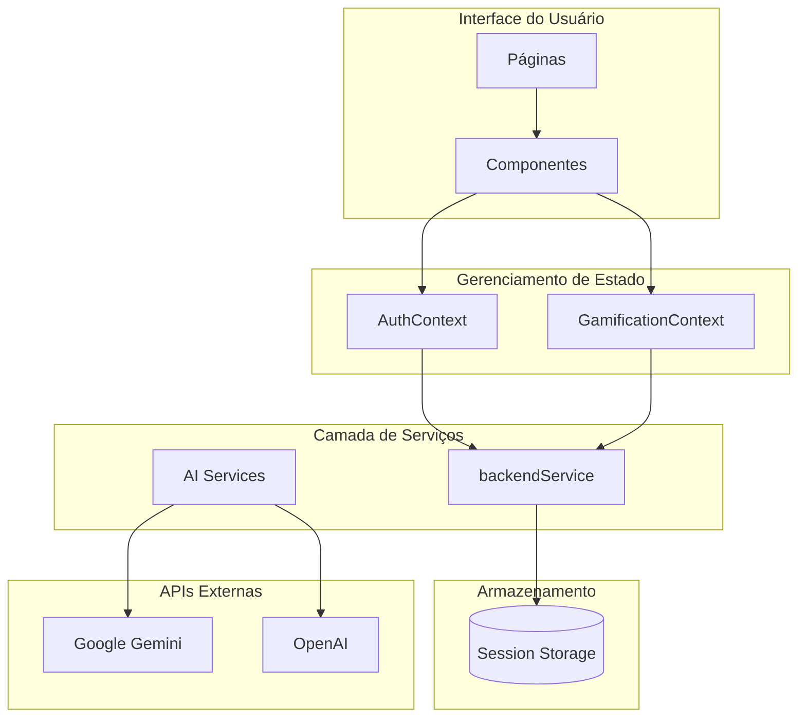

### Princípios de Fluxo de Dados

1. **Unidirecional**: Dados fluem de cima para baixo
2. **Imutabilidade**: Estado nunca é mutado diretamente
3. **Centralizado**: Context API como single source of truth
4. **Reativo**: UI atualiza automaticamente com mudanças de estado

---

## Fluxo de Autenticação

### Diagrama de Sequência - Login

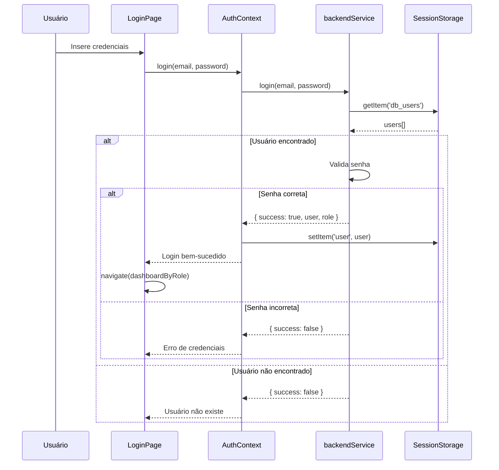

### Estado de Autenticação

```typescript
interface AuthState {
  user: User | null;
  isAuthenticated: boolean;
  isLoading: boolean;
}

interface AuthActions {
  login: (email: string, password: string) => Promise<LoginResult>;
  logout: () => void;
}
```

### Fluxo de Logout

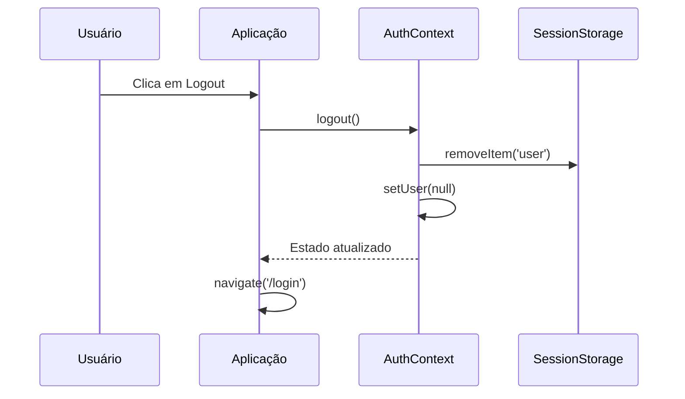

---

## Fluxo de Gamificação

### Diagrama de Estado - Gamificação

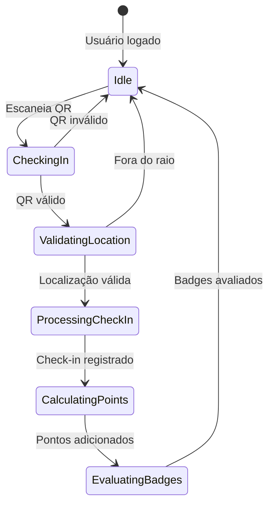

### Fluxo de Pontuação

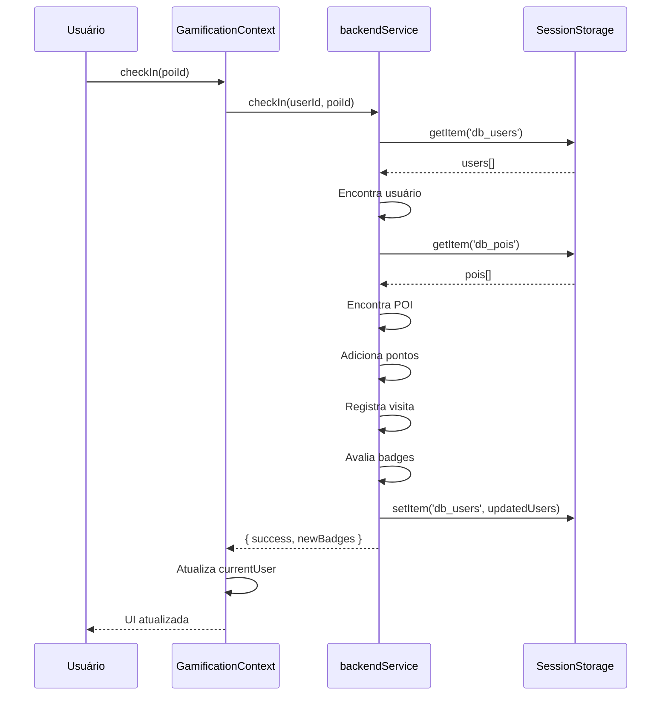

### Avaliação de Badges

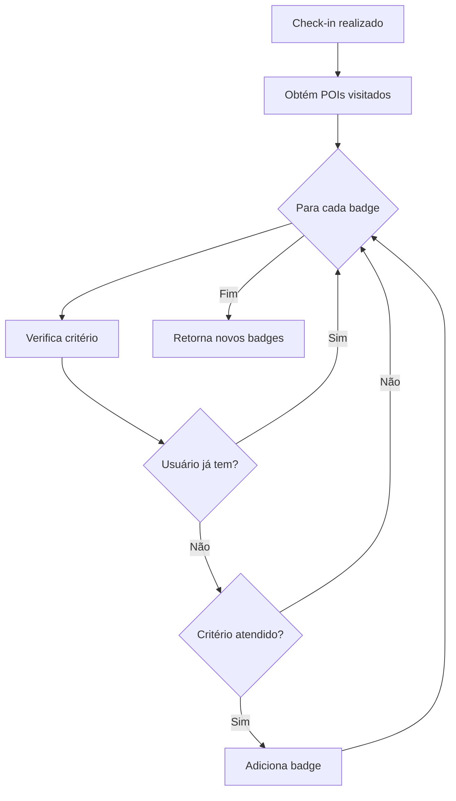

### Critérios de Badges

```typescript
const BADGES = [
  {
    id: 'explorador_natureza',
    criteria: (visitedIds: Set<string>) => {
      const naturePois = ['pedra-segredo', 'guaritas', 'cascata'];
      return naturePois.every(id => visitedIds.has(id));
    }
  },
  {
    id: 'pioneiro',
    criteria: (visitedIds: Set<string>) => visitedIds.size >= 1
  },
  // ...
];
```

---

## Fluxo de Check-in

### Diagrama Completo - Check-in com QR Code

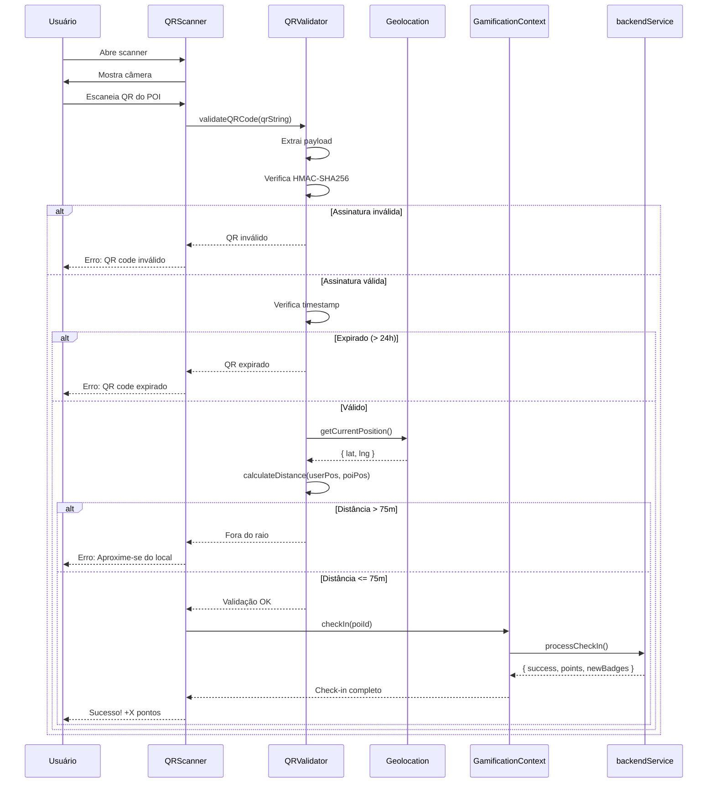

### Estrutura do QR Code

```typescript
interface QRPayload {
  poiId: string;      // ID do ponto de interesse
  lat: number;        // Latitude do POI
  lng: number;        // Longitude do POI
  timestamp: number;  // Unix timestamp de geração
  nonce: string;      // Valor aleatório único
  signature: string;  // HMAC-SHA256 do payload
}

// Exemplo de QR code gerado
const qrData = {
  poiId: 'forte-dom-pedro',
  lat: -30.5144,
  lng: -53.4883,
  timestamp: 1732636800000,
  nonce: 'a1b2c3d4e5',
  signature: 'hmac_sha256_hash_here'
};
```

### Validação Geográfica

```typescript
// Constantes de validação
const CHECKIN_RADIUS = 75;  // metros
const DISCOVERY_RADIUS = 60; // metros

// Fórmula de Haversine para cálculo de distância
function calculateDistance(
  lat1: number, lng1: number,
  lat2: number, lng2: number
): number {
  const R = 6371e3; // Raio da Terra em metros
  const φ1 = lat1 * Math.PI / 180;
  const φ2 = lat2 * Math.PI / 180;
  const Δφ = (lat2 - lat1) * Math.PI / 180;
  const Δλ = (lng2 - lng1) * Math.PI / 180;

  const a = Math.sin(Δφ/2) * Math.sin(Δφ/2) +
            Math.cos(φ1) * Math.cos(φ2) *
            Math.sin(Δλ/2) * Math.sin(Δλ/2);
  const c = 2 * Math.atan2(Math.sqrt(a), Math.sqrt(1-a));

  return R * c;
}
```

---

## Fluxo de IA

### Diagrama - Chat com IA

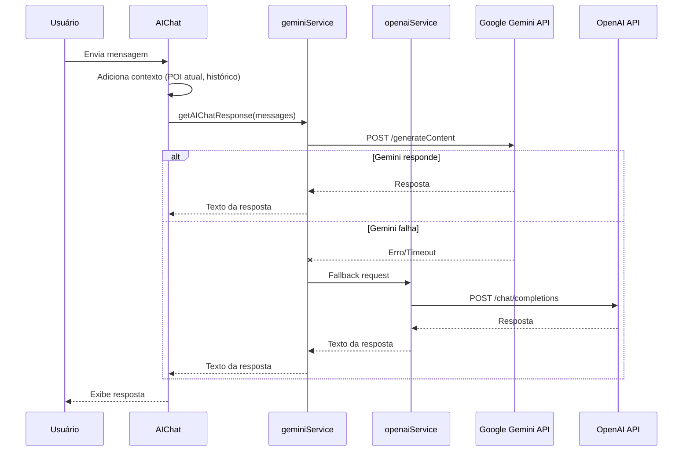

### Estrutura de Mensagens

```typescript
interface AIMessage {
  role: 'user' | 'assistant' | 'system';
  content: string;
}

interface AIContext {
  currentPOI?: PointOfInterest;
  userLocation?: Coordinates;
  visitedPOIs: string[];
  userPreferences?: UserPreferences;
}

// Prompt do sistema
const systemPrompt = `
Você é um guia turístico virtual especializado em Caçapava do Sul, RS.
Forneça informações precisas sobre pontos turísticos, história local,
gastronomia e dicas de viagem. Seja amigável e entusiasmado.
Contexto atual: ${JSON.stringify(context)}
`;
```

### Fluxo de Fallback

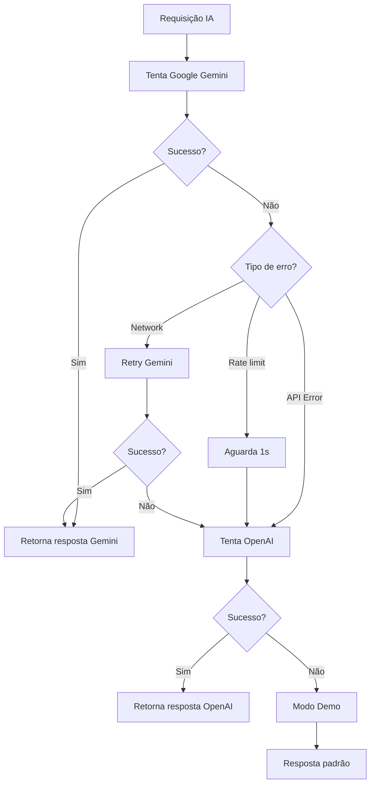

---

## Fluxo de Dados por Papel

### Turista

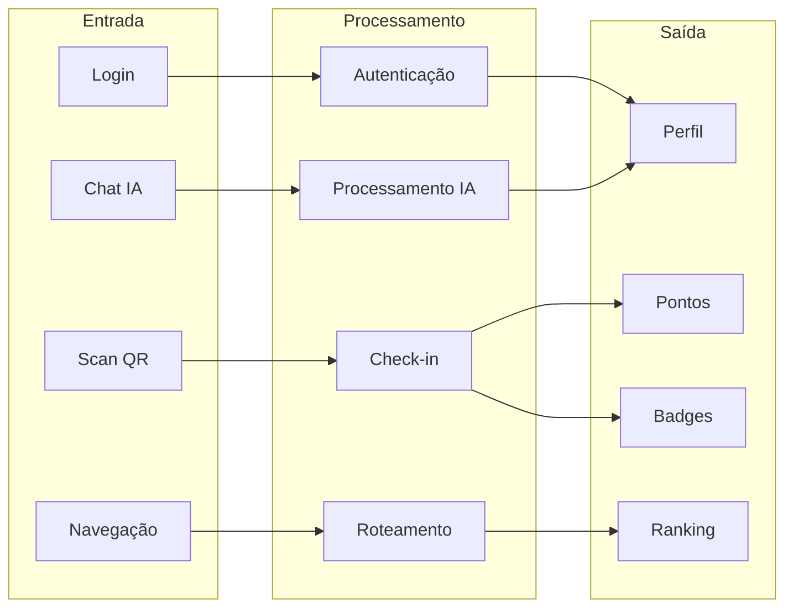

### Administrador (Secretaria)

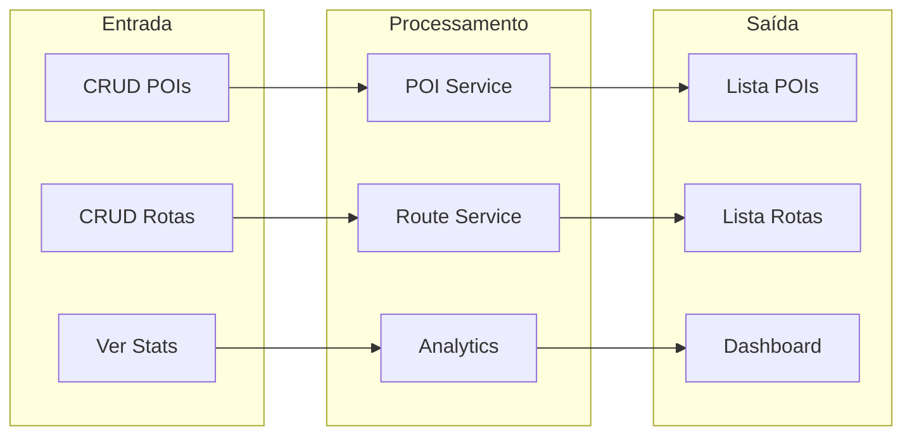

### Hotel

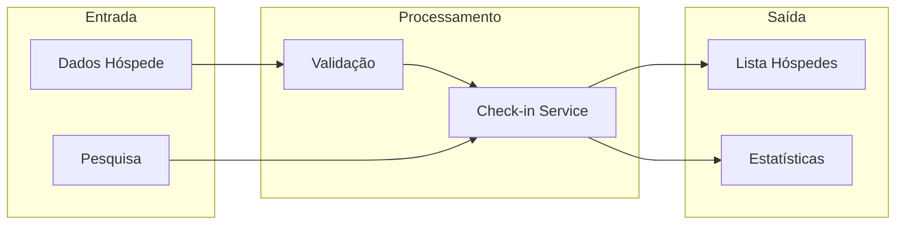

---

## Persistência de Dados

### Estrutura do Session Storage

```typescript
// Chaves de armazenamento
const STORAGE_KEYS = {
  USERS: 'db_users',
  POIS: 'db_pois',
  ROUTES: 'db_routes',
  BADGES: 'db_badges',
  PHOTOS: 'db_photos',
  REVIEWS: 'db_reviews',
  FAVORITES: 'db_favorites',
  CHECKINS: 'db_checkins',
  CURRENT_USER: 'user'
};

// Estrutura de dados
interface StorageSchema {
  db_users: User[];
  db_pois: PointOfInterest[];
  db_routes: Route[];
  db_badges: Badge[];
  db_photos: Photo[];
  db_reviews: Review[];
  db_favorites: Favorite[];
  db_checkins: HotelCheckIn[];
  user: User | null;
}
```

### Fluxo de Inicialização

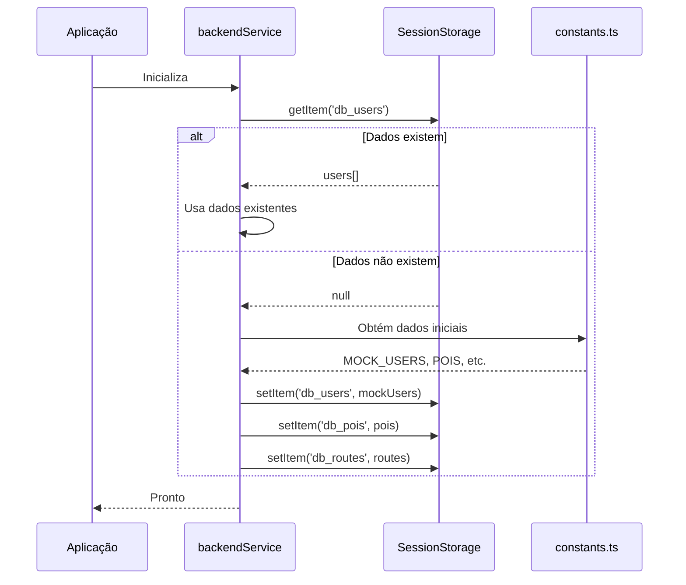

### Ciclo de Vida dos Dados

```
Início da Sessão:
┌─────────────────────────────────────────┐
│ 1. Verifica Session Storage             │
│ 2. Se vazio, inicializa com mock data   │
│ 3. Carrega estado em memória            │
└─────────────────────────────────────────┘
                    │
                    ▼
Durante a Sessão:
┌─────────────────────────────────────────┐
│ • Operações CRUD atualizam Storage      │
│ • Contextos mantêm estado reativo       │
│ • UI sincroniza automaticamente         │
└─────────────────────────────────────────┘
                    │
                    ▼
Fim da Sessão:
┌─────────────────────────────────────────┐
│ • Session Storage limpo pelo navegador  │
│ • Dados perdidos (comportamento demo)   │
└─────────────────────────────────────────┘
```

---

## Referências

- [React Data Flow](https://react.dev/learn/thinking-in-react#step-4-identify-where-your-state-should-live)
- [Flux Architecture](https://facebookarchive.github.io/flux/)
- [Session Storage MDN](https://developer.mozilla.org/en-US/docs/Web/API/Window/sessionStorage)

---

```
© 2025 Oryum Tech. Todos os direitos reservados.
Este documento é propriedade exclusiva da Oryum Tech.
Proibida a reprodução, distribuição ou uso sem autorização expressa.
```
