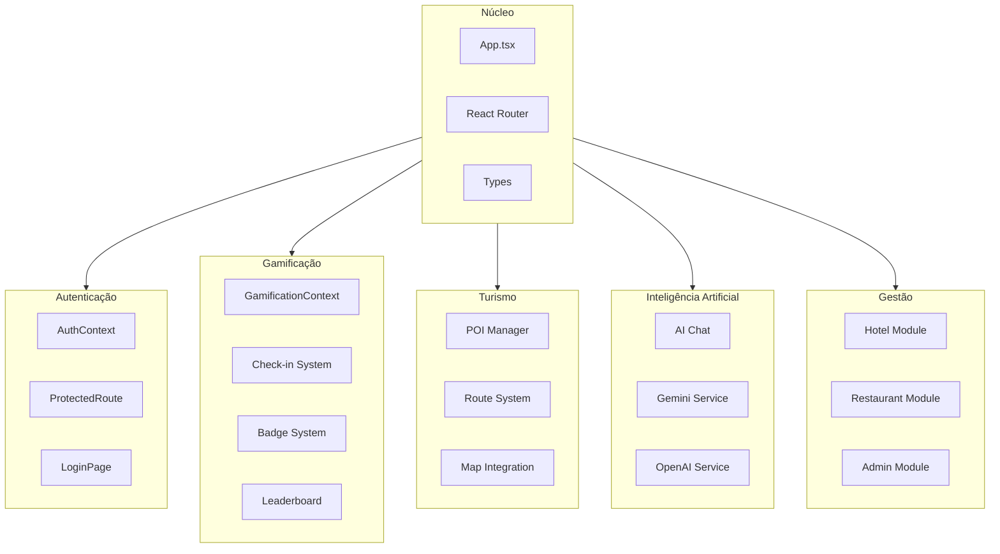
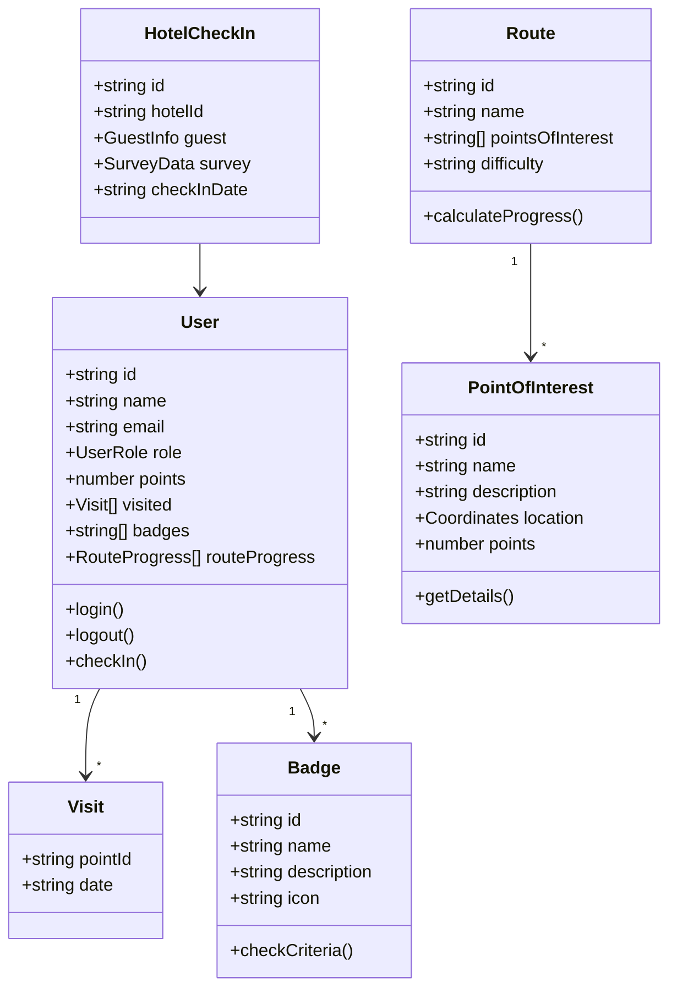
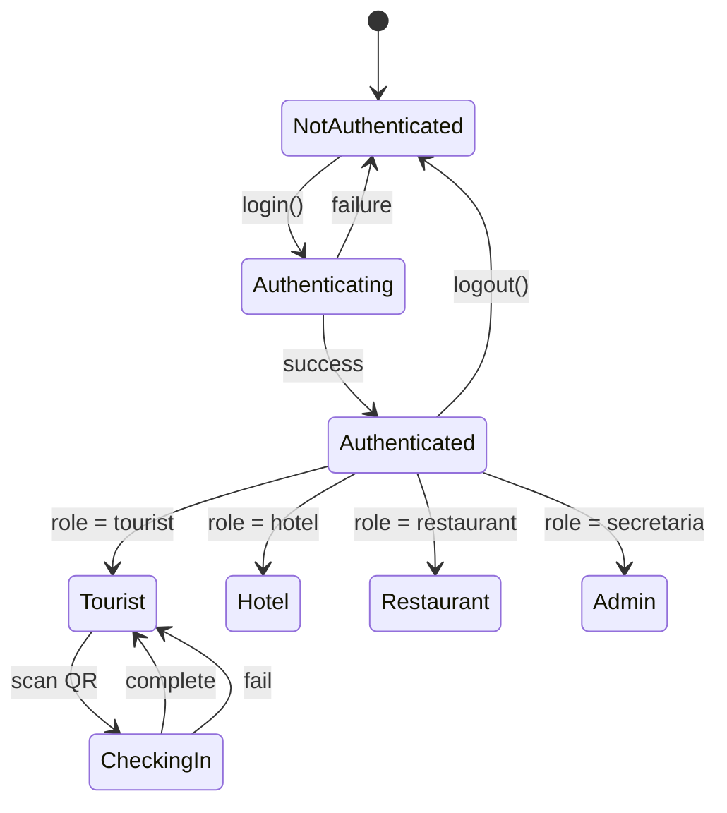
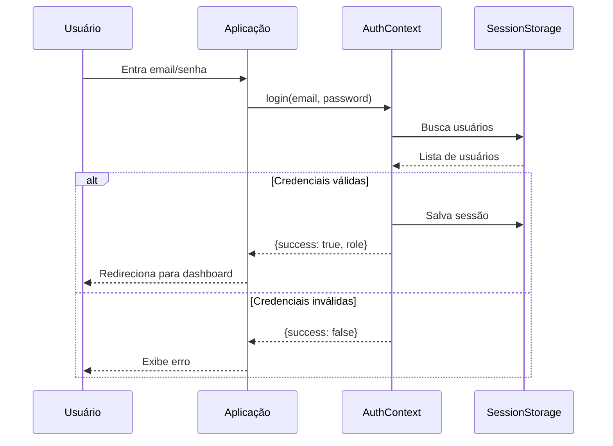
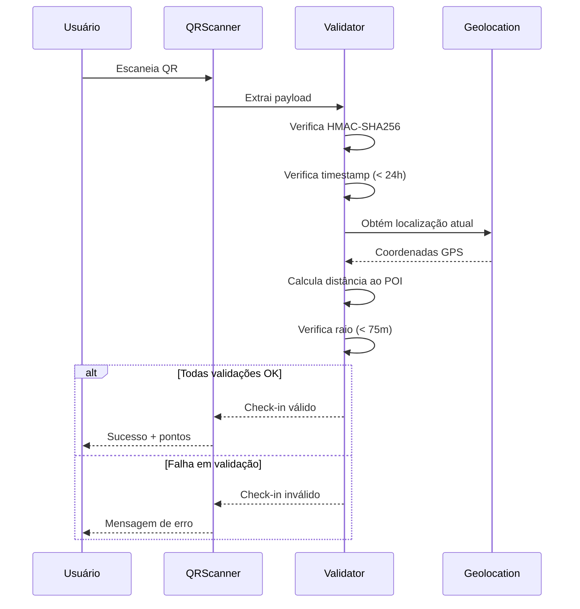

# Design do Sistema

## 📋 Índice

1. [Visão Geral do Design](#visão-geral-do-design)
2. [Decomposição do Sistema](#decomposição-do-sistema)
3. [Design de Componentes](#design-de-componentes)
4. [Design de Interface](#design-de-interface)
5. [Design de Dados](#design-de-dados)
6. [Design de Segurança](#design-de-segurança)
7. [Requisitos Não-Funcionais](#requisitos-não-funcionais)

---

## Visão Geral do Design

### Objetivos do Design

1. **Usabilidade**: Interface intuitiva para turistas de todas as idades
2. **Performance**: Carregamento rápido e responsividade
3. **Manutenibilidade**: Código organizado e documentado
4. **Extensibilidade**: Facilidade para adicionar novas funcionalidades
5. **Segurança**: Proteção contra fraudes e uso indevido

### Restrições de Design

| Restrição | Descrição | Impacto |
|-----------|-----------|---------|
| Client-side only | Sem backend dedicado | Mock services, session storage |
| Budget limitado | MVP com recursos mínimos | Uso de serviços gratuitos/open source |
| Tempo | Entrega rápida | Priorização de features essenciais |
| Região | Foco em Caçapava do Sul | Geolocalização específica |

---

## Decomposição do Sistema

### Diagrama de Módulos



### Responsabilidades dos Módulos

#### Core Module
```
Responsabilidades:
├── Inicialização da aplicação
├── Configuração de rotas
├── Definição de tipos globais
└── Constantes do sistema
```

#### Auth Module
```
Responsabilidades:
├── Login/Logout
├── Gerenciamento de sessão
├── Controle de acesso por papel
└── Proteção de rotas
```

#### Gamification Module
```
Responsabilidades:
├── Sistema de pontos
├── Desbloqueio de badges
├── Ranking de usuários
├── Validação de check-ins
└── Progresso em rotas
```

#### Tourism Module
```
Responsabilidades:
├── Gestão de POIs
├── Rotas temáticas
├── Integração com mapas
└── Busca e filtros
```

#### AI Module
```
Responsabilidades:
├── Chat com assistente virtual
├── Integração Gemini (primário)
├── Fallback OpenAI
└── Respostas contextualizadas
```

---

## Design de Componentes

### Hierarquia de Componentes

```
src/
├── App.tsx                          # Raiz
│
├── components/
│   ├── layouts/                     # Containers de layout
│   │   ├── TouristLayout.tsx       # Layout turista
│   │   ├── AdminLayout.tsx         # Layout admin
│   │   ├── HotelLayout.tsx         # Layout hotel
│   │   └── RestaurantLayout.tsx    # Layout restaurante
│   │
│   ├── ui/                          # Componentes de UI básicos
│   │   └── RadioGroup.tsx
│   │
│   ├── admin/                       # Componentes administrativos
│   │   ├── SecretaryDashboard.tsx
│   │   ├── StatCard.tsx
│   │   ├── ChartCard.tsx
│   │   └── InfoCard.tsx
│   │
│   └── [shared]/                    # Componentes compartilhados
│       ├── Header.tsx
│       ├── Footer.tsx
│       ├── ProtectedRoute.tsx
│       ├── QRCodeScanner.tsx
│       ├── QRCodeGenerator.tsx
│       ├── LeafletMap.tsx
│       ├── BadgeIcon.tsx
│       └── ...
│
├── pages/                           # Componentes de página
│   ├── HomePage.tsx
│   ├── LoginPage.tsx
│   ├── ProfilePage.tsx
│   ├── admin/
│   ├── hotel/
│   └── restaurant/
│
├── context/                         # Provedores de contexto
│   ├── AuthContext.tsx
│   └── GamificationContext.tsx
│
├── services/                        # Serviços de negócio
│   ├── backendService.ts
│   ├── geminiService.ts
│   └── openaiService.ts
│
└── utils/                           # Utilitários
    ├── qrCodeSystem.ts
    ├── checkinSystem.ts
    └── geolocation.ts
```

### Padrões de Componentes

#### 1. Container/Presentational

```typescript
// Container (com lógica)
function ProfilePageContainer() {
  const { currentUser } = useGamification();
  const [editing, setEditing] = useState(false);

  return <ProfilePage user={currentUser} isEditing={editing} />;
}

// Presentational (apenas UI)
function ProfilePage({ user, isEditing }: ProfilePageProps) {
  return (
    <div className="profile">
      <Avatar src={user.avatarUrl} />
      <h1>{user.name}</h1>
      {/* ... */}
    </div>
  );
}
```

#### 2. Compound Components

```typescript
// Componentes compostos para flexibilidade
<Card>
  <Card.Header>Título</Card.Header>
  <Card.Body>Conteúdo</Card.Body>
  <Card.Footer>Ações</Card.Footer>
</Card>
```

#### 3. Custom Hooks

```typescript
// Encapsulamento de lógica reutilizável
function useCheckIn() {
  const { checkIn } = useGamification();
  const [loading, setLoading] = useState(false);
  const [error, setError] = useState<string | null>(null);

  const performCheckIn = async (poiId: string) => {
    setLoading(true);
    try {
      const result = await checkIn(poiId);
      return result;
    } catch (err) {
      setError(err.message);
    } finally {
      setLoading(false);
    }
  };

  return { performCheckIn, loading, error };
}
```

---

## Design de Interface

### Sistema de Design

#### Cores da Marca

```css
:root {
  /* Paleta Principal */
  --brand-dark-green: #00331E;    /* Primária escura */
  --brand-green: #02A343;         /* Primária */
  --brand-light-green: #6CBC3A;   /* Secundária */
  --brand-beige: #FDF4D9;         /* Background */
  --brand-red: #D92525;           /* Alerta/Erro */

  /* Tons de Cinza */
  --gray-50: #f9fafb;
  --gray-100: #f3f4f6;
  --gray-500: #6b7280;
  --gray-900: #111827;
}
```

#### Tipografia

```css
:root {
  /* Fontes */
  --font-sans: 'Inter', system-ui, sans-serif;
  --font-display: 'Staatliches', sans-serif;

  /* Tamanhos */
  --text-xs: 0.75rem;
  --text-sm: 0.875rem;
  --text-base: 1rem;
  --text-lg: 1.125rem;
  --text-xl: 1.25rem;
  --text-2xl: 1.5rem;
  --text-3xl: 1.875rem;
}
```

#### Espaçamento

```css
:root {
  --spacing-1: 0.25rem;   /* 4px */
  --spacing-2: 0.5rem;    /* 8px */
  --spacing-3: 0.75rem;   /* 12px */
  --spacing-4: 1rem;      /* 16px */
  --spacing-6: 1.5rem;    /* 24px */
  --spacing-8: 2rem;      /* 32px */
}
```

### Componentes de UI

#### Botões

```tsx
// Variantes de botão
<Button variant="primary">Ação Principal</Button>
<Button variant="secondary">Ação Secundária</Button>
<Button variant="outline">Contorno</Button>
<Button variant="ghost">Fantasma</Button>
<Button variant="danger">Perigo</Button>
```

#### Cards

```tsx
// Card padrão com variantes
<Card>
  <CardHeader>
    <CardTitle>Título</CardTitle>
    <CardDescription>Descrição</CardDescription>
  </CardHeader>
  <CardContent>Conteúdo</CardContent>
  <CardFooter>
    <Button>Ação</Button>
  </CardFooter>
</Card>
```

### Layout Responsivo

```tsx
// Grid responsivo com Tailwind
<div className="grid grid-cols-1 md:grid-cols-2 lg:grid-cols-3 gap-4">
  {items.map(item => <Card key={item.id} {...item} />)}
</div>
```

### Breakpoints

| Nome | Largura | Uso |
|------|---------|-----|
| sm | 640px | Telefones landscape |
| md | 768px | Tablets |
| lg | 1024px | Desktop pequeno |
| xl | 1280px | Desktop |
| 2xl | 1536px | Desktop grande |

---

## Design de Dados

### Modelo de Domínio



### Fluxo de Estado



---

## Design de Segurança

### Autenticação



### Validação de QR Code



### Camadas de Segurança

```
┌─────────────────────────────────────────┐
│          Camada de Apresentação          │
│  • Validação de input no frontend        │
│  • Sanitização de dados exibidos         │
└────────────────────┬────────────────────┘
                     │
┌────────────────────▼────────────────────┐
│           Camada de Negócio             │
│  • Validação de regras de negócio       │
│  • Controle de acesso (RBAC)            │
│  • Validação criptográfica de QR        │
└────────────────────┬────────────────────┘
                     │
┌────────────────────▼────────────────────┐
│            Camada de Dados              │
│  • Session Storage (isolamento)         │
│  • Sem dados sensíveis persistidos      │
└─────────────────────────────────────────┘
```

---

## Requisitos Não-Funcionais

### Performance

| Métrica | Target | Método de Medição |
|---------|--------|-------------------|
| First Contentful Paint | < 1.5s | Lighthouse |
| Time to Interactive | < 3s | Lighthouse |
| Largest Contentful Paint | < 2.5s | Lighthouse |
| Bundle Size | < 500KB gzipped | Build output |

### Disponibilidade

| Métrica | Target |
|---------|--------|
| Uptime | 99.9% (via Vercel) |
| Tempo de resposta médio | < 200ms |
| Suporte offline parcial | Páginas estáticas |

### Compatibilidade

| Navegador | Versão Mínima |
|-----------|---------------|
| Chrome | 90+ |
| Firefox | 88+ |
| Safari | 14+ |
| Edge | 90+ |
| Mobile Safari | iOS 14+ |
| Chrome Mobile | Android 8+ |

### Acessibilidade

| Critério | Conformidade |
|----------|--------------|
| WCAG 2.1 | Nível AA |
| VLibras | Integrado |
| Navegação por teclado | Suportada |
| Screen readers | Compatível |

### Escalabilidade

| Aspecto | Atual | Planejado |
|---------|-------|-----------|
| Usuários simultâneos | ~100 | 10.000+ |
| Dados | Session Storage | PostgreSQL |
| Assets | Vercel CDN | Multi-region CDN |
| API | Mock local | REST/GraphQL |

---

## Referências

- [React Design Patterns](https://react.dev/learn)
- [Tailwind CSS Documentation](https://tailwindcss.com/docs)
- [IEEE 1016 Software Design Descriptions](https://standards.ieee.org/standard/1016-2009.html)

---

```
© 2025 Oryum Tech. Todos os direitos reservados.
Este documento é propriedade exclusiva da Oryum Tech.
Proibida a reprodução, distribuição ou uso sem autorização expressa.
```
