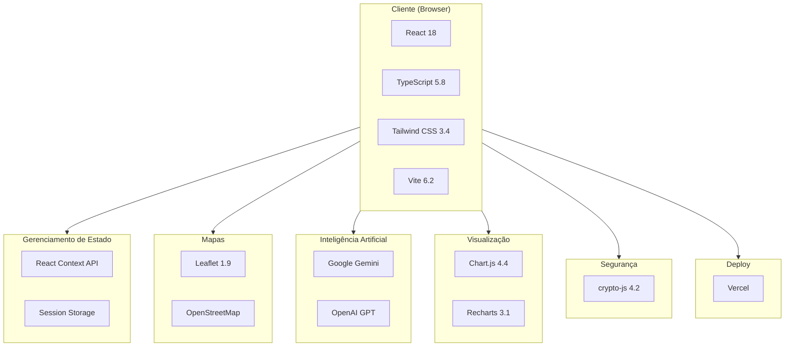

# Stack Tecnológica

## 📋 Índice

1. [Visão Geral](#visão-geral)
2. [Frontend](#frontend)
3. [Serviços e APIs](#serviços-e-apis)
4. [Ferramentas de Desenvolvimento](#ferramentas-de-desenvolvimento)
5. [Infraestrutura](#infraestrutura)
6. [Dependências](#dependências)
7. [Versões e Compatibilidade](#versões-e-compatibilidade)

---

## Visão Geral

### Arquitetura da Stack



### Stack Principal

| Camada | Tecnologia | Versão |
|--------|------------|--------|
| **Framework** | React | 18.2.0 |
| **Linguagem** | TypeScript | 5.8.2 |
| **Build Tool** | Vite | 6.2.0 |
| **Estilização** | Tailwind CSS | 3.4.17 |
| **Roteamento** | React Router DOM | 6.25.1 |
| **Deploy** | Vercel | - |

---

## Frontend

### React 18.2

**Papel**: Framework de UI principal

```typescript
// Recursos utilizados
- Functional Components
- Hooks (useState, useEffect, useContext, etc.)
- Context API
- React.StrictMode
- Concurrent Features
```

**Justificativa**:
- Ecossistema maduro e estável
- Grande comunidade e suporte
- Performance com Virtual DOM
- Hooks simplificam lógica de estado

### TypeScript 5.8

**Papel**: Tipagem estática e segurança de tipos

```typescript
// Configuração principal (tsconfig.json)
{
  "compilerOptions": {
    "target": "ES2022",
    "lib": ["ES2023", "DOM", "DOM.Iterable"],
    "module": "ESNext",
    "strict": true,
    "jsx": "react-jsx",
    "moduleResolution": "bundler"
  }
}
```

**Benefícios**:
- Detecção de erros em compile-time
- IntelliSense aprimorado
- Refatoração segura
- Documentação inline via tipos

### Vite 6.2

**Papel**: Build tool e dev server

```typescript
// vite.config.ts
import { defineConfig } from 'vite';
import react from '@vitejs/plugin-react';

export default defineConfig({
  plugins: [react()],
  define: {
    'import.meta.env.VITE_GEMINI_API_KEY': JSON.stringify(process.env.VITE_GEMINI_API_KEY),
  }
});
```

**Vantagens**:
- Hot Module Replacement (HMR) instantâneo
- Build otimizado com Rollup
- Suporte nativo a ESM
- Configuração mínima

### Tailwind CSS 3.4

**Papel**: Framework CSS utility-first

```javascript
// tailwind.config.js
module.exports = {
  content: ['./index.html', './src/**/*.{js,ts,jsx,tsx}'],
  theme: {
    extend: {
      colors: {
        'brand-dark-green': '#00331E',
        'brand-green': '#02A343',
        'brand-light-green': '#6CBC3A',
        'brand-beige': '#FDF4D9',
        'brand-red': '#D92525',
      },
      fontFamily: {
        sans: ['Inter', 'system-ui', 'sans-serif'],
        display: ['Staatliches', 'sans-serif'],
      },
    },
  },
};
```

**Uso**:
```tsx
<div className="flex items-center justify-between p-4 bg-brand-beige rounded-lg shadow-md">
  <h1 className="text-2xl font-display text-brand-dark-green">Título</h1>
</div>
```

### React Router DOM 6.25

**Papel**: Roteamento client-side

```tsx
// Estrutura de rotas
<Routes>
  <Route path="/login" element={<LoginPage />} />

  {/* Rotas protegidas - Turista */}
  <Route element={<ProtectedRoute allowedRoles={['tourist']} />}>
    <Route element={<TouristLayout />}>
      <Route path="/" element={<HomePage />} />
      <Route path="/routes" element={<RoutesPage />} />
      <Route path="/profile" element={<ProfilePage />} />
    </Route>
  </Route>

  {/* Rotas protegidas - Admin */}
  <Route element={<ProtectedRoute allowedRoles={['secretaria']} />}>
    <Route path="/admin" element={<AdminLayout />}>
      <Route index element={<AdminDashboard />} />
    </Route>
  </Route>
</Routes>
```

---

## Serviços e APIs

### Google Gemini API

**Papel**: IA principal para assistente virtual

```typescript
// services/geminiService.ts
import { GoogleGenerativeAI } from '@google/genai';

const genAI = new GoogleGenerativeAI(import.meta.env.VITE_GEMINI_API_KEY);

export async function callGeminiAPI(prompt: string, systemInstruction: string) {
  const model = genAI.getGenerativeModel({
    model: 'gemini-1.5-flash',
    systemInstruction,
  });

  const result = await model.generateContent(prompt);
  return result.response.text();
}
```

**Características**:
- Modelo: gemini-1.5-flash
- Baixa latência
- Suporte a contexto longo

### OpenAI API

**Papel**: Fallback para IA

```typescript
// services/openaiService.ts
import OpenAI from 'openai';

const openai = new OpenAI({
  apiKey: import.meta.env.VITE_OPENAI_API_KEY,
  dangerouslyAllowBrowser: true,
});

export async function generateContent(prompt: string, systemInstruction: string) {
  const completion = await openai.chat.completions.create({
    model: 'gpt-3.5-turbo',
    messages: [
      { role: 'system', content: systemInstruction },
      { role: 'user', content: prompt },
    ],
  });

  return completion.choices[0].message.content;
}
```

### Leaflet 1.9

**Papel**: Biblioteca de mapas interativos

```tsx
// Uso com React Leaflet
import { MapContainer, TileLayer, Marker, Popup } from 'react-leaflet';

<MapContainer center={[-30.5144, -53.4883]} zoom={13}>
  <TileLayer
    url="https://{s}.tile.openstreetmap.org/{z}/{x}/{y}.png"
    attribution='&copy; OpenStreetMap contributors'
  />
  {pois.map(poi => (
    <Marker key={poi.id} position={[poi.lat, poi.lng]}>
      <Popup>{poi.name}</Popup>
    </Marker>
  ))}
</MapContainer>
```

**Vantagens**:
- Open source
- Sem custos de API
- Altamente customizável
- Leve e performático

### Chart.js 4.4 + Recharts 3.1

**Papel**: Visualização de dados

```tsx
// Chart.js com react-chartjs-2
import { Bar } from 'react-chartjs-2';

<Bar
  data={{
    labels: ['Jan', 'Fev', 'Mar'],
    datasets: [{
      label: 'Visitantes',
      data: [100, 150, 200],
      backgroundColor: '#02A343',
    }],
  }}
/>

// Recharts para gráficos mais complexos
import { LineChart, Line, XAxis, YAxis, Tooltip } from 'recharts';

<LineChart data={data}>
  <XAxis dataKey="name" />
  <YAxis />
  <Tooltip />
  <Line type="monotone" dataKey="value" stroke="#02A343" />
</LineChart>
```

---

## Ferramentas de Desenvolvimento

### PostCSS 8.5

**Papel**: Processamento de CSS

```javascript
// postcss.config.js
export default {
  plugins: {
    tailwindcss: {},
    autoprefixer: {},
  },
};
```

### Autoprefixer 10.4

**Papel**: Prefixos de vendor automáticos

```css
/* Input */
.example {
  display: flex;
}

/* Output */
.example {
  display: -webkit-box;
  display: -ms-flexbox;
  display: flex;
}
```

### ESLint (Recomendado)

```javascript
// .eslintrc.js (configuração sugerida)
module.exports = {
  extends: [
    'eslint:recommended',
    'plugin:@typescript-eslint/recommended',
    'plugin:react-hooks/recommended',
  ],
  parser: '@typescript-eslint/parser',
  plugins: ['@typescript-eslint', 'react-hooks'],
};
```

### Prettier (Recomendado)

```json
// .prettierrc
{
  "semi": true,
  "singleQuote": true,
  "tabWidth": 2,
  "trailingComma": "es5"
}
```

---

## Infraestrutura

### Vercel

**Papel**: Plataforma de deploy e hosting

```json
// vercel.json
{
  "buildCommand": "npm run build",
  "outputDirectory": "dist"
}
```

**Recursos utilizados**:
- Edge Network global
- SSL automático
- Preview deployments
- Environment variables
- Analytics básico

### GitHub

**Papel**: Controle de versão e CI/CD

```yaml
# .github/workflows (exemplo)
name: CI
on: [push, pull_request]
jobs:
  build:
    runs-on: ubuntu-latest
    steps:
      - uses: actions/checkout@v4
      - uses: actions/setup-node@v4
      - run: npm ci
      - run: npm run build
```

---

## Dependências

### Produção

```json
{
  "dependencies": {
    "@google/genai": "^1.14.0",
    "@types/crypto-js": "^4.2.2",
    "@types/leaflet": "^1.9.20",
    "chart.js": "^4.4.2",
    "crypto-js": "^4.2.0",
    "leaflet": "^1.9.4",
    "lucide-react": "^0.540.0",
    "openai": "^5.16.0",
    "react": "^18.2.0",
    "react-chartjs-2": "^5.2.0",
    "react-dom": "^18.2.0",
    "react-icons": "^5.5.0",
    "react-leaflet": "^4.2.1",
    "react-router-dom": "^6.25.1",
    "recharts": "^3.1.2"
  }
}
```

### Desenvolvimento

```json
{
  "devDependencies": {
    "@types/node": "^22.14.0",
    "@types/react": "^19.1.12",
    "autoprefixer": "^10.4.21",
    "postcss": "^8.5.6",
    "tailwindcss": "^3.4.17",
    "typescript": "~5.8.2",
    "vite": "^6.2.0"
  }
}
```

### Análise de Bundle

| Dependência | Tamanho (gzip) | Justificativa |
|-------------|----------------|---------------|
| react + react-dom | ~45 KB | Core framework |
| react-router-dom | ~12 KB | Roteamento |
| leaflet | ~40 KB | Mapas |
| chart.js | ~60 KB | Gráficos |
| lucide-react | ~5 KB | Ícones (tree-shaking) |
| crypto-js | ~15 KB | Criptografia |
| @google/genai | ~20 KB | API Gemini |
| openai | ~25 KB | API OpenAI |

---

## Versões e Compatibilidade

### Matriz de Compatibilidade

| Componente | Versão Atual | Mínima Suportada | LTS |
|------------|--------------|------------------|-----|
| Node.js | 20.x | 18.x | 18.x |
| npm | 10.x | 9.x | - |
| React | 18.2 | 18.0 | - |
| TypeScript | 5.8 | 5.0 | - |
| Vite | 6.2 | 5.0 | - |

### Navegadores Suportados

```json
// .browserslistrc
> 0.5%
last 2 versions
Firefox ESR
not dead
not IE 11
```

| Navegador | Versão Mínima | Suporte |
|-----------|---------------|---------|
| Chrome | 90+ | ✅ Completo |
| Firefox | 88+ | ✅ Completo |
| Safari | 14+ | ✅ Completo |
| Edge | 90+ | ✅ Completo |
| Chrome Mobile | Android 8+ | ✅ Completo |
| Safari Mobile | iOS 14+ | ✅ Completo |
| IE 11 | - | ❌ Não suportado |

### Política de Atualização

| Tipo | Frequência | Ação |
|------|------------|------|
| Patches de segurança | Imediato | Atualização prioritária |
| Minor updates | Mensal | Avaliação e teste |
| Major updates | Semestral | Planejamento e migração |

---

## Referências

- [React Documentation](https://react.dev/)
- [TypeScript Handbook](https://www.typescriptlang.org/docs/)
- [Vite Guide](https://vitejs.dev/guide/)
- [Tailwind CSS Docs](https://tailwindcss.com/docs)
- [Leaflet Documentation](https://leafletjs.com/reference.html)

---

```
© 2025 Oryum Tech. Todos os direitos reservados.
Este documento é propriedade exclusiva da Oryum Tech.
Proibida a reprodução, distribuição ou uso sem autorização expressa.
```
