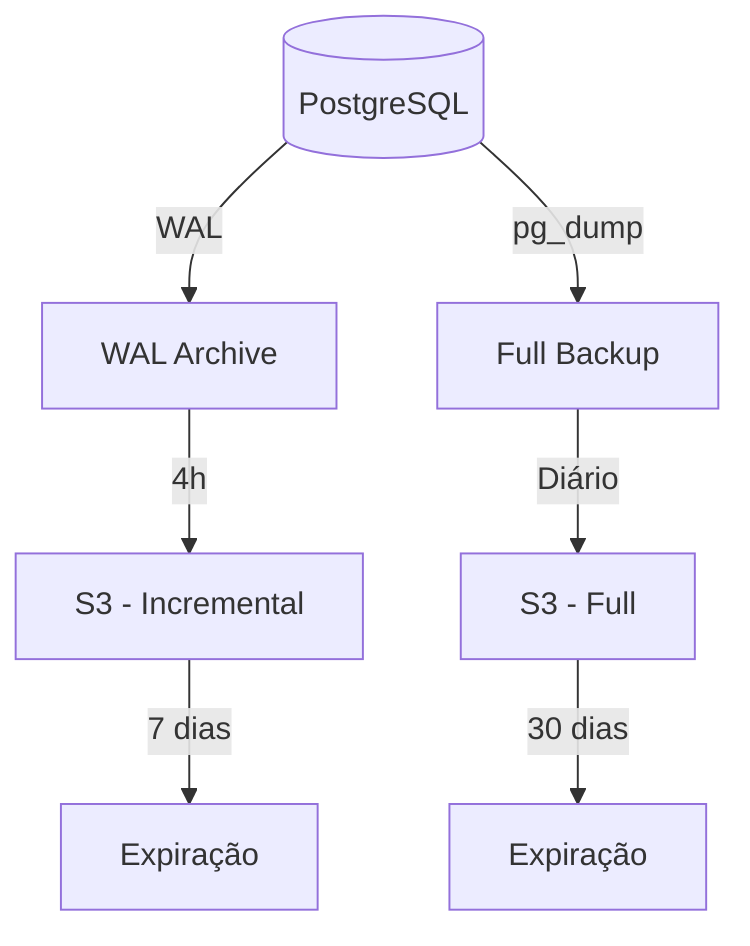

# Backup e Recuperação

## Visão Geral

> **Nota**: O MVP atual usa Session Storage sem necessidade de backup. Esta documentação descreve a estratégia para produção com PostgreSQL.

## Estratégia de Backup

### Tipos de Backup

| Tipo | Frequência | Retenção | Método |
|------|------------|----------|--------|
| Full | Diário (01:00 UTC) | 30 dias | pg_dump |
| Incremental | 4 horas | 7 dias | WAL archiving |
| Transaction Log | Contínuo | 7 dias | WAL streaming |

### Diagrama de Backup



## Scripts de Backup

### Backup Full (pg_dump)

```bash
#!/bin/bash
# backup-full.sh

DATE=$(date +%Y%m%d_%H%M%S)
BACKUP_DIR="/backups"
DB_NAME="visitecacapava"
S3_BUCKET="s3://visitecacapava-backups"

# Criar backup
pg_dump -Fc $DB_NAME > $BACKUP_DIR/full_$DATE.dump

# Comprimir
gzip $BACKUP_DIR/full_$DATE.dump

# Enviar para S3
aws s3 cp $BACKUP_DIR/full_$DATE.dump.gz $S3_BUCKET/full/

# Limpar backups locais antigos (>7 dias)
find $BACKUP_DIR -name "full_*.dump.gz" -mtime +7 -delete

echo "Backup completo: full_$DATE.dump.gz"
```

### Configuração WAL Archiving

```ini
# postgresql.conf

archive_mode = on
archive_command = 'aws s3 cp %p s3://visitecacapava-backups/wal/%f'
wal_level = replica
max_wal_senders = 3
```

## Procedimentos de Recuperação

### Recuperação de Backup Full

```bash
#!/bin/bash
# restore-full.sh

BACKUP_FILE=$1
DB_NAME="visitecacapava"

# Baixar do S3
aws s3 cp s3://visitecacapava-backups/full/$BACKUP_FILE .

# Descomprimir
gunzip $BACKUP_FILE

# Restaurar
pg_restore -d $DB_NAME ${BACKUP_FILE%.gz}

echo "Restauração completa"
```

### Point-in-Time Recovery (PITR)

```bash
# Recuperar até momento específico
recovery_target_time = '2025-11-26 10:30:00 UTC'

# Ou até transação específica
recovery_target_xid = '12345678'
```

## RPO e RTO

| Métrica | Objetivo | Atual |
|---------|----------|-------|
| **RPO** (Recovery Point Objective) | < 4 horas | ~4 horas |
| **RTO** (Recovery Time Objective) | < 1 hora | ~30 min |

## Testes de Recuperação

### Cronograma de Testes

| Teste | Frequência | Responsável |
|-------|------------|-------------|
| Restore de backup full | Mensal | DevOps |
| PITR simulado | Trimestral | DevOps |
| Disaster recovery completo | Semestral | DevOps + Dev |

### Checklist de Teste

- [ ] Baixar backup mais recente
- [ ] Restaurar em ambiente de teste
- [ ] Verificar integridade dos dados
- [ ] Testar funcionalidades críticas
- [ ] Documentar tempo de recuperação
- [ ] Reportar resultados

## Monitoramento

### Alertas

| Condição | Severidade | Ação |
|----------|------------|------|
| Backup não executado | Crítico | Notificar imediatamente |
| Backup com erro | Alto | Notificar em 1h |
| Espaço em S3 > 80% | Médio | Notificar em 24h |

---

```
© 2025 Oryum Tech. Todos os direitos reservados.
```
