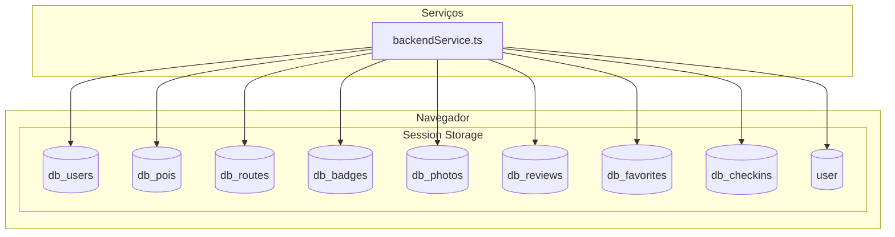
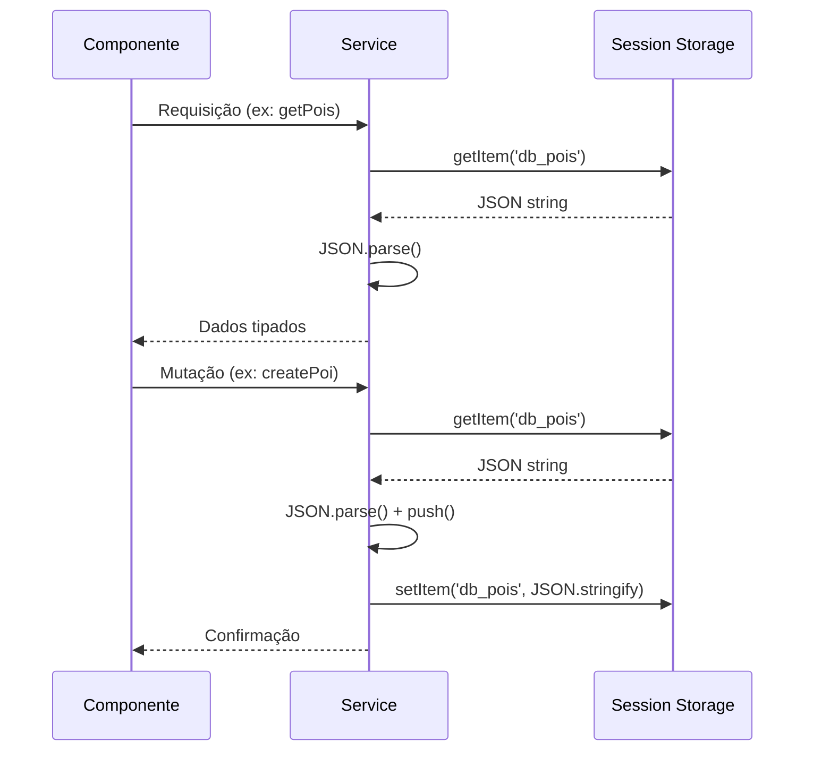
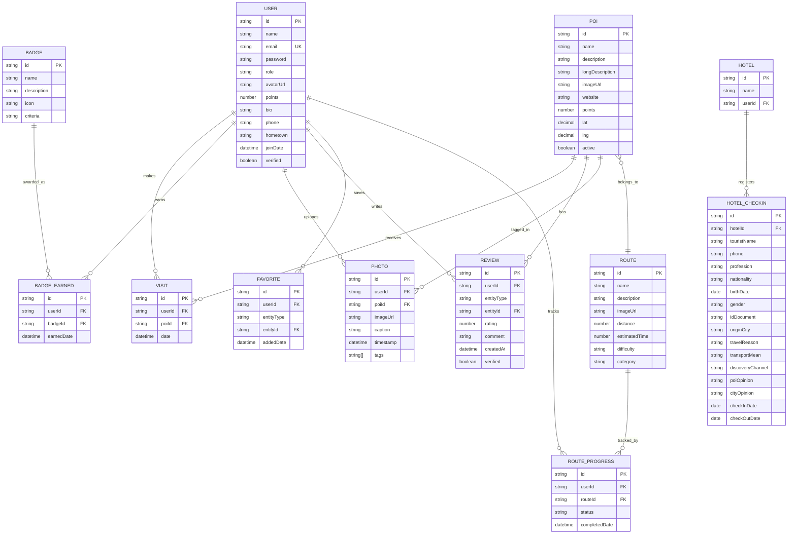
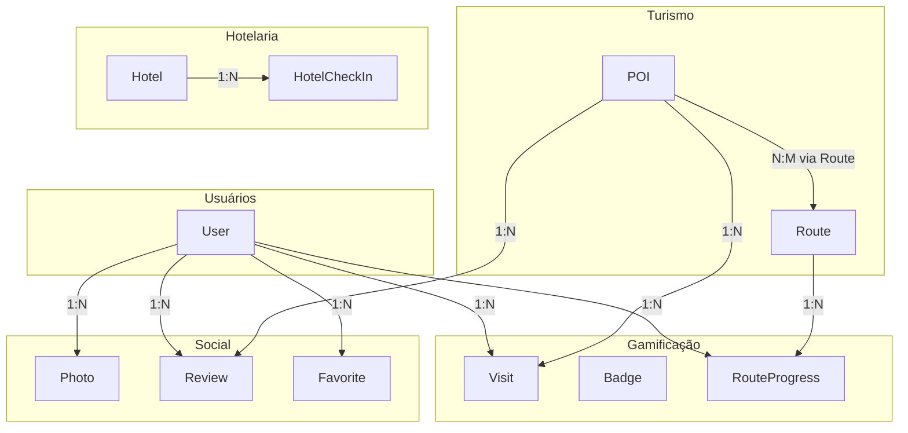

# Design do Banco de Dados

## 📋 Índice

1. [Visão Geral](#visão-geral)
2. [Arquitetura de Dados Atual](#arquitetura-de-dados-atual)
3. [Modelo Entidade-Relacionamento](#modelo-entidade-relacionamento)
4. [Entidades e Atributos](#entidades-e-atributos)
5. [Relacionamentos](#relacionamentos)
6. [Arquitetura de Produção](#arquitetura-de-produção)
7. [Índices e Performance](#índices-e-performance)
8. [Segurança de Dados](#segurança-de-dados)

---

## Visão Geral

### Estado Atual (MVP)

O sistema atualmente utiliza **Session Storage** do navegador como mecanismo de persistência temporária. Esta é uma solução de demonstração que:

- ✅ Permite prototipagem rápida
- ✅ Zero configuração de infraestrutura
- ❌ Não persiste entre sessões
- ❌ Não suporta múltiplos usuários simultâneos
- ❌ Não é adequado para produção

### Estrutura de Armazenamento

```typescript
// Chaves do Session Storage
const STORAGE_KEYS = {
  USERS: 'db_users',           // Usuários do sistema
  POIS: 'db_pois',             // Pontos de interesse
  ROUTES: 'db_routes',         // Rotas turísticas
  BADGES: 'db_badges',         // Badges disponíveis
  PHOTOS: 'db_photos',         // Fotos da galeria
  REVIEWS: 'db_reviews',       // Avaliações
  FAVORITES: 'db_favorites',   // Favoritos
  CHECKINS: 'db_checkins',     // Check-ins de hotel
  CHALLENGES: 'db_challenges', // Desafios
  CURRENT_USER: 'user'         // Usuário logado
};
```

---

## Arquitetura de Dados Atual

### Diagrama de Armazenamento



### Fluxo de Dados



---

## Modelo Entidade-Relacionamento

### Diagrama ER



---

## Entidades e Atributos

### User (Usuário)

```typescript
interface User {
  // Identificação
  id: string;                    // UUID
  name: string;                  // Nome completo
  email: string;                 // Email único
  password?: string;             // Hash (não exposto)
  role: UserRole;                // Papel no sistema

  // Perfil
  avatarUrl: string;             // URL do avatar
  bio?: string;                  // Biografia
  phone?: string;                // Telefone
  birthDate?: string;            // Data de nascimento
  gender?: Gender;               // Gênero
  hometown?: string;             // Cidade de origem

  // Gamificação
  points: number;                // Pontos acumulados
  visited: Visit[];              // Histórico de visitas
  badges: string[];              // IDs dos badges
  routeProgress: RouteProgress[];// Progresso nas rotas

  // Social
  socialMedia?: SocialMedia;     // Links de redes sociais
  followers?: string[];          // IDs de seguidores
  following?: string[];          // IDs que segue

  // Metadados
  joinDate?: string;             // Data de cadastro
  verified?: boolean;            // Conta verificada

  // Privacidade
  privacySettings?: {
    profilePublic: boolean;
    showStats: boolean;
    showVisits: boolean;
    allowMessages: boolean;
  };
}

type UserRole = 'tourist' | 'hotel' | 'restaurant' | 'secretaria';
type Gender = 'Masculino' | 'Feminino' | 'Outro';

interface Visit {
  pointId: string;
  date: string;  // ISO 8601
}

interface RouteProgress {
  routeId: string;
  status: 'in_progress' | 'completed';
  completedDate?: string;
}

interface SocialMedia {
  instagram?: string;
  facebook?: string;
  twitter?: string;
}
```

### PointOfInterest (POI)

```typescript
interface PointOfInterest {
  // Identificação
  id: string;                    // UUID
  name: string;                  // Nome do local

  // Descrição
  description: string;           // Descrição curta
  longDescription: string;       // Descrição detalhada

  // Mídia
  imageUrl: string;              // URL da imagem principal
  website?: string;              // Website oficial

  // Gamificação
  points: number;                // Pontos por check-in

  // Localização
  lat: number;                   // Latitude
  lng: number;                   // Longitude

  // Status
  active?: boolean;              // Ativo/Inativo
}
```

### Route (Rota)

```typescript
interface Route {
  // Identificação
  id: string;                    // UUID
  name: string;                  // Nome da rota

  // Descrição
  description: string;           // Descrição
  imageUrl?: string;             // Imagem de capa

  // POIs
  pointsOfInterest: string[];    // Array de IDs de POIs

  // Métricas
  distance?: number;             // Distância em km
  estimatedTime?: number;        // Tempo em minutos
  difficulty?: Difficulty;       // Nível de dificuldade

  // Categorização
  category?: string;             // Categoria (ex: Natureza, História)
  mapUrl?: string;               // URL do mapa
}

type Difficulty = 'Fácil' | 'Moderado' | 'Difícil';
```

### Badge (Conquista)

```typescript
interface Badge {
  id: string;                    // Identificador único
  name: string;                  // Nome do badge
  description: string;           // Descrição/critério
  icon: string;                  // Nome do ícone (Lucide)

  // Critério de desbloqueio (função ou referência)
  criteria: (visitedIds: Set<string>, allPoiIds?: Set<string>) => boolean;
}
```

### HotelCheckIn (Check-in de Hotel)

```typescript
interface HotelCheckIn {
  // Identificação
  id: string;                    // UUID
  hotelId: string;               // ID do hotel

  // Dados Pessoais
  touristName: string;           // Nome do hóspede
  phone: string;                 // Telefone
  profession: string;            // Profissão
  nationality: string;           // Nacionalidade
  birthDate: string;             // Data de nascimento
  gender: 'Masculino' | 'Feminino';
  idDocument: string;            // Documento de identidade
  originCity: string;            // Cidade de origem

  // Pesquisa Turística
  travelReason: TravelReason;    // Motivo da viagem
  transportMean: TransportMean;  // Meio de transporte
  discoveryChannel: DiscoveryChannel; // Como conheceu

  // Avaliação
  poiOpinion: OpinionScale;      // Opinião sobre POIs
  cityOpinion: OpinionScale;     // Opinião sobre a cidade

  // Período
  checkInDate: string;           // Data de entrada
  checkOutDate: string;          // Data de saída
}

type TravelReason = 'Turismo' | 'Negócio' | 'Convenção' | 'Férias' | 'Outros';
type TransportMean = 'Automóvel' | 'Ônibus' | 'Outros';
type DiscoveryChannel = 'Site' | 'Jornal' | 'TV' | 'Indicação de amigos' | 'Rede Social' | 'Outros';
type OpinionScale = 'Péssimo' | 'Ruim' | 'Boa' | 'Muito boa' | 'Ótima';
```

### Photo (Foto)

```typescript
interface Photo {
  id: string;
  userId: string;
  userName: string;
  userAvatarUrl: string;
  imageUrl: string;
  caption: string;
  location?: string;
  poiId?: string;
  timestamp: string;
  likes: string[];      // IDs dos usuários que curtiram
  tags?: string[];
  category?: string;
}
```

### Review (Avaliação)

```typescript
interface Review {
  id: string;
  userId: string;
  entityType: 'restaurant' | 'poi' | 'hotel';
  entityId: string;
  rating: number;       // 1-5
  comment: string;
  createdAt: string;
  helpful: number;      // Votos positivos
  notHelpful: number;   // Votos negativos
  response?: string;    // Resposta do estabelecimento
  verified: boolean;    // Review verificado
  user?: {
    name: string;
    avatarUrl: string;
  };
}
```

---

## Relacionamentos

### Diagrama de Relacionamentos



### Cardinalidades

| Relacionamento | Cardinalidade | Descrição |
|----------------|---------------|-----------|
| User → Visit | 1:N | Um usuário pode ter muitas visitas |
| User → Badge | N:M | Um usuário pode ter muitos badges |
| User → Photo | 1:N | Um usuário pode ter muitas fotos |
| User → Review | 1:N | Um usuário pode ter muitas avaliações |
| POI → Visit | 1:N | Um POI pode ter muitas visitas |
| POI → Review | 1:N | Um POI pode ter muitas avaliações |
| Route → POI | 1:N | Uma rota contém muitos POIs |
| Hotel → HotelCheckIn | 1:N | Um hotel pode ter muitos check-ins |

---

## Arquitetura de Produção

### Proposta de Banco de Dados

Para produção, recomendamos **PostgreSQL** devido a:

- Suporte a tipos geográficos (PostGIS)
- ACID compliance
- Performance em queries complexas
- Escalabilidade horizontal
- Ecossistema maduro

### Schema PostgreSQL

```sql
-- Extensões
CREATE EXTENSION IF NOT EXISTS "uuid-ossp";
CREATE EXTENSION IF NOT EXISTS "postgis";

-- Enum Types
CREATE TYPE user_role AS ENUM ('tourist', 'hotel', 'restaurant', 'secretaria');
CREATE TYPE gender AS ENUM ('Masculino', 'Feminino', 'Outro');
CREATE TYPE difficulty AS ENUM ('Fácil', 'Moderado', 'Difícil');
CREATE TYPE route_status AS ENUM ('in_progress', 'completed');

-- Users
CREATE TABLE users (
    id UUID PRIMARY KEY DEFAULT uuid_generate_v4(),
    name VARCHAR(255) NOT NULL,
    email VARCHAR(255) UNIQUE NOT NULL,
    password_hash VARCHAR(255) NOT NULL,
    role user_role NOT NULL DEFAULT 'tourist',
    avatar_url TEXT,
    bio TEXT,
    phone VARCHAR(20),
    hometown VARCHAR(100),
    points INTEGER DEFAULT 0,
    verified BOOLEAN DEFAULT FALSE,
    created_at TIMESTAMP WITH TIME ZONE DEFAULT NOW(),
    updated_at TIMESTAMP WITH TIME ZONE DEFAULT NOW()
);

-- Points of Interest
CREATE TABLE pois (
    id UUID PRIMARY KEY DEFAULT uuid_generate_v4(),
    name VARCHAR(255) NOT NULL,
    description TEXT NOT NULL,
    long_description TEXT,
    image_url TEXT NOT NULL,
    website TEXT,
    points INTEGER NOT NULL DEFAULT 20,
    location GEOGRAPHY(POINT, 4326) NOT NULL,
    active BOOLEAN DEFAULT TRUE,
    created_at TIMESTAMP WITH TIME ZONE DEFAULT NOW(),
    updated_at TIMESTAMP WITH TIME ZONE DEFAULT NOW()
);

-- Routes
CREATE TABLE routes (
    id UUID PRIMARY KEY DEFAULT uuid_generate_v4(),
    name VARCHAR(255) NOT NULL,
    description TEXT NOT NULL,
    image_url TEXT,
    distance_km DECIMAL(6, 2),
    estimated_time_min INTEGER,
    difficulty difficulty DEFAULT 'Fácil',
    category VARCHAR(100),
    created_at TIMESTAMP WITH TIME ZONE DEFAULT NOW()
);

-- Route-POI Junction Table
CREATE TABLE route_pois (
    route_id UUID REFERENCES routes(id) ON DELETE CASCADE,
    poi_id UUID REFERENCES pois(id) ON DELETE CASCADE,
    sequence INTEGER NOT NULL,
    PRIMARY KEY (route_id, poi_id)
);

-- Visits (Check-ins)
CREATE TABLE visits (
    id UUID PRIMARY KEY DEFAULT uuid_generate_v4(),
    user_id UUID REFERENCES users(id) ON DELETE CASCADE,
    poi_id UUID REFERENCES pois(id) ON DELETE CASCADE,
    visited_at TIMESTAMP WITH TIME ZONE DEFAULT NOW(),
    points_earned INTEGER NOT NULL,
    UNIQUE(user_id, poi_id)
);

-- Badges
CREATE TABLE badges (
    id VARCHAR(50) PRIMARY KEY,
    name VARCHAR(100) NOT NULL,
    description TEXT NOT NULL,
    icon VARCHAR(50) NOT NULL,
    criteria_type VARCHAR(50) NOT NULL,
    criteria_data JSONB
);

-- User Badges
CREATE TABLE user_badges (
    user_id UUID REFERENCES users(id) ON DELETE CASCADE,
    badge_id VARCHAR(50) REFERENCES badges(id),
    earned_at TIMESTAMP WITH TIME ZONE DEFAULT NOW(),
    PRIMARY KEY (user_id, badge_id)
);

-- Route Progress
CREATE TABLE route_progress (
    id UUID PRIMARY KEY DEFAULT uuid_generate_v4(),
    user_id UUID REFERENCES users(id) ON DELETE CASCADE,
    route_id UUID REFERENCES routes(id) ON DELETE CASCADE,
    status route_status DEFAULT 'in_progress',
    completed_at TIMESTAMP WITH TIME ZONE,
    UNIQUE(user_id, route_id)
);

-- Indexes
CREATE INDEX idx_users_email ON users(email);
CREATE INDEX idx_users_role ON users(role);
CREATE INDEX idx_pois_location ON pois USING GIST(location);
CREATE INDEX idx_visits_user ON visits(user_id);
CREATE INDEX idx_visits_poi ON visits(poi_id);
CREATE INDEX idx_route_progress_user ON route_progress(user_id);
```

---

## Índices e Performance

### Índices Recomendados

| Tabela | Coluna(s) | Tipo | Justificativa |
|--------|-----------|------|---------------|
| users | email | B-tree | Busca por login |
| users | role | B-tree | Filtro por papel |
| users | points | B-tree DESC | Leaderboard |
| pois | location | GiST (PostGIS) | Queries geográficas |
| visits | user_id | B-tree | Histórico do usuário |
| visits | poi_id | B-tree | Estatísticas de POI |
| visits | visited_at | B-tree | Queries temporais |

### Queries Otimizadas

```sql
-- Leaderboard (Top 100)
SELECT id, name, points, avatar_url
FROM users
WHERE role = 'tourist'
ORDER BY points DESC
LIMIT 100;

-- POIs próximos (raio de 5km)
SELECT *
FROM pois
WHERE ST_DWithin(
    location,
    ST_MakePoint(-53.4883, -30.5144)::geography,
    5000  -- metros
)
AND active = TRUE;

-- Badges de um usuário
SELECT b.*
FROM badges b
JOIN user_badges ub ON b.id = ub.badge_id
WHERE ub.user_id = $1;
```

---

## Segurança de Dados

### Criptografia

| Dado | Método | Notas |
|------|--------|-------|
| Senhas | bcrypt (cost 12) | Nunca armazenar em texto plano |
| Tokens | AES-256 | Para refresh tokens |
| PII | AES-256 | Dados pessoais sensíveis |

### Controle de Acesso

```sql
-- Row Level Security (PostgreSQL)
ALTER TABLE visits ENABLE ROW LEVEL SECURITY;

CREATE POLICY visits_user_policy ON visits
    FOR ALL
    USING (user_id = current_user_id());

-- Exemplo de função para obter ID do usuário atual
CREATE OR REPLACE FUNCTION current_user_id()
RETURNS UUID AS $$
    SELECT current_setting('app.current_user_id')::UUID;
$$ LANGUAGE SQL STABLE;
```

### Backup

```yaml
Estratégia de Backup:
  Full Backup:
    Frequência: Diário (01:00 UTC)
    Retenção: 30 dias

  Incremental:
    Frequência: A cada 4 horas
    Retenção: 7 dias

  Transaction Log:
    Frequência: Contínuo (WAL)
    Retenção: 7 dias
```

---

## Referências

- [PostgreSQL Documentation](https://www.postgresql.org/docs/)
- [PostGIS Documentation](https://postgis.net/documentation/)
- [Database Design Best Practices](https://www.vertabelo.com/blog/database-design-best-practices/)

---

```
© 2025 Oryum Tech. Todos os direitos reservados.
Este documento é propriedade exclusiva da Oryum Tech.
Proibida a reprodução, distribuição ou uso sem autorização expressa.
```
