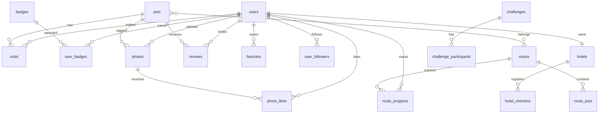

# Schema do Banco de Dados

## 📋 Índice

1. [Schema TypeScript (Atual)](#schema-typescript-atual)
2. [Schema SQL (Produção)](#schema-sql-produção)
3. [Diagrama ER Visual](#diagrama-er-visual)
4. [Dados de Exemplo](#dados-de-exemplo)

---

## Schema TypeScript (Atual)

### types.ts - Definições Completas

```typescript
// ==========================================
// TIPOS BASE
// ==========================================

export type UserRole = 'tourist' | 'hotel' | 'restaurant' | 'secretaria';
export type Gender = 'Masculino' | 'Feminino' | 'Outro';
export type Difficulty = 'Fácil' | 'Moderado' | 'Difícil';
export type RouteStatus = 'in_progress' | 'completed';
export type EntityType = 'restaurant' | 'poi' | 'hotel';

// ==========================================
// USER (USUÁRIO)
// ==========================================

export interface User {
  id: string;
  name: string;
  email: string;
  password?: string;
  role: UserRole;
  avatarUrl: string;
  points: number;
  visited: Visit[];
  badges: string[];
  routeProgress: RouteProgress[];

  // Perfil estendido
  bio?: string;
  phone?: string;
  birthDate?: string;
  gender?: Gender;
  hometown?: string;

  // Redes sociais
  socialMedia?: SocialMedia;

  // Social
  followers?: string[];
  following?: string[];

  // Metadados
  joinDate?: string;
  verified?: boolean;

  // Privacidade
  privacySettings?: PrivacySettings;
}

export interface Visit {
  pointId: string;
  date: string;
}

export interface RouteProgress {
  routeId: string;
  status: RouteStatus;
  completedDate?: string;
}

export interface SocialMedia {
  instagram?: string;
  facebook?: string;
  twitter?: string;
}

export interface PrivacySettings {
  profilePublic: boolean;
  showStats: boolean;
  showVisits: boolean;
  allowMessages: boolean;
}

// ==========================================
// POI (PONTO DE INTERESSE)
// ==========================================

export interface PointOfInterest {
  id: string;
  name: string;
  description: string;
  longDescription: string;
  imageUrl: string;
  website?: string;
  points: number;
  lat: number;
  lng: number;
  active?: boolean;
}

// ==========================================
// ROUTE (ROTA)
// ==========================================

export interface Route {
  id: string;
  name: string;
  description: string;
  pointsOfInterest: string[];
  imageUrl?: string;
  distance?: number;
  estimatedTime?: number;
  difficulty?: Difficulty;
  category?: string;
  mapUrl?: string;
}

// ==========================================
// BADGE (CONQUISTA)
// ==========================================

export interface Badge {
  id: string;
  name: string;
  description: string;
  icon: string;
  criteria: (visitedIds: Set<string>, allPoiIds?: Set<string>) => boolean;
}

// Versão serializável para storage
export interface BadgeData {
  id: string;
  name: string;
  description: string;
  icon: string;
  criteriaType: 'pois_list' | 'count' | 'all';
  criteriaData?: string[] | number;
}

// ==========================================
// PHOTO (FOTO)
// ==========================================

export interface Photo {
  id: string;
  userId: string;
  userName: string;
  userAvatarUrl: string;
  imageUrl: string;
  caption: string;
  location?: string;
  poiId?: string;
  timestamp: string;
  likes: string[];
  tags?: string[];
  category?: string;
}

// ==========================================
// REVIEW (AVALIAÇÃO)
// ==========================================

export interface Review {
  id: string;
  userId: string;
  entityType: EntityType;
  entityId: string;
  rating: number;
  comment: string;
  createdAt: string;
  helpful: number;
  notHelpful: number;
  response?: string;
  verified: boolean;
  user?: {
    name: string;
    avatarUrl: string;
  };
}

// ==========================================
// FAVORITE (FAVORITO)
// ==========================================

export interface Favorite {
  id: string;
  userId: string;
  entityType: EntityType;
  entityId: string;
  addedDate: string;
}

// ==========================================
// HOTEL CHECK-IN
// ==========================================

export interface HotelCheckIn {
  id: string;
  hotelId: string;

  // Dados pessoais
  touristName: string;
  phone: string;
  profession: string;
  nationality: string;
  birthDate: string;
  gender: 'Masculino' | 'Feminino';
  idDocument: string;
  originCity: string;

  // Pesquisa turística
  travelReason: TravelReason;
  transportMean: TransportMean;
  discoveryChannel: DiscoveryChannel;
  poiOpinion: OpinionScale;
  cityOpinion: OpinionScale;

  // Período
  checkInDate: string;
  checkOutDate: string;
}

export type TravelReason =
  | 'Turismo'
  | 'Negócio'
  | 'Convenção'
  | 'Férias'
  | 'Outros';

export type TransportMean =
  | 'Automóvel'
  | 'Ônibus'
  | 'Outros';

export type DiscoveryChannel =
  | 'Site'
  | 'Jornal'
  | 'TV'
  | 'Indicação de amigos'
  | 'Rede Social'
  | 'Outros';

export type OpinionScale =
  | 'Péssimo'
  | 'Ruim'
  | 'Boa'
  | 'Muito boa'
  | 'Ótima';

// ==========================================
// CHALLENGE (DESAFIO)
// ==========================================

export interface Challenge {
  id: string;
  name: string;
  description: string;
  startDate: string;
  endDate: string;
  type: 'checkin' | 'photo' | 'route';
  target: number;
  reward: number;
  participants?: string[];
  completedBy?: string[];
}

// ==========================================
// ANALYTICS
// ==========================================

export interface AdminStats {
  totalTourists: number;
  totalCheckIns: number;
  totalPois: number;
  totalRoutes: number;
  averagePointsPerUser: number;
  mostVisitedPois: Array<{
    id: string;
    name: string;
    visits: number;
  }>;
  recentActivity: Activity[];
}

export interface Activity {
  id: string;
  type: 'checkin' | 'badge' | 'route_complete';
  userId: string;
  userName: string;
  targetId: string;
  targetName: string;
  timestamp: string;
}
```

---

## Schema SQL (Produção)

### Script Completo de Criação

```sql
-- ==========================================
-- VISITE CAÇAPAVA - DATABASE SCHEMA
-- PostgreSQL 15+ with PostGIS
-- ==========================================

-- Extensões necessárias
CREATE EXTENSION IF NOT EXISTS "uuid-ossp";
CREATE EXTENSION IF NOT EXISTS "postgis";
CREATE EXTENSION IF NOT EXISTS "pgcrypto";

-- ==========================================
-- TIPOS ENUM
-- ==========================================

CREATE TYPE user_role AS ENUM (
    'tourist',
    'hotel',
    'restaurant',
    'secretaria'
);

CREATE TYPE gender AS ENUM (
    'Masculino',
    'Feminino',
    'Outro'
);

CREATE TYPE difficulty AS ENUM (
    'Fácil',
    'Moderado',
    'Difícil'
);

CREATE TYPE route_status AS ENUM (
    'in_progress',
    'completed'
);

CREATE TYPE entity_type AS ENUM (
    'restaurant',
    'poi',
    'hotel'
);

CREATE TYPE travel_reason AS ENUM (
    'Turismo',
    'Negócio',
    'Convenção',
    'Férias',
    'Outros'
);

CREATE TYPE transport_mean AS ENUM (
    'Automóvel',
    'Ônibus',
    'Outros'
);

CREATE TYPE discovery_channel AS ENUM (
    'Site',
    'Jornal',
    'TV',
    'Indicação de amigos',
    'Rede Social',
    'Outros'
);

CREATE TYPE opinion_scale AS ENUM (
    'Péssimo',
    'Ruim',
    'Boa',
    'Muito boa',
    'Ótima'
);

CREATE TYPE challenge_type AS ENUM (
    'checkin',
    'photo',
    'route'
);

-- ==========================================
-- TABELA: users
-- ==========================================

CREATE TABLE users (
    id UUID PRIMARY KEY DEFAULT uuid_generate_v4(),
    name VARCHAR(255) NOT NULL,
    email VARCHAR(255) UNIQUE NOT NULL,
    password_hash VARCHAR(255) NOT NULL,
    role user_role NOT NULL DEFAULT 'tourist',

    -- Perfil
    avatar_url TEXT DEFAULT '/img/default-avatar.png',
    bio TEXT,
    phone VARCHAR(20),
    birth_date DATE,
    gender gender,
    hometown VARCHAR(100),

    -- Gamificação
    points INTEGER NOT NULL DEFAULT 0,

    -- Social Media (JSONB)
    social_media JSONB DEFAULT '{}',

    -- Privacy Settings (JSONB)
    privacy_settings JSONB DEFAULT '{
        "profilePublic": true,
        "showStats": true,
        "showVisits": true,
        "allowMessages": true
    }',

    -- Metadados
    verified BOOLEAN DEFAULT FALSE,
    created_at TIMESTAMP WITH TIME ZONE DEFAULT NOW(),
    updated_at TIMESTAMP WITH TIME ZONE DEFAULT NOW(),

    -- Constraints
    CONSTRAINT email_format CHECK (email ~* '^[A-Za-z0-9._%+-]+@[A-Za-z0-9.-]+\.[A-Za-z]{2,}$'),
    CONSTRAINT points_non_negative CHECK (points >= 0)
);

-- ==========================================
-- TABELA: pois (Points of Interest)
-- ==========================================

CREATE TABLE pois (
    id UUID PRIMARY KEY DEFAULT uuid_generate_v4(),
    name VARCHAR(255) NOT NULL,
    description TEXT NOT NULL,
    long_description TEXT,
    image_url TEXT NOT NULL,
    website TEXT,
    points INTEGER NOT NULL DEFAULT 20,
    location GEOGRAPHY(POINT, 4326) NOT NULL,
    active BOOLEAN DEFAULT TRUE,
    created_at TIMESTAMP WITH TIME ZONE DEFAULT NOW(),
    updated_at TIMESTAMP WITH TIME ZONE DEFAULT NOW(),

    -- Constraints
    CONSTRAINT points_positive CHECK (points > 0)
);

-- ==========================================
-- TABELA: routes
-- ==========================================

CREATE TABLE routes (
    id UUID PRIMARY KEY DEFAULT uuid_generate_v4(),
    name VARCHAR(255) NOT NULL,
    description TEXT NOT NULL,
    image_url TEXT,
    distance_km DECIMAL(6, 2),
    estimated_time_min INTEGER,
    difficulty difficulty DEFAULT 'Fácil',
    category VARCHAR(100),
    map_url TEXT,
    created_at TIMESTAMP WITH TIME ZONE DEFAULT NOW(),
    updated_at TIMESTAMP WITH TIME ZONE DEFAULT NOW()
);

-- ==========================================
-- TABELA: route_pois (Junction Table)
-- ==========================================

CREATE TABLE route_pois (
    route_id UUID REFERENCES routes(id) ON DELETE CASCADE,
    poi_id UUID REFERENCES pois(id) ON DELETE CASCADE,
    sequence INTEGER NOT NULL,
    PRIMARY KEY (route_id, poi_id)
);

-- ==========================================
-- TABELA: badges
-- ==========================================

CREATE TABLE badges (
    id VARCHAR(50) PRIMARY KEY,
    name VARCHAR(100) NOT NULL,
    description TEXT NOT NULL,
    icon VARCHAR(50) NOT NULL,
    criteria_type VARCHAR(50) NOT NULL,
    criteria_data JSONB,
    created_at TIMESTAMP WITH TIME ZONE DEFAULT NOW()
);

-- ==========================================
-- TABELA: visits (Check-ins)
-- ==========================================

CREATE TABLE visits (
    id UUID PRIMARY KEY DEFAULT uuid_generate_v4(),
    user_id UUID NOT NULL REFERENCES users(id) ON DELETE CASCADE,
    poi_id UUID NOT NULL REFERENCES pois(id) ON DELETE CASCADE,
    points_earned INTEGER NOT NULL,
    visited_at TIMESTAMP WITH TIME ZONE DEFAULT NOW(),

    -- Constraint: um usuário só pode fazer um check-in por POI
    CONSTRAINT unique_user_poi UNIQUE (user_id, poi_id)
);

-- ==========================================
-- TABELA: user_badges
-- ==========================================

CREATE TABLE user_badges (
    user_id UUID REFERENCES users(id) ON DELETE CASCADE,
    badge_id VARCHAR(50) REFERENCES badges(id) ON DELETE CASCADE,
    earned_at TIMESTAMP WITH TIME ZONE DEFAULT NOW(),
    PRIMARY KEY (user_id, badge_id)
);

-- ==========================================
-- TABELA: route_progress
-- ==========================================

CREATE TABLE route_progress (
    id UUID PRIMARY KEY DEFAULT uuid_generate_v4(),
    user_id UUID NOT NULL REFERENCES users(id) ON DELETE CASCADE,
    route_id UUID NOT NULL REFERENCES routes(id) ON DELETE CASCADE,
    status route_status DEFAULT 'in_progress',
    completed_at TIMESTAMP WITH TIME ZONE,
    created_at TIMESTAMP WITH TIME ZONE DEFAULT NOW(),

    CONSTRAINT unique_user_route UNIQUE (user_id, route_id)
);

-- ==========================================
-- TABELA: photos
-- ==========================================

CREATE TABLE photos (
    id UUID PRIMARY KEY DEFAULT uuid_generate_v4(),
    user_id UUID NOT NULL REFERENCES users(id) ON DELETE CASCADE,
    poi_id UUID REFERENCES pois(id) ON DELETE SET NULL,
    image_url TEXT NOT NULL,
    caption TEXT,
    location VARCHAR(255),
    tags TEXT[],
    category VARCHAR(50),
    created_at TIMESTAMP WITH TIME ZONE DEFAULT NOW()
);

-- ==========================================
-- TABELA: photo_likes
-- ==========================================

CREATE TABLE photo_likes (
    photo_id UUID REFERENCES photos(id) ON DELETE CASCADE,
    user_id UUID REFERENCES users(id) ON DELETE CASCADE,
    liked_at TIMESTAMP WITH TIME ZONE DEFAULT NOW(),
    PRIMARY KEY (photo_id, user_id)
);

-- ==========================================
-- TABELA: reviews
-- ==========================================

CREATE TABLE reviews (
    id UUID PRIMARY KEY DEFAULT uuid_generate_v4(),
    user_id UUID NOT NULL REFERENCES users(id) ON DELETE CASCADE,
    entity_type entity_type NOT NULL,
    entity_id UUID NOT NULL,
    rating INTEGER NOT NULL,
    comment TEXT NOT NULL,
    helpful INTEGER DEFAULT 0,
    not_helpful INTEGER DEFAULT 0,
    response TEXT,
    verified BOOLEAN DEFAULT FALSE,
    created_at TIMESTAMP WITH TIME ZONE DEFAULT NOW(),
    updated_at TIMESTAMP WITH TIME ZONE DEFAULT NOW(),

    CONSTRAINT rating_range CHECK (rating >= 1 AND rating <= 5),
    CONSTRAINT unique_user_entity_review UNIQUE (user_id, entity_type, entity_id)
);

-- ==========================================
-- TABELA: favorites
-- ==========================================

CREATE TABLE favorites (
    id UUID PRIMARY KEY DEFAULT uuid_generate_v4(),
    user_id UUID NOT NULL REFERENCES users(id) ON DELETE CASCADE,
    entity_type entity_type NOT NULL,
    entity_id UUID NOT NULL,
    added_at TIMESTAMP WITH TIME ZONE DEFAULT NOW(),

    CONSTRAINT unique_user_favorite UNIQUE (user_id, entity_type, entity_id)
);

-- ==========================================
-- TABELA: hotels
-- ==========================================

CREATE TABLE hotels (
    id UUID PRIMARY KEY DEFAULT uuid_generate_v4(),
    user_id UUID NOT NULL REFERENCES users(id) ON DELETE CASCADE,
    name VARCHAR(255) NOT NULL,
    address TEXT,
    phone VARCHAR(20),
    created_at TIMESTAMP WITH TIME ZONE DEFAULT NOW()
);

-- ==========================================
-- TABELA: hotel_checkins
-- ==========================================

CREATE TABLE hotel_checkins (
    id UUID PRIMARY KEY DEFAULT uuid_generate_v4(),
    hotel_id UUID NOT NULL REFERENCES hotels(id) ON DELETE CASCADE,

    -- Dados pessoais
    tourist_name VARCHAR(255) NOT NULL,
    phone VARCHAR(20) NOT NULL,
    profession VARCHAR(100),
    nationality VARCHAR(100) NOT NULL,
    birth_date DATE NOT NULL,
    gender gender NOT NULL,
    id_document VARCHAR(50) NOT NULL,
    origin_city VARCHAR(100) NOT NULL,

    -- Pesquisa turística
    travel_reason travel_reason NOT NULL,
    transport_mean transport_mean NOT NULL,
    discovery_channel discovery_channel NOT NULL,
    poi_opinion opinion_scale,
    city_opinion opinion_scale,

    -- Período
    check_in_date DATE NOT NULL,
    check_out_date DATE NOT NULL,

    created_at TIMESTAMP WITH TIME ZONE DEFAULT NOW(),

    CONSTRAINT valid_dates CHECK (check_out_date >= check_in_date)
);

-- ==========================================
-- TABELA: challenges
-- ==========================================

CREATE TABLE challenges (
    id UUID PRIMARY KEY DEFAULT uuid_generate_v4(),
    name VARCHAR(255) NOT NULL,
    description TEXT NOT NULL,
    start_date DATE NOT NULL,
    end_date DATE NOT NULL,
    type challenge_type NOT NULL,
    target INTEGER NOT NULL,
    reward INTEGER NOT NULL,
    created_at TIMESTAMP WITH TIME ZONE DEFAULT NOW(),

    CONSTRAINT valid_challenge_dates CHECK (end_date >= start_date)
);

-- ==========================================
-- TABELA: challenge_participants
-- ==========================================

CREATE TABLE challenge_participants (
    challenge_id UUID REFERENCES challenges(id) ON DELETE CASCADE,
    user_id UUID REFERENCES users(id) ON DELETE CASCADE,
    progress INTEGER DEFAULT 0,
    completed BOOLEAN DEFAULT FALSE,
    completed_at TIMESTAMP WITH TIME ZONE,
    joined_at TIMESTAMP WITH TIME ZONE DEFAULT NOW(),
    PRIMARY KEY (challenge_id, user_id)
);

-- ==========================================
-- TABELA: user_followers (Self-referencing)
-- ==========================================

CREATE TABLE user_followers (
    follower_id UUID REFERENCES users(id) ON DELETE CASCADE,
    following_id UUID REFERENCES users(id) ON DELETE CASCADE,
    followed_at TIMESTAMP WITH TIME ZONE DEFAULT NOW(),
    PRIMARY KEY (follower_id, following_id),

    CONSTRAINT no_self_follow CHECK (follower_id != following_id)
);

-- ==========================================
-- ÍNDICES
-- ==========================================

-- Users
CREATE INDEX idx_users_email ON users(email);
CREATE INDEX idx_users_role ON users(role);
CREATE INDEX idx_users_points ON users(points DESC);

-- POIs
CREATE INDEX idx_pois_location ON pois USING GIST(location);
CREATE INDEX idx_pois_active ON pois(active) WHERE active = TRUE;

-- Visits
CREATE INDEX idx_visits_user ON visits(user_id);
CREATE INDEX idx_visits_poi ON visits(poi_id);
CREATE INDEX idx_visits_date ON visits(visited_at DESC);

-- Reviews
CREATE INDEX idx_reviews_entity ON reviews(entity_type, entity_id);
CREATE INDEX idx_reviews_user ON reviews(user_id);

-- Photos
CREATE INDEX idx_photos_user ON photos(user_id);
CREATE INDEX idx_photos_poi ON photos(poi_id);
CREATE INDEX idx_photos_date ON photos(created_at DESC);

-- Hotel Checkins
CREATE INDEX idx_hotel_checkins_hotel ON hotel_checkins(hotel_id);
CREATE INDEX idx_hotel_checkins_date ON hotel_checkins(check_in_date DESC);

-- ==========================================
-- TRIGGERS
-- ==========================================

-- Atualizar updated_at automaticamente
CREATE OR REPLACE FUNCTION update_updated_at()
RETURNS TRIGGER AS $$
BEGIN
    NEW.updated_at = NOW();
    RETURN NEW;
END;
$$ LANGUAGE plpgsql;

CREATE TRIGGER tr_users_updated_at
    BEFORE UPDATE ON users
    FOR EACH ROW
    EXECUTE FUNCTION update_updated_at();

CREATE TRIGGER tr_pois_updated_at
    BEFORE UPDATE ON pois
    FOR EACH ROW
    EXECUTE FUNCTION update_updated_at();

CREATE TRIGGER tr_routes_updated_at
    BEFORE UPDATE ON routes
    FOR EACH ROW
    EXECUTE FUNCTION update_updated_at();

-- Atualizar pontos do usuário após check-in
CREATE OR REPLACE FUNCTION update_user_points()
RETURNS TRIGGER AS $$
BEGIN
    UPDATE users
    SET points = points + NEW.points_earned
    WHERE id = NEW.user_id;
    RETURN NEW;
END;
$$ LANGUAGE plpgsql;

CREATE TRIGGER tr_visits_update_points
    AFTER INSERT ON visits
    FOR EACH ROW
    EXECUTE FUNCTION update_user_points();

-- ==========================================
-- VIEWS
-- ==========================================

-- View: Leaderboard
CREATE VIEW leaderboard AS
SELECT
    id,
    name,
    avatar_url,
    points,
    (SELECT COUNT(*) FROM visits WHERE user_id = u.id) as total_visits,
    (SELECT COUNT(*) FROM user_badges WHERE user_id = u.id) as total_badges,
    RANK() OVER (ORDER BY points DESC) as rank
FROM users u
WHERE role = 'tourist'
ORDER BY points DESC;

-- View: POI Statistics
CREATE VIEW poi_statistics AS
SELECT
    p.id,
    p.name,
    COUNT(v.id) as total_visits,
    AVG(r.rating) as average_rating,
    COUNT(r.id) as review_count
FROM pois p
LEFT JOIN visits v ON p.id = v.poi_id
LEFT JOIN reviews r ON p.id = r.entity_id AND r.entity_type = 'poi'
GROUP BY p.id, p.name;
```

---

## Diagrama ER Visual



---

## Dados de Exemplo

### Seed de Badges

```sql
INSERT INTO badges (id, name, description, icon, criteria_type, criteria_data) VALUES
('pioneiro', 'Pioneiro Caçapavano', 'Faça seu primeiro check-in em Caçapava do Sul', 'flag', 'count', '{"min": 1}'),
('explorador_natureza', 'Explorador da Natureza', 'Visite todos os pontos da rota Belezas Naturais', 'mountain', 'pois_list', '["pedra-segredo", "guaritas", "cascata-salso"]'),
('historiador', 'Historiador de Caçapava', 'Visite todos os pontos históricos', 'book', 'pois_list', '["forte-dom-pedro", "museu-lanceiros", "igreja-matriz"]'),
('mestre_desbravador', 'Mestre Desbravador', 'Visite todos os pontos turísticos autênticos', 'crown', 'all', NULL),
('guardiao_patrimonio', 'Guardião do Patrimônio', 'Visite o Forte Dom Pedro II e o Museu Militar', 'shield', 'pois_list', '["forte-dom-pedro", "museu-lanceiros"]'),
('explorador_pedra', 'Explorador da Pedra do Segredo', 'Visite a Pedra do Segredo e o Parque Natural', 'gem', 'pois_list', '["pedra-segredo"]'),
('descobridor_geoparques', 'Descobridor de Geoparques', 'Visite as Minas do Camaquã e o Parque das Guaritas', 'map', 'pois_list', '["minas-camaqua", "guaritas"]'),
('conhecedor_cultural', 'Conhecedor Cultural', 'Complete a rota de Diversidade Cultural', 'palette', 'pois_list', '["igreja-matriz", "museu-lanceiros"]');
```

### Seed de POIs

```sql
INSERT INTO pois (id, name, description, long_description, image_url, points, location) VALUES
('forte-dom-pedro', 'Forte Dom Pedro II', 'Fortificação histórica do século XIX', 'O Forte Dom Pedro II é uma fortificação militar construída no século XIX...', '/img/pontos_turisticos/forte.jpg', 25, ST_MakePoint(-53.4883, -30.5144)::geography),
('pedra-segredo', 'Pedra do Segredo', 'Formação rochosa de 120m de altura', 'A Pedra do Segredo é uma impressionante formação rochosa...', '/img/pontos_turisticos/pedra-segredo.jpg', 35, ST_MakePoint(-53.4913, -30.5694)::geography),
('minas-camaqua', 'Minas do Camaquã', 'Complexo de mineração histórico', 'As Minas do Camaquã representam um importante patrimônio...', '/img/pontos_turisticos/minas.jpg', 35, ST_MakePoint(-53.7664, -30.7303)::geography),
('guaritas', 'Parque das Guaritas', 'Formações rochosas únicas do Geoparque', 'O Parque das Guaritas é um dos principais atrativos...', '/img/pontos_turisticos/guaritas.jpg', 40, ST_MakePoint(-53.4682, -30.7397)::geography);
```

---

```
© 2025 Oryum Tech. Todos os direitos reservados.
Este documento é propriedade exclusiva da Oryum Tech.
Proibida a reprodução, distribuição ou uso sem autorização expressa.
```
