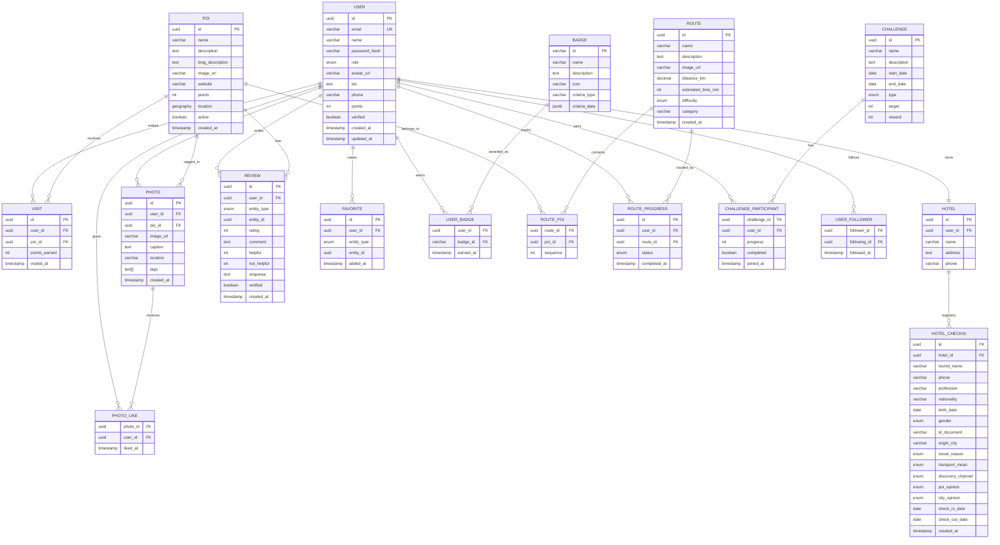

# Diagrama Entidade-Relacionamento

## Visão Geral



## Legenda

### Tipos de Dados

| Tipo | Descrição |
|------|-----------|
| `uuid` | Identificador único universal |
| `varchar` | Texto de tamanho variável |
| `text` | Texto longo |
| `int` | Número inteiro |
| `decimal` | Número decimal |
| `boolean` | Verdadeiro/Falso |
| `date` | Data sem hora |
| `timestamp` | Data e hora com timezone |
| `enum` | Valor de conjunto predefinido |
| `jsonb` | JSON binário |
| `geography` | Tipo geográfico (PostGIS) |
| `text[]` | Array de texto |

### Cardinalidades

| Símbolo | Significado |
|---------|-------------|
| `\|\|--o{` | Um para muitos |
| `\|\|--\|\|` | Um para um |
| `}o--o{` | Muitos para muitos |

### Constraints

| Abreviação | Significado |
|------------|-------------|
| `PK` | Primary Key |
| `FK` | Foreign Key |
| `UK` | Unique Key |

---

```
© 2025 Oryum Tech. Todos os direitos reservados.
```
