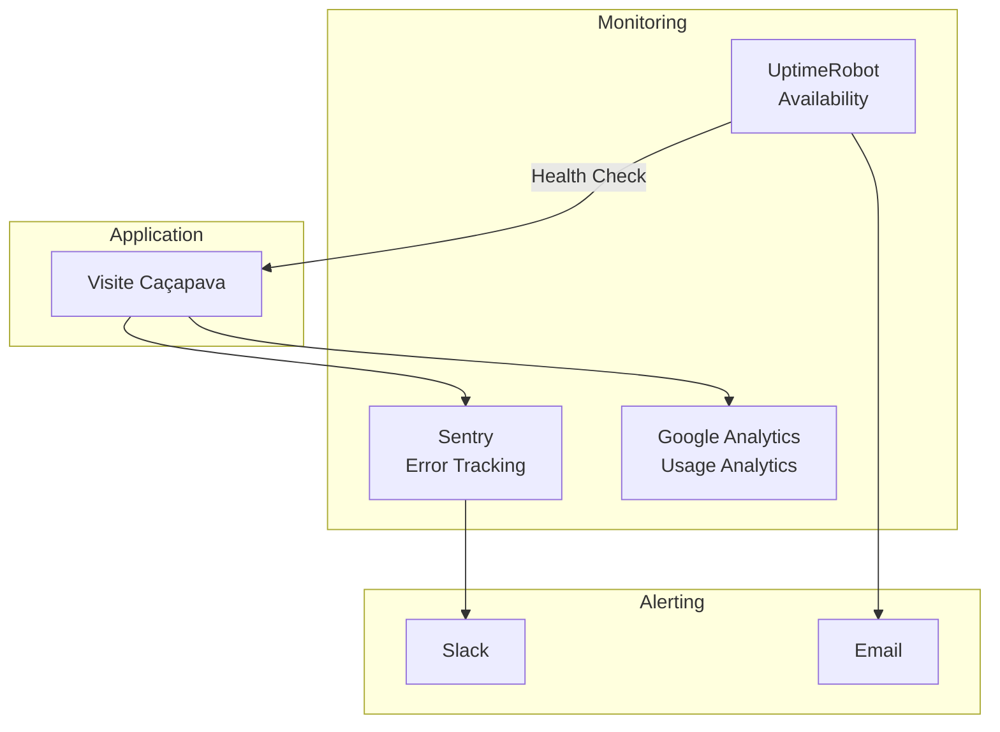

# Monitoramento e Alertas

## Ferramentas Atuais

### Vercel Analytics

- **Tipo**: Real User Monitoring (RUM)
- **Métricas**: Page views, visitors, performance
- **Acesso**: Dashboard da Vercel

### Web Vitals

| Métrica | Bom | Precisa Melhorar | Ruim |
|---------|-----|------------------|------|
| LCP | < 2.5s | 2.5s - 4s | > 4s |
| FID | < 100ms | 100ms - 300ms | > 300ms |
| CLS | < 0.1 | 0.1 - 0.25 | > 0.25 |

## Monitoramento Planejado

### Stack de Produção



## Alertas

### Configuração de Alertas

| Condição | Severidade | Canal | Tempo de Resposta |
|----------|------------|-------|-------------------|
| Site down | Crítico | Slack + Email + SMS | 15 min |
| Error rate > 5% | Alto | Slack + Email | 1 hora |
| Performance degradada | Médio | Slack | 4 horas |
| API de IA indisponível | Médio | Slack | 4 horas |

### Exemplo UptimeRobot

```yaml
Monitor:
  Name: Visite Caçapava - Production
  URL: https://visitecacapava.vercel.app
  Interval: 5 minutes
  Alert Contacts:
    - Slack Webhook
    - Email: devops@oryumtech.com.br
```

## Logs

### Vercel Logs

```bash
# Via CLI
vercel logs [deployment-url]

# Filtrar por tipo
vercel logs --filter="error"
```

### Estrutura de Logs (Produção)

```json
{
  "timestamp": "2025-11-26T10:30:00.000Z",
  "level": "error",
  "service": "api",
  "message": "Check-in failed",
  "context": {
    "userId": "user-123",
    "poiId": "poi-456",
    "error": "GEO_002"
  }
}
```

## Dashboard

### Métricas Chave

| Métrica | Fonte | Frequência |
|---------|-------|------------|
| Uptime | UptimeRobot | Real-time |
| Error rate | Sentry | Real-time |
| Page views | Analytics | Diário |
| Check-ins | Database | Diário |
| API response time | APM | Real-time |

---

```
© 2025 Oryum Tech. Todos os direitos reservados.
```
