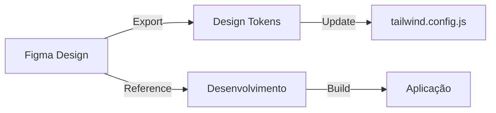

# Integração com Figma

## Visão Geral

O design do Visite Caçapava é gerenciado no Figma, com integração ao código via design tokens.

## Estrutura do Figma

```
Visite Caçapava
├── 📁 Foundations
│   ├── Colors
│   ├── Typography
│   ├── Spacing
│   └── Shadows
│
├── 📁 Components
│   ├── Buttons
│   ├── Cards
│   ├── Forms
│   ├── Navigation
│   └── Modals
│
├── 📁 Pages
│   ├── Tourist
│   ├── Admin
│   ├── Hotel
│   └── Restaurant
│
└── 📁 Assets
    ├── Icons
    ├── Illustrations
    └── Photos
```

## Design Tokens

### Cores (do Figma)

```javascript
// tailwind.config.js
colors: {
  'brand-dark-green': '#00331E',   // Primary Dark
  'brand-green': '#02A343',         // Primary
  'brand-light-green': '#6CBC3A',   // Secondary
  'brand-beige': '#FDF4D9',         // Background
  'brand-red': '#D92525',           // Error/Alert
}
```

### Tipografia

```javascript
fontFamily: {
  sans: ['Inter', 'system-ui', 'sans-serif'],
  display: ['Staatliches', 'sans-serif'],
}
```

### Espaçamento

Utilizamos a escala padrão do Tailwind CSS:
- `p-1` = 4px
- `p-2` = 8px
- `p-4` = 16px
- `p-6` = 24px
- `p-8` = 32px

## Fluxo de Design para Código



## Acesso ao Figma

| Recurso | Link |
|---------|------|
| Design System | [Figma Link - Solicitar acesso] |
| Protótipo | [Figma Link - Solicitar acesso] |
| Assets | [Figma Link - Solicitar acesso] |

## Convenções

### Nomenclatura de Componentes

| Figma | Código |
|-------|--------|
| Button / Primary | `<Button variant="primary" />` |
| Card / POI | `<POICard />` |
| Input / Text | `<input type="text" />` |

### Estados de Componentes

- Default
- Hover
- Active
- Disabled
- Focus
- Error

---

```
© 2025 Oryum Tech. Todos os direitos reservados.
```
