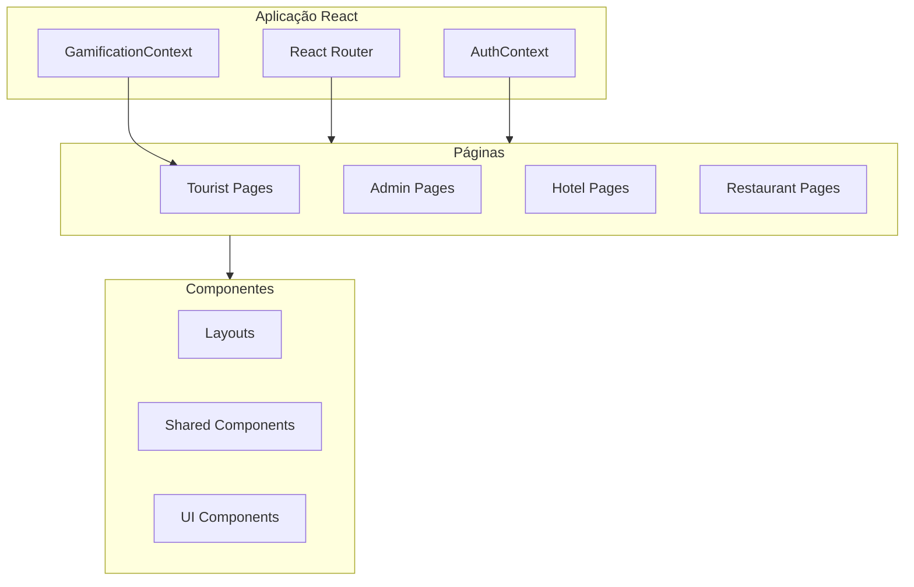

# Visão Geral do Frontend

## 📋 Índice

1. [Arquitetura](#arquitetura)
2. [Stack Tecnológica](#stack-tecnológica)
3. [Estrutura de Componentes](#estrutura-de-componentes)
4. [Roteamento](#roteamento)
5. [Estado Global](#estado-global)

---

## Arquitetura

O Visite Caçapava é uma **Single Page Application (SPA)** construída com React 18 e TypeScript, seguindo padrões modernos de desenvolvimento frontend.



---

## Stack Tecnológica

| Tecnologia | Versão | Uso |
|------------|--------|-----|
| React | 18.2 | Framework UI |
| TypeScript | 5.8 | Tipagem |
| Vite | 6.2 | Build tool |
| Tailwind CSS | 3.4 | Estilização |
| React Router | 6.25 | Roteamento |
| Leaflet | 1.9 | Mapas |
| Chart.js | 4.4 | Gráficos |
| Lucide React | 0.540 | Ícones |

---

## Estrutura de Componentes

### Hierarquia

```
App
├── LoginPage (público)
└── ProtectedRoute
    ├── TouristLayout
    │   └── [Tourist Pages]
    ├── AdminLayout
    │   └── [Admin Pages]
    ├── HotelLayout
    │   └── [Hotel Pages]
    └── RestaurantLayout
        └── [Restaurant Pages]
```

### Componentes por Categoria

**Layouts**: Containers com navegação específica por papel
**Pages**: Páginas completas com lógica de negócio
**Shared**: Componentes reutilizáveis
**UI**: Componentes de interface básicos

---

## Roteamento

### Rotas por Papel

| Papel | Base Path | Exemplo |
|-------|-----------|---------|
| Turista | `/` | `/profile`, `/map` |
| Admin | `/admin` | `/admin/pois`, `/admin/analytics` |
| Hotel | `/hotel` | `/hotel/checkin` |
| Restaurante | `/restaurant` | `/restaurant/reviews` |

### Proteção de Rotas

```tsx
<Route element={<ProtectedRoute allowedRoles={['tourist']} />}>
  <Route element={<TouristLayout />}>
    <Route path="/" element={<HomePage />} />
  </Route>
</Route>
```

---

## Estado Global

### AuthContext

```typescript
interface AuthContextType {
  user: User | null;
  isAuthenticated: boolean;
  login: (email, password) => Promise<LoginResult>;
  logout: () => void;
}
```

### GamificationContext

```typescript
interface GamificationContextType {
  currentUser: User | null;
  checkIn: (poiId) => Promise<CheckInResult>;
  getVisitedIds: () => Set<string>;
  updateUserProfile: (name, avatarUrl) => Promise<User>;
}
```

---

```
© 2025 Oryum Tech. Todos os direitos reservados.
```
