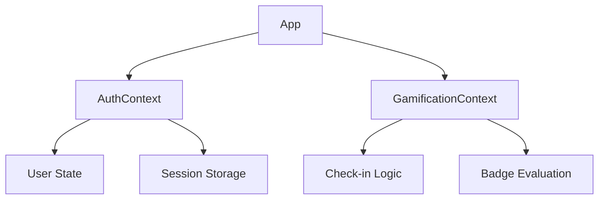

# Gerenciamento de Estado

## Estratégia

O Visite Caçapava utiliza **React Context API** para gerenciamento de estado global, dividido em dois contextos principais:



---

## AuthContext

### Responsabilidades

- Gerenciar estado do usuário logado
- Processar login/logout
- Persistir sessão no Session Storage
- Fornecer informações de autenticação

### Interface

```typescript
interface AuthContextType {
  user: User | null;
  isAuthenticated: boolean;
  isLoading: boolean;
  login: (email: string, password: string) => Promise<LoginResult>;
  logout: () => void;
}

interface LoginResult {
  success: boolean;
  role?: UserRole;
  error?: string;
}
```

### Uso

```tsx
import { useAuth } from '@/context/AuthContext';

function MyComponent() {
  const { user, isAuthenticated, login, logout } = useAuth();

  if (!isAuthenticated) {
    return <LoginPrompt />;
  }

  return <Dashboard user={user} />;
}
```

---

## GamificationContext

### Responsabilidades

- Gerenciar dados de gamificação do turista
- Processar check-ins em POIs
- Avaliar e desbloquear badges
- Atualizar pontos e visitas

### Interface

```typescript
interface GamificationContextType {
  currentUser: User | null;
  checkIn: (poiId: string) => Promise<CheckInResult>;
  getVisitedIds: () => Set<string>;
  updateUserProfile: (name: string, avatarUrl: string) => Promise<User>;
}

interface CheckInResult {
  success: boolean;
  message: string;
  pointsEarned?: number;
  newBadges?: Badge[];
  error?: string;
}
```

### Uso

```tsx
import { useGamification } from '@/context/GamificationContext';

function CheckInButton({ poiId }) {
  const { checkIn, currentUser } = useGamification();

  const handleCheckIn = async () => {
    const result = await checkIn(poiId);
    if (result.success) {
      toast.success(`+${result.pointsEarned} pontos!`);
      if (result.newBadges?.length) {
        toast.success(`Novo badge: ${result.newBadges[0].name}`);
      }
    }
  };

  return <button onClick={handleCheckIn}>Check-in</button>;
}
```

---

## Estado Local vs Global

| Tipo de Estado | Onde Usar | Exemplo |
|----------------|-----------|---------|
| **Global (Context)** | Compartilhado entre páginas | User, Auth status |
| **Local (useState)** | Específico do componente | Form inputs, modals |
| **URL (Router)** | Estado de navegação | Filtros, página atual |
| **Cache (Session)** | Persistência temporária | Dados mock |

---

## Fluxo de Dados

```
Ação do Usuário
      │
      ▼
  Componente
      │
      ▼
   Context
      │
      ▼
   Service
      │
      ▼
Session Storage
      │
      ▼
   Context
      │
      ▼
  Re-render
```

---

```
© 2025 Oryum Tech. Todos os direitos reservados.
```
