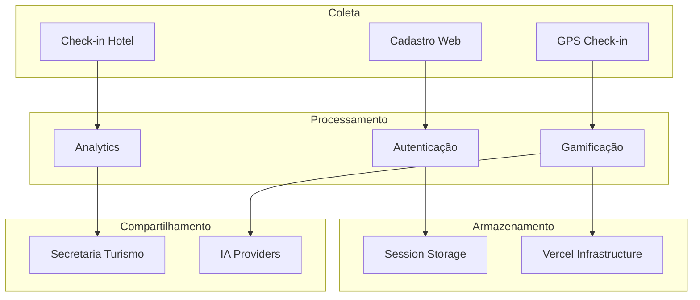
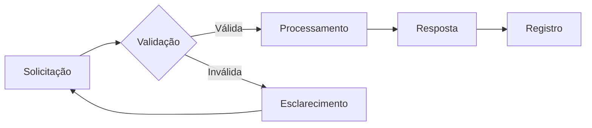
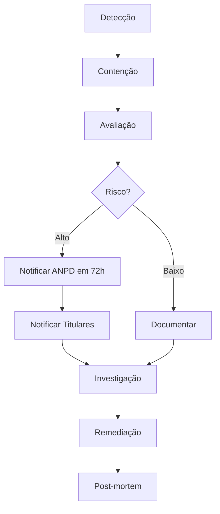

# Acordo de Tratamento de Dados (DPA)

## Data Processing Agreement

**Visite Caçapava - Plataforma de Turismo Gamificada**

---

## 1. PARTES

### Controlador
```
Oryum Tech - Software House 360°
CNPJ: [NÚMERO DO CNPJ]
Endereço: Caçapava do Sul, RS, Brasil
Representante: [Nome do Representante Legal]
Email: dpo@oryumtech.com.br
```

### Operador (quando aplicável)
```
[Nome do Operador/Subcontratado]
CNPJ: [NÚMERO]
Endereço: [ENDEREÇO]
Contato: [EMAIL]
```

---

## 2. DEFINIÇÕES

Para fins deste Acordo:

| Termo | Definição |
|-------|-----------|
| **LGPD** | Lei Geral de Proteção de Dados (Lei nº 13.709/2018) |
| **Dados Pessoais** | Informação relacionada a pessoa natural identificada ou identificável |
| **Tratamento** | Toda operação realizada com dados pessoais |
| **Controlador** | Pessoa que toma decisões sobre o tratamento |
| **Operador** | Pessoa que realiza tratamento em nome do controlador |
| **Titular** | Pessoa natural a quem se referem os dados |
| **DPO** | Encarregado de Proteção de Dados |

---

## 3. OBJETO

Este Acordo estabelece as obrigações das partes em relação ao tratamento de dados pessoais no âmbito do software Visite Caçapava, em conformidade com a LGPD.

---

## 4. ESCOPO DO TRATAMENTO

### 4.1 Categorias de Dados

| Categoria | Tipos de Dados | Finalidade |
|-----------|----------------|------------|
| **Identificação** | Nome, email, documento | Cadastro e autenticação |
| **Contato** | Telefone, redes sociais | Comunicação |
| **Localização** | Coordenadas GPS | Check-ins turísticos |
| **Uso** | Logs, histórico de visitas | Gamificação e analytics |
| **Pesquisa** | Profissão, nacionalidade, motivo viagem | Estatísticas turísticas |

### 4.2 Categorias de Titulares

- Turistas cadastrados na plataforma
- Funcionários de hotéis parceiros
- Funcionários de restaurantes parceiros
- Administradores da secretaria de turismo
- Hóspedes que realizam check-in em hotéis

### 4.3 Operações de Tratamento



---

## 5. OBRIGAÇÕES DO CONTROLADOR

A Oryum Tech, como Controlador, compromete-se a:

### 5.1 Compliance

- [ ] Manter registro das operações de tratamento
- [ ] Designar Encarregado (DPO)
- [ ] Implementar medidas de segurança adequadas
- [ ] Garantir direitos dos titulares
- [ ] Comunicar incidentes à ANPD

### 5.2 Bases Legais

| Tratamento | Base Legal | Justificativa |
|------------|------------|---------------|
| Cadastro | Execução de contrato | Necessário para serviço |
| Check-ins | Execução de contrato | Funcionalidade principal |
| Analytics | Interesse legítimo | Melhoria do serviço |
| Marketing | Consentimento | Opt-in do usuário |
| Pesquisa turística | Consentimento | Formulário opcional |
| Dados de hotel | Obrigação legal | Legislação hoteleira |

### 5.3 Transparência

- Política de Privacidade clara e acessível
- Informar finalidades do tratamento
- Comunicar compartilhamentos
- Responder solicitações de titulares

---

## 6. OBRIGAÇÕES DO OPERADOR

Quando houver Operador envolvido, este compromete-se a:

### 6.1 Tratamento

- Tratar dados apenas conforme instruções documentadas
- Não subcontratar sem autorização prévia
- Garantir confidencialidade de funcionários
- Auxiliar no atendimento a titulares

### 6.2 Segurança

- Implementar medidas técnicas e organizacionais
- Notificar incidentes imediatamente
- Permitir auditorias do Controlador
- Destruir dados ao término do contrato

### 6.3 Suboperadores Autorizados

| Suboperador | Serviço | Localização | Medidas |
|-------------|---------|-------------|---------|
| Vercel Inc. | Hospedagem | EUA | SCCs + DPA |
| Google LLC | Gemini AI | EUA | SCCs + DPA |
| OpenAI Inc. | GPT API | EUA | SCCs + DPA |

---

## 7. MEDIDAS DE SEGURANÇA

### 7.1 Medidas Técnicas

```yaml
Criptografia:
  em_transito: TLS 1.3
  em_repouso: AES-256 (quando aplicável)
  qr_codes: HMAC-SHA256

Controle_de_Acesso:
  autenticacao: Email/senha
  autorizacao: RBAC (Role-Based)
  sessao: Session Storage

Monitoramento:
  logs: Atividades sensíveis
  alertas: Tentativas de acesso
  auditoria: Registros de tratamento
```

### 7.2 Medidas Organizacionais

- Política de segurança da informação
- Treinamento de funcionários em privacidade
- Acordo de confidencialidade
- Procedimentos de resposta a incidentes
- Revisões periódicas de segurança

### 7.3 Medidas Físicas

- Servidores em datacenters certificados (Vercel)
- Controle de acesso físico
- Monitoramento 24/7
- Redundância geográfica

---

## 8. TRANSFERÊNCIA INTERNACIONAL

### 8.1 Países Destinatários

| País | Adequação | Mecanismo |
|------|-----------|-----------|
| EUA | Não | Cláusulas Contratuais Padrão |
| UE | Sim | Decisão de adequação |

### 8.2 Salvaguardas

Para transferências para países sem decisão de adequação:

1. **Cláusulas Contratuais Padrão (SCCs)**
   - Modelo aprovado pela Comissão Europeia
   - Adaptado para requisitos LGPD
   - Assinado com cada operador

2. **Medidas Suplementares**
   - Criptografia de dados em trânsito
   - Pseudonimização quando possível
   - Minimização de dados transferidos

---

## 9. DIREITOS DOS TITULARES

### 9.1 Procedimento de Atendimento



### 9.2 Canais de Atendimento

```
Email: privacidade@oryumtech.com.br
Formulário: [URL do formulário]
Presencial: Mediante agendamento
```

### 9.3 Prazos

| Direito | Prazo |
|---------|-------|
| Confirmação de tratamento | Imediato |
| Acesso simplificado | Imediato |
| Acesso completo | 15 dias |
| Correção | 15 dias |
| Eliminação | 15 dias |
| Portabilidade | 15 dias |

---

## 10. INCIDENTES DE SEGURANÇA

### 10.1 Definição

Incidente de segurança: qualquer evento que comprometa a confidencialidade, integridade ou disponibilidade de dados pessoais.

### 10.2 Procedimento de Notificação



### 10.3 Conteúdo da Notificação

À ANPD:
- Descrição da natureza dos dados
- Informações sobre titulares afetados
- Medidas técnicas de proteção
- Riscos relacionados ao incidente
- Medidas adotadas para reverter prejuízos

Aos Titulares:
- Descrição do incidente
- Dados potencialmente afetados
- Riscos decorrentes
- Medidas de proteção recomendadas
- Canais de contato

---

## 11. RETENÇÃO E ELIMINAÇÃO

### 11.1 Períodos de Retenção

| Categoria | Período | Justificativa |
|-----------|---------|---------------|
| Dados de conta | Enquanto ativa + 5 anos | Prescrição civil |
| Logs de acesso | 6 meses | Segurança |
| Dados de hotel | 5 anos | Obrigação fiscal |
| Analytics | 2 anos (anonimizado) | Interesse legítimo |
| Backups | 30 dias | Recuperação |

### 11.2 Procedimento de Eliminação

1. Identificação dos dados a eliminar
2. Verificação de obrigações legais de retenção
3. Eliminação segura (sobrescrita/destruição)
4. Documentação do processo
5. Certificado de destruição (quando solicitado)

---

## 12. AUDITORIA E COMPLIANCE

### 12.1 Auditorias

O Controlador pode realizar auditorias:
- Mediante aviso prévio de 30 dias
- No máximo uma vez por ano
- Com escopo pré-definido
- Custos de cada parte

### 12.2 Relatórios

| Relatório | Frequência | Responsável |
|-----------|------------|-------------|
| RIPD (DPIA) | Quando necessário | DPO |
| Registro de Tratamento | Contínuo | Controlador |
| Métricas de Segurança | Mensal | DevOps |
| Atendimento a Titulares | Trimestral | DPO |

---

## 13. VIGÊNCIA E RESCISÃO

### 13.1 Vigência

Este Acordo entra em vigor na data de assinatura e permanece válido enquanto houver tratamento de dados pessoais.

### 13.2 Rescisão

O Acordo pode ser rescindido:
- Por mútuo acordo
- Por violação material não sanada em 30 dias
- Por determinação legal ou regulatória

### 13.3 Obrigações Pós-Rescisão

Após rescisão, o Operador deve:
- Cessar tratamento imediatamente
- Devolver ou destruir dados (a critério do Controlador)
- Fornecer certificado de destruição
- Manter confidencialidade indefinidamente

---

## 14. DISPOSIÇÕES FINAIS

### 14.1 Lei Aplicável

Este Acordo é regido pelas leis brasileiras, especialmente a LGPD.

### 14.2 Foro

Fica eleito o foro de Caçapava do Sul, RS.

### 14.3 Alterações

Alterações requerem termo aditivo por escrito.

### 14.4 Independência

Se qualquer cláusula for inválida, as demais permanecem em vigor.

---

## 15. ASSINATURAS

```
CONTROLADOR                         OPERADOR

_________________________          _________________________
[Nome]                             [Nome]
[Cargo]                            [Cargo]
[Data]                             [Data]

```

---

## ANEXOS

### Anexo A - Registro de Operações de Tratamento

[Template para documentação conforme Art. 37 LGPD]

### Anexo B - Cláusulas Contratuais Padrão

[SCCs para transferência internacional]

### Anexo C - Medidas Técnicas e Organizacionais

[Detalhamento das medidas de segurança]

### Anexo D - Lista de Suboperadores

[Relação atualizada de suboperadores autorizados]

---

```
© 2025 Oryum Tech. Todos os direitos reservados.
Este documento é propriedade exclusiva da Oryum Tech.
Proibida a reprodução, distribuição ou uso sem autorização expressa.
```
