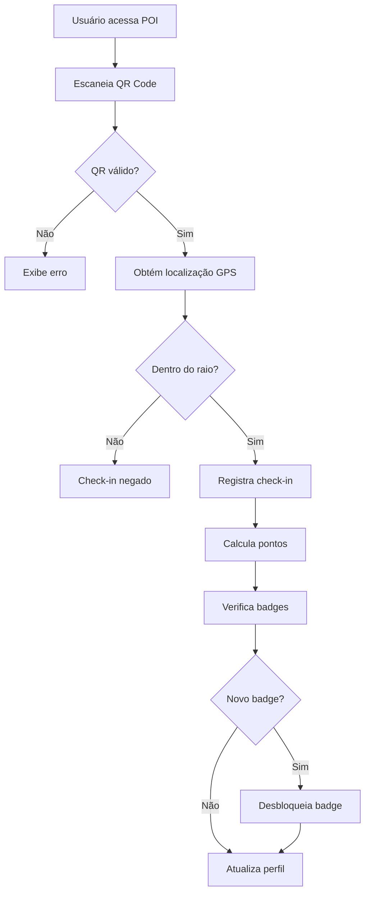
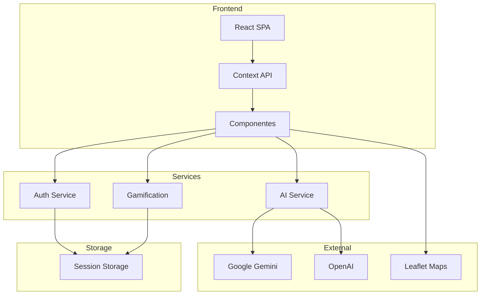

# Documentação para Registro no INPI

## Instituto Nacional da Propriedade Industrial

---

## 1. INFORMAÇÕES DO PROGRAMA

### 1.1 Dados Básicos

| Campo | Informação |
|-------|------------|
| **Título** | VISITE CAÇAPAVA - Plataforma de Turismo Gamificada |
| **Nome Comercial** | Visite Caçapava |
| **Versão** | 1.0.0 |
| **Tipo** | Aplicativo Web (Single Page Application) |
| **Linguagem** | TypeScript/JavaScript |
| **Data de Criação** | 2025 |

### 1.2 Titular

```
Razão Social: Oryum Tech - Software House 360° Ltda.
CNPJ: [NÚMERO DO CNPJ]
Endereço: Caçapava do Sul, RS, Brasil
CEP: [CEP]
Representante Legal: [Nome do Representante]
CPF: [CPF do Representante]
```

### 1.3 Autores

```
1. [Nome do Desenvolvedor Principal]
   CPF: [CPF]
   Nacionalidade: Brasileira
   Função: Desenvolvedor Full Stack / Arquiteto de Software

2. [Nome do Co-desenvolvedor]
   CPF: [CPF]
   Nacionalidade: Brasileira
   Função: [Função]
```

---

## 2. DESCRIÇÃO FUNCIONAL

### 2.1 Resumo Executivo

O **Visite Caçapava** é uma plataforma de turismo gamificada desenvolvida para promover e facilitar a experiência turística em Caçapava do Sul, RS. O sistema combina tecnologias de geolocalização, inteligência artificial e elementos de jogos para criar uma experiência interativa e envolvente para visitantes.

### 2.2 Funcionalidades Principais

#### 2.2.1 Sistema de Gamificação
- Check-in em pontos turísticos via QR Code e GPS
- Sistema de pontuação por visitação
- Conquistas (badges) desbloqueáveis
- Ranking de turistas (leaderboard)
- Rotas temáticas com progresso

#### 2.2.2 Gestão Multi-Papel
- **Turistas**: Exploração gamificada
- **Hotéis**: Gestão de hóspedes
- **Restaurantes**: Feedback de clientes
- **Administração**: Dashboard analítico

#### 2.2.3 Inteligência Artificial
- Assistente virtual para informações turísticas
- Integração com Google Gemini e OpenAI
- Respostas contextualizadas por localização

#### 2.2.4 Segurança e Validação
- Validação criptográfica de QR codes (HMAC-SHA256)
- Verificação de proximidade GPS
- Medidas anti-fraude em check-ins

### 2.3 Tecnologias Utilizadas

| Categoria | Tecnologia | Versão |
|-----------|------------|--------|
| Framework Frontend | React | 18.2.0 |
| Linguagem | TypeScript | 5.8.2 |
| Build Tool | Vite | 6.2.0 |
| Estilização | Tailwind CSS | 3.4.17 |
| Mapas | Leaflet | 1.9.4 |
| Gráficos | Chart.js | 4.4.2 |
| Criptografia | crypto-js | 4.2.0 |
| IA | @google/genai + OpenAI | Últimas |

---

## 3. ORIGINALIDADE E INOVAÇÃO

### 3.1 Elementos Originais

1. **Sistema de Check-in Gamificado**
   - Combinação única de QR Code + GPS + Gamificação para turismo
   - Validação em múltiplas camadas para autenticidade

2. **Arquitetura Multi-Papel**
   - Sistema integrado para toda cadeia turística
   - Hotéis, restaurantes, secretaria e turistas em uma plataforma

3. **Segurança Criptográfica**
   - Implementação proprietária de HMAC-SHA256 para QR codes
   - Sistema anti-fraude para check-ins turísticos

4. **Integração de IA para Turismo**
   - Prompts otimizados para assistência turística local
   - Fallback automático entre provedores de IA

### 3.2 Diferenciação de Mercado

O Visite Caçapava se diferencia de soluções existentes por:

- Foco específico em turismo municipal gamificado
- Integração completa da cadeia turística
- Validação de presença física com segurança criptográfica
- Sistema de badges baseado em roteiros temáticos
- Dados para gestão pública do turismo

---

## 4. DOCUMENTOS PARA DEPÓSITO

### 4.1 Formulários INPI

- [ ] **Formulário de Pedido de Registro**
  - Disponível em: https://www.gov.br/inpi/pt-br/servicos/programas-de-computador

- [ ] **Declaração de Autoria e Titularidade**
  - Modelo padrão INPI
  - Assinatura do titular e autores

### 4.2 Documentação Técnica

#### Resumo Digital (Hash)

```
Arquivos principais para hash SHA-256:

1. package.json
   SHA-256: [A SER CALCULADO]

2. src/App.tsx
   SHA-256: [A SER CALCULADO]

3. src/types.ts
   SHA-256: [A SER CALCULADO]

4. src/services/backendService.ts
   SHA-256: [A SER CALCULADO]

5. src/utils/qrCodeSystem.ts
   SHA-256: [A SER CALCULADO]
```

#### Comando para Geração de Hash
```bash
sha256sum arquivo.ts
```

### 4.3 Documentação Anexa

- [ ] Contrato social da empresa
- [ ] Documento de identidade do representante
- [ ] Procuração (se aplicável)
- [ ] Cessão de direitos dos autores (se aplicável)

---

## 5. TELAS REPRESENTATIVAS

### 5.1 Lista de Telas

| Tela | Descrição | Arquivo |
|------|-----------|---------|
| Home | Página inicial do turista | HomePage.tsx |
| Mapa | Mapa interativo com POIs | MapPage.tsx |
| Check-in | Scanner de QR Code | QRCodeScanner.tsx |
| Perfil | Perfil do usuário com badges | ProfilePage.tsx |
| Leaderboard | Ranking de turistas | LeaderboardPage.tsx |
| Admin | Dashboard administrativo | AdminDashboard.tsx |
| Hotel | Check-in de hóspedes | HotelCheckInPage.tsx |

### 5.2 Screenshots

[Anexar capturas de tela das principais funcionalidades]

---

## 6. FLUXOGRAMAS

### 6.1 Fluxo de Check-in



### 6.2 Arquitetura do Sistema



---

## 7. CLASSIFICAÇÃO

### 7.1 Categoria INPI

- **Tipo**: Programa de Computador
- **Campo de Aplicação**: Turismo e Lazer
- **Plataforma**: Web (Navegadores)

### 7.2 Classificação Internacional

- **CPC (Cooperative Patent Classification)**: G06Q 50/14 (Turismo)
- **IPC (International Patent Classification)**: G06Q 10/00 (Administração)

---

## 8. TAXAS E PRAZOS

### 8.1 Taxas INPI (2025)

| Serviço | Valor | GRU |
|---------|-------|-----|
| Pedido de Registro | R$ 185,00* | 730 |
| Expedição de Certificado | R$ 0,00 | - |

*Valores sujeitos a alteração. Consultar tabela atualizada do INPI.

### 8.2 Cronograma

| Etapa | Prazo Estimado |
|-------|----------------|
| Preparação de documentos | 2 semanas |
| Protocolo do pedido | 1 dia |
| Análise formal INPI | 60-90 dias |
| Emissão do certificado | 30 dias após aprovação |

---

## 9. DECLARAÇÕES

### 9.1 Declaração de Veracidade

```
Declaro, sob as penas da lei, que as informações prestadas neste
pedido de registro são verdadeiras, que o programa de computador
objeto deste pedido é de minha autoria e propriedade, e que não
infringe direitos de terceiros.

Caçapava do Sul, [DATA]

_________________________________
[Nome do Representante Legal]
[CPF]
[Cargo]
```

### 9.2 Declaração de Autoria

```
Declaro(amos), para os devidos fins, que sou(somos) autor(es) do
programa de computador denominado "VISITE CAÇAPAVA - Plataforma
de Turismo Gamificada" e que cedo(cedemos) à Oryum Tech todos os
direitos patrimoniais sobre a obra, conforme contrato de trabalho
e/ou cessão de direitos autorais.

[Assinaturas dos Autores]
```

---

## 10. CONTATO

### Para questões sobre o registro:

```
Oryum Tech - Departamento de Propriedade Intelectual
Email: inpi@oryumtech.com.br
Telefone: +55 (55) XXXX-XXXX
```

### INPI

```
Instituto Nacional da Propriedade Industrial
Website: www.gov.br/inpi
Central de Atendimento: 0800 722 1000
```

---

## 11. CHECKLIST FINAL

### Documentação

- [ ] Formulário de pedido preenchido
- [ ] Declaração de autoria e titularidade
- [ ] Contrato social atualizado
- [ ] Documento do representante legal
- [ ] Procuração (se aplicável)
- [ ] Comprovante de pagamento (GRU)

### Técnico

- [ ] Resumo funcional do programa
- [ ] Hash SHA-256 dos arquivos principais
- [ ] Screenshots das telas
- [ ] Fluxogramas de funcionamento
- [ ] Descrição das tecnologias

### Revisão

- [ ] Verificar dados cadastrais
- [ ] Conferir valores de taxas
- [ ] Validar assinaturas
- [ ] Revisar descrições técnicas

---

```
© 2025 Oryum Tech. Todos os direitos reservados.
Este documento é propriedade exclusiva da Oryum Tech.
Proibida a reprodução, distribuição ou uso sem autorização expressa.
```
