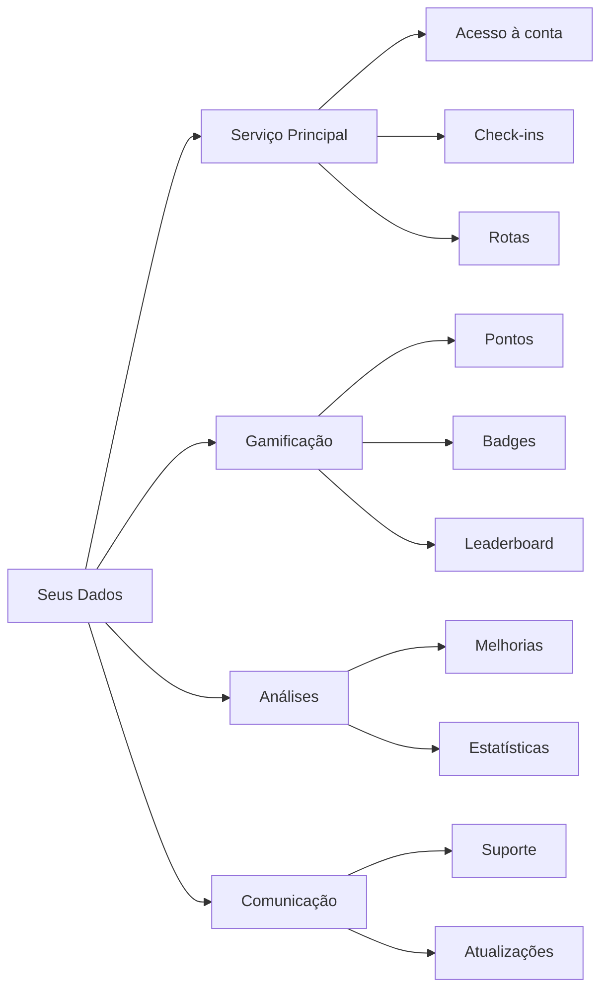

# Política de Privacidade

## VISITE CAÇAPAVA - Plataforma de Turismo Gamificada

**Última atualização**: 26 de Novembro de 2025
**Vigência**: A partir de 26 de Novembro de 2025

---

## 1. INTRODUÇÃO

A **Oryum Tech** ("nós", "nosso" ou "Empresa") está comprometida com a proteção da privacidade dos usuários do aplicativo **Visite Caçapava** ("Aplicativo" ou "Serviço"). Esta Política de Privacidade explica como coletamos, usamos, armazenamos e protegemos suas informações pessoais em conformidade com a **Lei Geral de Proteção de Dados (LGPD - Lei nº 13.709/2018)**.

### Controlador de Dados

```
Oryum Tech - Software House 360°
CNPJ: [NÚMERO DO CNPJ]
Endereço: Caçapava do Sul, RS, Brasil
Email: privacidade@oryumtech.com.br
Encarregado (DPO): [Nome do DPO]
```

---

## 2. DEFINIÇÕES

| Termo | Definição |
|-------|-----------|
| **Dados Pessoais** | Informação relacionada a pessoa natural identificada ou identificável |
| **Dados Sensíveis** | Dados sobre origem racial, convicção religiosa, opinião política, saúde, vida sexual, dado genético ou biométrico |
| **Titular** | Pessoa natural a quem se referem os dados pessoais |
| **Tratamento** | Toda operação realizada com dados pessoais |
| **Consentimento** | Manifestação livre, informada e inequívoca do titular |
| **ANPD** | Autoridade Nacional de Proteção de Dados |

---

## 3. DADOS QUE COLETAMOS

### 3.1 Dados Fornecidos pelo Usuário

| Categoria | Dados | Finalidade |
|-----------|-------|------------|
| **Cadastro** | Nome, email, senha | Criação e acesso à conta |
| **Perfil** | Avatar, biografia, cidade natal | Personalização da experiência |
| **Contato** | Telefone (opcional) | Comunicação sobre o serviço |
| **Social** | Instagram, Facebook, Twitter (opcional) | Integração social |

### 3.2 Dados Coletados Automaticamente

| Categoria | Dados | Finalidade |
|-----------|-------|------------|
| **Localização** | Coordenadas GPS | Validação de check-ins e descoberta de POIs |
| **Uso** | Páginas visitadas, tempo de sessão | Melhoria do serviço |
| **Dispositivo** | Tipo de navegador, sistema operacional | Otimização de compatibilidade |
| **Gamificação** | Pontos, badges, check-ins | Sistema de recompensas |

### 3.3 Dados de Hotéis (Check-in)

Dados coletados apenas quando o usuário realiza check-in em hotel parceiro:

| Dado | Finalidade | Base Legal |
|------|------------|------------|
| Nome completo | Identificação do hóspede | Execução de contrato |
| Documento de identidade | Cumprimento de obrigação legal | Obrigação legal |
| Nacionalidade | Estatísticas turísticas | Interesse legítimo |
| Profissão | Pesquisa de perfil | Consentimento |
| Motivo da viagem | Análise turística | Consentimento |
| Meio de transporte | Estatísticas de mobilidade | Consentimento |
| Canal de descoberta | Marketing e melhorias | Consentimento |

---

## 4. BASE LEGAL PARA TRATAMENTO

Tratamos seus dados com base nas seguintes hipóteses legais da LGPD (Art. 7º):

| Base Legal | Aplicação |
|------------|-----------|
| **Consentimento** (Art. 7º, I) | Coleta de dados opcionais, pesquisas, marketing |
| **Execução de Contrato** (Art. 7º, V) | Fornecimento do serviço de gamificação |
| **Interesse Legítimo** (Art. 7º, IX) | Melhorias no serviço, segurança, prevenção de fraude |
| **Obrigação Legal** (Art. 7º, II) | Cumprimento de legislação turística e fiscal |

---

## 5. COMO USAMOS SEUS DADOS

### 5.1 Finalidades Principais



### 5.2 Detalhamento

| Finalidade | Descrição | Dados Utilizados |
|------------|-----------|------------------|
| **Autenticação** | Verificar identidade do usuário | Email, senha |
| **Check-ins** | Validar presença em pontos turísticos | Localização GPS, timestamp |
| **Gamificação** | Calcular pontos e desbloquear conquistas | Histórico de visitas |
| **Leaderboard** | Exibir ranking de usuários | Nome, pontos, badges |
| **Personalização** | Sugerir rotas e pontos de interesse | Histórico, preferências |
| **Analytics** | Entender padrões de uso turístico | Dados agregados e anonimizados |
| **Segurança** | Prevenir fraude e uso indevido | Logs de acesso, localização |

---

## 6. COMPARTILHAMENTO DE DADOS

### 6.1 Com Quem Compartilhamos

| Destinatário | Dados | Finalidade | Base Legal |
|--------------|-------|------------|------------|
| **Secretaria de Turismo** | Dados agregados/anonimizados | Estatísticas turísticas | Interesse legítimo |
| **Hotéis Parceiros** | Dados de check-in | Gestão hoteleira | Execução de contrato |
| **Provedores de IA** | Mensagens do chat | Assistente turístico | Execução de contrato |
| **Infraestrutura** | Dados técnicos | Hospedagem do serviço | Execução de contrato |

### 6.2 Provedores de Serviço

| Provedor | Serviço | Localização | Adequação |
|----------|---------|-------------|-----------|
| Vercel | Hospedagem | EUA | Cláusulas Contratuais Padrão |
| Google (Gemini) | IA | EUA | Privacy Shield |
| OpenAI | IA (fallback) | EUA | Privacy Shield |
| GitHub | Repositório | EUA | Privacy Shield |

### 6.3 NÃO Compartilhamos

- ❌ Dados pessoais com terceiros para fins de marketing
- ❌ Informações de localização em tempo real
- ❌ Dados com empresas não relacionadas ao serviço
- ❌ Informações de forma que identifique usuários específicos em relatórios públicos

---

## 7. DADOS DE LOCALIZAÇÃO

### 7.1 Coleta de Localização

```
⚠️ IMPORTANTE
A coleta de localização GPS é essencial para o funcionamento
do sistema de check-ins e só é ativada com seu consentimento
explícito através do navegador.
```

### 7.2 Como Funciona

| Momento | Uso | Armazenamento |
|---------|-----|---------------|
| **Check-in** | Validar proximidade do POI (75m) | Apenas timestamp e POI visitado |
| **Descoberta** | Notificar POIs próximos (60m) | Não armazenado |
| **Mapa** | Mostrar sua posição | Apenas em memória, não armazenado |

### 7.3 Controle do Usuário

- Você pode desativar a localização a qualquer momento nas configurações do navegador
- O serviço funcionará parcialmente sem localização (sem check-ins automáticos)
- Não rastreamos sua localização em background

---

## 8. SEGURANÇA DOS DADOS

### 8.1 Medidas Técnicas

| Medida | Descrição |
|--------|-----------|
| **Criptografia em Trânsito** | HTTPS/TLS 1.3 em todas as comunicações |
| **Criptografia em Repouso** | Dados sensíveis criptografados |
| **Controle de Acesso** | RBAC com permissões mínimas |
| **Validação** | HMAC-SHA256 para integridade de QR codes |
| **Monitoramento** | Logs de auditoria e detecção de anomalias |

### 8.2 Medidas Organizacionais

- Acesso restrito a funcionários autorizados
- Treinamento em privacidade e segurança
- Política de senhas fortes
- Revisões periódicas de segurança

### 8.3 Resposta a Incidentes

Em caso de incidente de segurança envolvendo dados pessoais:

1. Comunicação à ANPD em até 72 horas
2. Notificação aos titulares afetados
3. Investigação e remediação
4. Documentação do incidente

---

## 9. RETENÇÃO DE DADOS

### 9.1 Períodos de Retenção

| Categoria | Período | Justificativa |
|-----------|---------|---------------|
| **Dados de Conta** | Enquanto conta ativa + 5 anos | Obrigação legal |
| **Histórico de Check-ins** | Enquanto conta ativa | Funcionalidade do serviço |
| **Dados de Localização** | Não retido | Apenas processamento temporário |
| **Logs de Acesso** | 6 meses | Segurança |
| **Dados de Hotel** | 5 anos | Obrigação fiscal |
| **Analytics** | 2 anos (anonimizado) | Melhoria do serviço |

### 9.2 Eliminação

Após os períodos de retenção:
- Dados pessoais são eliminados ou anonimizados
- Backups são sobrescritos conforme ciclo de rotação
- Certificado de destruição disponível mediante solicitação

---

## 10. SEUS DIREITOS (LGPD Art. 18)

Como titular dos dados, você tem direito a:

| Direito | Descrição | Como Exercer |
|---------|-----------|--------------|
| **Confirmação** | Saber se tratamos seus dados | Envie solicitação |
| **Acesso** | Obter cópia dos seus dados | Página de perfil ou solicitação |
| **Correção** | Atualizar dados incorretos | Página de perfil |
| **Anonimização** | Solicitar anonimização | Envie solicitação |
| **Bloqueio** | Suspender tratamento | Envie solicitação |
| **Eliminação** | Apagar dados pessoais | Envie solicitação |
| **Portabilidade** | Transferir dados | Envie solicitação |
| **Informação** | Saber com quem compartilhamos | Esta política |
| **Revogação** | Retirar consentimento | Configurações ou solicitação |
| **Oposição** | Recusar tratamento | Envie solicitação |

### 10.1 Como Exercer Seus Direitos

```
Email: privacidade@oryumtech.com.br
Assunto: Solicitação LGPD - [Seu Direito]

Informações necessárias:
- Nome completo
- Email cadastrado
- Direito que deseja exercer
- Detalhes da solicitação
```

### 10.2 Prazos de Resposta

| Solicitação | Prazo |
|-------------|-------|
| Confirmação de existência | Imediato |
| Acesso simplificado | Imediato |
| Acesso completo | 15 dias |
| Demais direitos | 15 dias |

---

## 11. COOKIES E TECNOLOGIAS SIMILARES

### 11.1 Tipos de Cookies

| Tipo | Finalidade | Duração |
|------|------------|---------|
| **Essenciais** | Funcionamento do site | Sessão |
| **Preferências** | Lembrar configurações | 1 ano |
| **Analytics** | Entender uso do site | 2 anos |

### 11.2 Gerenciamento

Você pode gerenciar cookies através das configurações do navegador. Desativar cookies essenciais pode afetar o funcionamento do serviço.

---

## 12. MENORES DE IDADE

O Visite Caçapava é destinado a usuários maiores de 18 anos. Não coletamos intencionalmente dados de menores de 18 anos. Se tomarmos conhecimento de que coletamos dados de menor, tomaremos medidas para eliminar essas informações.

Para usuários entre 16 e 18 anos, é necessário consentimento do responsável legal.

---

## 13. TRANSFERÊNCIA INTERNACIONAL

Alguns de nossos provedores de serviço estão localizados fora do Brasil. Garantimos que essas transferências ocorrem:

- ✅ Para países com nível adequado de proteção
- ✅ Com cláusulas contratuais padrão aprovadas pela ANPD
- ✅ Com seu consentimento específico quando aplicável

---

## 14. ALTERAÇÕES NESTA POLÍTICA

Podemos atualizar esta Política de Privacidade periodicamente. Quando fizermos alterações significativas:

1. Publicaremos a versão atualizada no aplicativo
2. Notificaremos por email (se aplicável)
3. Atualizaremos a data de "Última atualização"
4. Destacaremos as principais mudanças

O uso continuado do serviço após as alterações constitui aceitação da política atualizada.

---

## 15. CONTATO E RECLAMAÇÕES

### 15.1 Fale Conosco

```
Encarregado de Proteção de Dados (DPO)
Oryum Tech

Email: privacidade@oryumtech.com.br
Telefone: +55 (55) XXXX-XXXX
Endereço: Caçapava do Sul, RS, Brasil
```

### 15.2 Reclamações

Se não estiver satisfeito com nossa resposta, você pode registrar reclamação junto à:

```
Autoridade Nacional de Proteção de Dados (ANPD)
Website: www.gov.br/anpd
```

---

## 16. HISTÓRICO DE VERSÕES

| Versão | Data | Alterações |
|--------|------|------------|
| 1.0.0 | 26/11/2025 | Versão inicial |

---

## 17. ACEITE

Ao utilizar o Visite Caçapava, você declara que:

- [x] Leu e compreendeu esta Política de Privacidade
- [x] Concorda com o tratamento de dados conforme descrito
- [x] É maior de 18 anos ou possui autorização do responsável
- [x] As informações fornecidas são verdadeiras

---

```
© 2025 Oryum Tech. Todos os direitos reservados.
Esta Política de Privacidade é documento público, disponível
para consulta por qualquer interessado.
```
