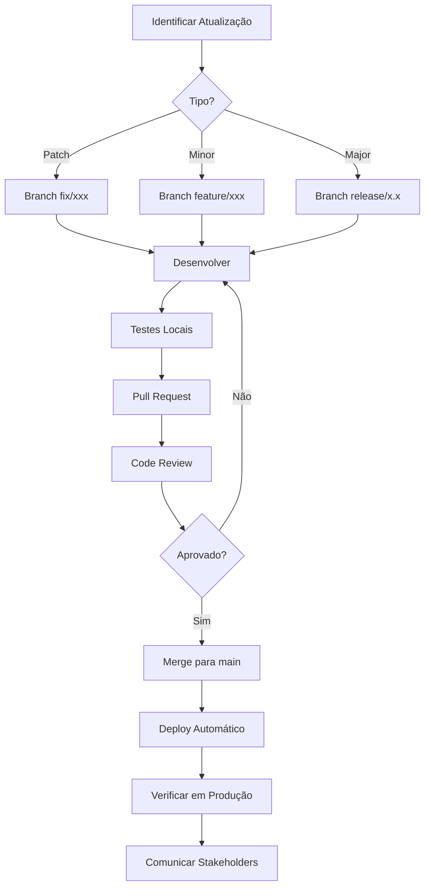
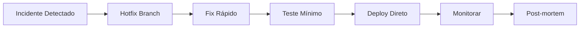

# Procedimentos de Atualização

## Tipos de Atualização

| Tipo | Frequência | Impacto | Aprovação |
|------|------------|---------|-----------|
| Patch (bug fix) | Conforme necessidade | Baixo | Tech Lead |
| Minor (features) | Sprint | Médio | PO + Tech Lead |
| Major (breaking) | Trimestral | Alto | CTO + Stakeholders |
| Emergência | Imediato | Variável | Tech Lead |

## Processo de Atualização

### Fluxo Padrão



### Atualização de Emergência



## Atualização de Dependências

### Verificação Regular

```bash
# Verificar dependências desatualizadas
npm outdated

# Verificar vulnerabilidades
npm audit

# Atualizar patch versions (seguro)
npm update

# Atualizar minor/major (cuidado)
npx npm-check-updates -u
```

### Política de Atualização

| Tipo | Ação | Frequência |
|------|------|------------|
| Patch de segurança | Atualizar imediatamente | Assim que disponível |
| Patch normal | Atualizar no próximo sprint | Semanal |
| Minor version | Testar antes de atualizar | Mensal |
| Major version | Avaliar breaking changes | Trimestral |

### Dependências Críticas

| Dependência | Versão Atual | Política |
|-------------|--------------|----------|
| React | 18.2.x | Manter major, atualizar minor |
| TypeScript | 5.8.x | Atualizar com cuidado |
| Vite | 6.2.x | Acompanhar releases |
| Tailwind | 3.4.x | Manter major atual |

## Procedimento Detalhado

### 1. Preparação

```bash
# 1. Criar branch de atualização
git checkout -b update/dependencies-YYYY-MM

# 2. Fazer backup do package-lock.json
cp package-lock.json package-lock.json.bak

# 3. Verificar estado atual
npm outdated
npm audit
```

### 2. Atualização

```bash
# 4. Atualizar dependências
npm update  # Para patches seguros

# Ou para updates específicos
npm install package@version

# 5. Verificar se compila
npm run build

# 6. Executar testes
npm test
```

### 3. Validação

```bash
# 7. Testar localmente
npm run dev

# 8. Verificar funcionalidades críticas
# - Login/Logout
# - Check-in QR Code
# - Mapa interativo
# - Dashboard admin
```

### 4. Deploy

```bash
# 9. Commit das alterações
git add package.json package-lock.json
git commit -m "chore: update dependencies YYYY-MM"

# 10. Push e PR
git push -u origin update/dependencies-YYYY-MM
# Criar PR no GitHub

# 11. Após aprovação e merge
# Deploy automático via Vercel
```

## Atualização do Ambiente

### Variáveis de Ambiente

```bash
# Atualizar via Vercel CLI
vercel env rm NOME_VARIAVEL production
vercel env add NOME_VARIAVEL production
# Inserir novo valor quando solicitado

# Redeploy para aplicar
vercel --prod
```

### Rotação de API Keys

```markdown
## Checklist de Rotação

1. [ ] Gerar nova key no provedor (Google Cloud, OpenAI)
2. [ ] Adicionar nova key no Vercel
3. [ ] Fazer deploy com nova key
4. [ ] Verificar funcionamento
5. [ ] Remover key antiga do Vercel
6. [ ] Revogar key antiga no provedor
7. [ ] Documentar rotação
```

## Rollback

### Procedimento de Rollback

```bash
# Via Vercel Dashboard
1. Acessar vercel.com/dashboard
2. Selecionar projeto visitecacapava
3. Ir em Deployments
4. Encontrar deploy anterior estável
5. Clicar em "..." > "Promote to Production"

# Via CLI
vercel rollback
# Ou para deployment específico
vercel promote [deployment-url]
```

### Critérios para Rollback

- Error rate > 10%
- Funcionalidade crítica quebrada
- Performance degradada > 50%
- Vulnerabilidade de segurança introduzida

## Comunicação

### Template de Anúncio

```markdown
# Atualização do Visite Caçapava

**Data**: [Data da atualização]
**Versão**: [Versão nova]
**Tipo**: [Patch/Minor/Major]

## Mudanças
- [Lista de mudanças]

## Ações Necessárias
- [Se alguma ação for necessária pelos usuários]

## Impacto
- [Downtime esperado: Nenhum / X minutos]

Em caso de problemas, contate: [contato]
```

### Canais de Comunicação

| Público | Canal | Timing |
|---------|-------|--------|
| Equipe técnica | Slack #dev | Antes do deploy |
| Stakeholders | Email | Após deploy |
| Usuários | In-app (se necessário) | Após validação |

## Documentação

### Após Cada Atualização

1. Atualizar CHANGELOG.md
2. Atualizar versão no package.json
3. Documentar breaking changes
4. Atualizar README se necessário

### Template de Changelog

```markdown
## [1.2.0] - 2025-11-26

### Adicionado
- Nova feature X

### Modificado
- Comportamento de Y alterado

### Corrigido
- Bug Z corrigido

### Segurança
- Atualização de dependência vulnerável
```

---

```
© 2025 Oryum Tech. Todos os direitos reservados.
```
