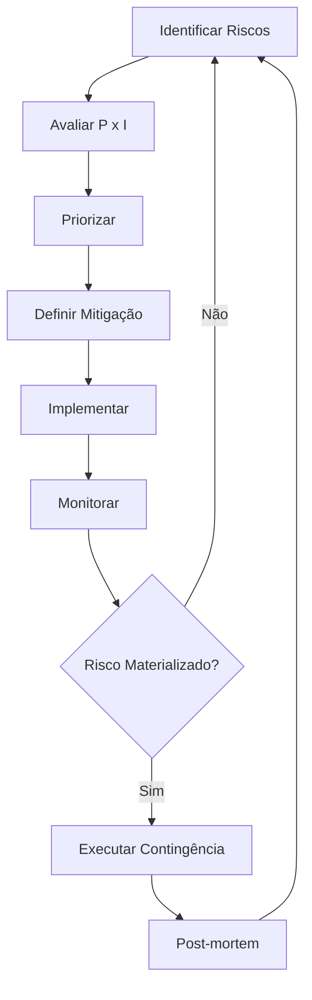

# Gestão de Riscos

## Metodologia

Utilizamos uma matriz de riscos baseada em **probabilidade x impacto** para priorizar ações de mitigação.

## Matriz de Riscos

### Escala de Probabilidade

| Nível | Probabilidade | Descrição |
|-------|--------------|-----------|
| 1 | Raro | < 10% de chance |
| 2 | Improvável | 10-25% de chance |
| 3 | Possível | 25-50% de chance |
| 4 | Provável | 50-75% de chance |
| 5 | Quase certo | > 75% de chance |

### Escala de Impacto

| Nível | Impacto | Descrição |
|-------|---------|-----------|
| 1 | Insignificante | Sem impacto perceptível |
| 2 | Menor | Impacto limitado, fácil recuperação |
| 3 | Moderado | Impacto significativo, requer ação |
| 4 | Maior | Impacto severo, afeta operação |
| 5 | Catastrófico | Impacto crítico, pode inviabilizar projeto |

### Matriz Visual

```
     Impacto
  5 │  5  10  15  20  25
  4 │  4   8  12  16  20
  3 │  3   6   9  12  15
  2 │  2   4   6   8  10
  1 │  1   2   3   4   5
    └────────────────────
        1   2   3   4   5
           Probabilidade

Score = Probabilidade × Impacto

■ 1-4: Baixo (aceitar/monitorar)
■ 5-9: Médio (mitigar)
■ 10-14: Alto (plano de ação)
■ 15-25: Crítico (ação imediata)
```

## Registro de Riscos

### Riscos Técnicos

| ID | Risco | P | I | Score | Mitigação | Status |
|----|-------|---|---|-------|-----------|--------|
| T01 | API de IA indisponível | 3 | 3 | 9 | Sistema de fallback implementado | ✅ Mitigado |
| T02 | Fraude em check-ins | 4 | 4 | 16 | HMAC-SHA256 + validação GPS | ✅ Mitigado |
| T03 | Perda de dados | 2 | 5 | 10 | Backup automatizado planejado | ⚠️ Em progresso |
| T04 | Performance degradada | 3 | 3 | 9 | Lazy loading + otimizações | ✅ Mitigado |
| T05 | Vulnerabilidade de segurança | 2 | 5 | 10 | Code review + security audit | ⚠️ Monitorando |

### Riscos de Negócio

| ID | Risco | P | I | Score | Mitigação | Status |
|----|-------|---|---|-------|-----------|--------|
| B01 | Baixa adoção por turistas | 3 | 4 | 12 | Gamificação + marketing | ⚠️ Em progresso |
| B02 | Parceiros não aderem | 3 | 4 | 12 | Demonstração de valor + suporte | ⚠️ Em progresso |
| B03 | Mudança de escopo | 4 | 3 | 12 | Controle de change requests | ✅ Processo definido |
| B04 | Atraso no cronograma | 3 | 3 | 9 | Buffer + priorização | ✅ Monitorando |

### Riscos Operacionais

| ID | Risco | P | I | Score | Mitigação | Status |
|----|-------|---|---|-------|-----------|--------|
| O01 | Indisponibilidade Vercel | 1 | 4 | 4 | Multi-region + monitoring | ✅ Baixo risco |
| O02 | Custos excedendo budget | 2 | 3 | 6 | Monitoramento de uso | ✅ Monitorando |
| O03 | Rotatividade de equipe | 2 | 4 | 8 | Documentação completa | ✅ Mitigado |
| O04 | Falta de suporte técnico | 3 | 3 | 9 | Runbooks + treinamento | ⚠️ Em progresso |

### Riscos Legais/Compliance

| ID | Risco | P | I | Score | Mitigação | Status |
|----|-------|---|---|-------|-----------|--------|
| L01 | Não conformidade LGPD | 2 | 5 | 10 | Política implementada | ✅ Mitigado |
| L02 | Uso indevido de imagens | 2 | 3 | 6 | Licenciamento correto | ✅ Mitigado |
| L03 | Propriedade intelectual | 1 | 4 | 4 | Registro INPI | ✅ Mitigado |

## Planos de Contingência

### T01 - API de IA Indisponível

```
Trigger: Gemini API retorna erro por >5 minutos

Ação Imediata:
1. Sistema automaticamente usa OpenAI como fallback
2. Se OpenAI também falhar, exibir respostas pré-definidas
3. Alerta enviado para equipe

Comunicação:
- Banner informativo para usuários
- Notificação interna via Slack

Recuperação:
- Monitorar status das APIs
- Restaurar quando disponível
```

### T02 - Fraude em Check-ins

```
Trigger: Detecção de padrão anômalo de check-ins

Ação Imediata:
1. Suspender pontuação da conta suspeita
2. Investigar logs de atividade
3. Se confirmado, invalidar pontos fraudulentos

Comunicação:
- Notificação ao usuário (se inocente)
- Relatório para administração

Prevenção:
- Validação GPS obrigatória
- Cooldown entre check-ins (24h por POI)
- HMAC-SHA256 em QR codes
```

### B01 - Baixa Adoção

```
Trigger: <100 check-ins por semana após lançamento

Ação Imediata:
1. Análise de funil de conversão
2. Pesquisa com turistas
3. Revisão de gamificação

Plano de Marketing:
- Parceria com hotéis para divulgação
- QR codes em material turístico
- Promoções de lançamento (pontos em dobro)

Métricas a Monitorar:
- Downloads/acessos
- Taxa de cadastro
- Check-ins por usuário
```

## Processo de Gestão

### Ciclo de Revisão



### Frequência de Revisão

| Nível de Risco | Frequência |
|----------------|------------|
| Crítico (15-25) | Diária |
| Alto (10-14) | Semanal |
| Médio (5-9) | Quinzenal |
| Baixo (1-4) | Mensal |

### Responsabilidades

| Papel | Responsabilidade |
|-------|------------------|
| Product Owner | Riscos de negócio |
| Tech Lead | Riscos técnicos |
| DevOps | Riscos operacionais |
| CTO | Riscos estratégicos |

## Indicadores de Risco

### KRIs (Key Risk Indicators)

| Indicador | Threshold | Ação |
|-----------|-----------|------|
| Error rate | > 5% | Investigar |
| Response time | > 3s | Otimizar |
| Check-in fraud rate | > 1% | Revisar validação |
| User complaints | > 10/semana | Analisar padrões |

---

```
© 2025 Oryum Tech. Todos os direitos reservados.
```
