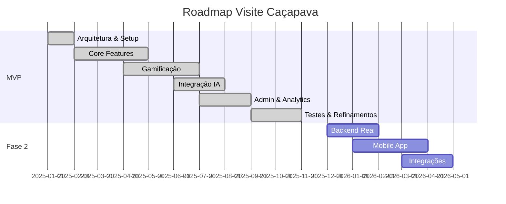

# Roadmap de Desenvolvimento

## Visão Geral



---

## Fase 1: MVP (Concluída)

### Q1 2025 - Fundação

- [x] Setup do projeto React + TypeScript
- [x] Configuração Vite + Tailwind
- [x] Sistema de autenticação mock
- [x] Estrutura de rotas
- [x] Layouts por papel

### Q2 2025 - Core Features

- [x] Cadastro de POIs
- [x] Sistema de rotas temáticas
- [x] Mapas interativos (Leaflet)
- [x] Sistema de gamificação básico
- [x] Check-in com QR Code

### Q3 2025 - Gamificação Completa

- [x] Sistema de pontos
- [x] Badges e conquistas
- [x] Leaderboard
- [x] Validação GPS
- [x] Integração IA (Gemini + OpenAI)

### Q4 2025 - Admin e Polimento

- [x] Dashboard administrativo
- [x] Analytics básico
- [x] Sistema de hotéis
- [x] Sistema de restaurantes
- [x] Deploy na Vercel
- [x] Documentação enterprise

---

## Fase 2: Produção (Planejado)

### Q1 2026 - Backend Real

- [ ] API REST com Node.js
- [ ] PostgreSQL + PostGIS
- [ ] Autenticação JWT
- [ ] Sistema de cache (Redis)
- [ ] CI/CD completo

### Q2 2026 - Mobile e Integrações

- [ ] App React Native
- [ ] Push notifications
- [ ] Integração com Google Business
- [ ] Sistema de reservas
- [ ] Pagamentos (se aplicável)

---

## Fase 3: Expansão (Futuro)

### 2026-2027

- [ ] Expansão para outras cidades
- [ ] Marketplace de parceiros
- [ ] Programa de fidelidade avançado
- [ ] Realidade aumentada
- [ ] Análise preditiva com ML

---

## KPIs de Sucesso

| Métrica | Meta MVP | Meta Produção |
|---------|----------|---------------|
| Usuários cadastrados | 100 | 5.000 |
| Check-ins/mês | 500 | 10.000 |
| POIs cadastrados | 9 | 50+ |
| Satisfação (NPS) | 50+ | 70+ |

---

```
© 2025 Oryum Tech. Todos os direitos reservados.
```
