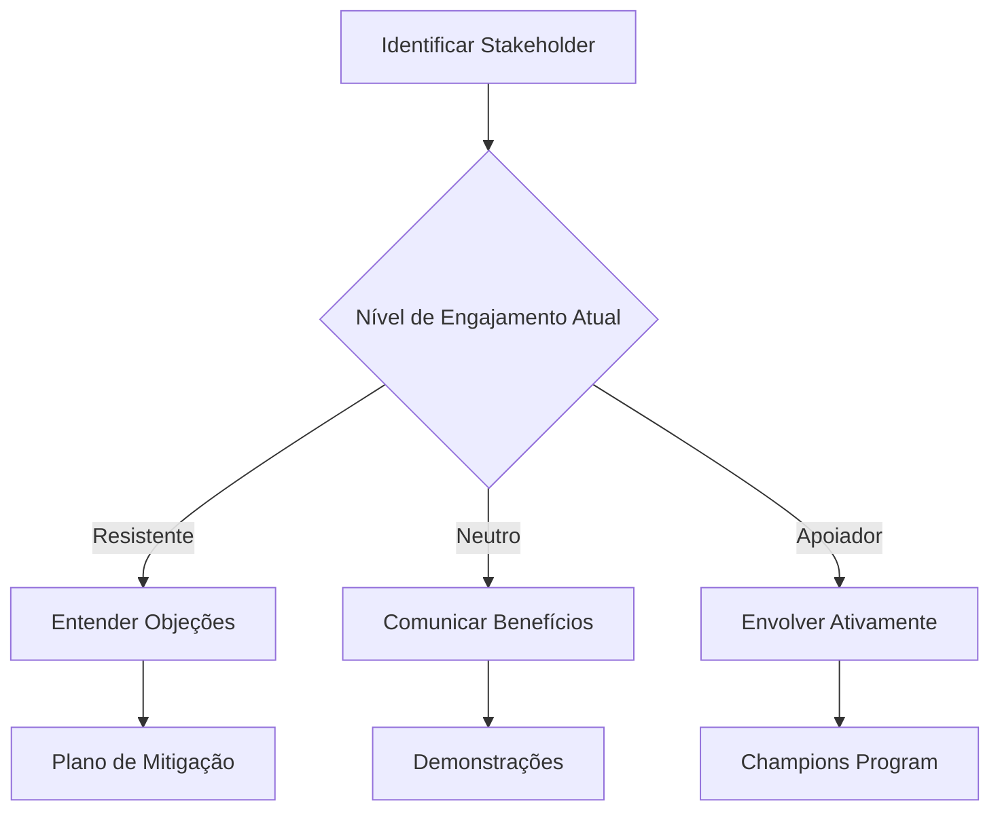

# Mapa de Stakeholders

## Visão Geral

Este documento identifica e classifica todos os stakeholders do projeto Visite Caçapava, definindo estratégias de comunicação e engajamento.

## Matriz de Stakeholders

### Classificação por Poder x Interesse

```
Alto Poder
    │
    │  ┌─────────────────┬─────────────────┐
    │  │   MANTER        │   GERENCIAR     │
    │  │   SATISFEITO    │   DE PERTO      │
    │  │                 │                 │
    │  │ • Investidores  │ • Secretaria    │
    │  │ • Parceiros     │   de Turismo    │
    │  │   estratégicos  │ • CTO/CEO       │
    │  │                 │ • Product Owner │
    │  ├─────────────────┼─────────────────┤
    │  │   MONITORAR     │   MANTER        │
    │  │                 │   INFORMADO     │
    │  │                 │                 │
    │  │ • Concorrentes  │ • Turistas      │
    │  │ • Reguladores   │ • Hotéis        │
    │  │                 │ • Restaurantes  │
    │  │                 │ • Equipe dev    │
    │  └─────────────────┴─────────────────┘
    │                                    Alto Interesse
    └────────────────────────────────────────►
```

## Stakeholders Primários

### Secretaria de Turismo de Caçapava do Sul

| Aspecto | Detalhes |
|---------|----------|
| **Tipo** | Cliente principal |
| **Interesse** | Promoção do turismo local, dados de visitação |
| **Influência** | Alta - define requisitos e aprova entregas |
| **Expectativas** | Plataforma funcional, relatórios, aumento do turismo |
| **Comunicação** | Reuniões semanais, relatórios mensais |
| **Representante** | Secretário(a) de Turismo |

### Turistas (Usuários Finais)

| Aspecto | Detalhes |
|---------|----------|
| **Tipo** | Usuário final principal |
| **Interesse** | Experiência turística gamificada, recompensas |
| **Influência** | Média - feedback influencia roadmap |
| **Expectativas** | App intuitivo, benefícios tangíveis, diversão |
| **Comunicação** | In-app, redes sociais, suporte |
| **Personas** | Famílias, aventureiros, culturais, gastronômicos |

### Parceiros Comerciais

#### Hotéis

| Aspecto | Detalhes |
|---------|----------|
| **Tipo** | Parceiro comercial |
| **Interesse** | Atrair hóspedes, visibilidade, dados |
| **Influência** | Média - fonte de receita potencial |
| **Expectativas** | Dashboard funcional, integração simples |
| **Comunicação** | Email, treinamentos, suporte dedicado |

#### Restaurantes

| Aspecto | Detalhes |
|---------|----------|
| **Tipo** | Parceiro comercial |
| **Interesse** | Atrair clientes, avaliações positivas |
| **Influência** | Média - fonte de receita potencial |
| **Expectativas** | Feedback de clientes, promoções |
| **Comunicação** | Email, treinamentos, suporte dedicado |

## Stakeholders Internos

### Oryum Tech - Equipe de Desenvolvimento

| Papel | Responsabilidade | Comunicação |
|-------|------------------|-------------|
| CTO | Direção técnica, arquitetura | Daily standups, decisões técnicas |
| Product Owner | Backlog, priorização | Planning, reviews |
| Tech Lead | Qualidade de código, mentoria | Code reviews, 1:1s |
| Desenvolvedores | Implementação | Daily standups, Slack |
| Designer | UX/UI, acessibilidade | Design reviews |
| QA | Qualidade, testes | Test reports |

### Gestão Oryum Tech

| Papel | Interesse | Comunicação |
|-------|-----------|-------------|
| CEO | ROI, crescimento, reputação | Relatórios mensais |
| CFO | Budget, custos | Reports financeiros |
| CMO | Marketing, branding | Campanhas, métricas |

## Stakeholders Externos

### Comunidade Local

| Grupo | Interesse | Engajamento |
|-------|-----------|-------------|
| Moradores | Desenvolvimento local | Comunicação transparente |
| Comerciantes | Aumento de visitantes | Parcerias, divulgação |
| Guias turísticos | Ferramenta de trabalho | Treinamento, integração |

### Entidades Governamentais

| Entidade | Relação | Comunicação |
|----------|---------|-------------|
| Prefeitura | Apoio institucional | Reuniões formais |
| SEBRAE | Potencial parceiro | Propostas de parceria |
| Embratur | Alinhamento nacional | Relatórios |

### Fornecedores de Tecnologia

| Fornecedor | Serviço | Criticidade |
|------------|---------|-------------|
| Vercel | Hospedagem | Alta |
| Google Cloud | Gemini API | Alta |
| OpenAI | API fallback | Média |
| GitHub | Repositório | Alta |

## Plano de Comunicação

### Matriz de Comunicação

| Stakeholder | Canal | Frequência | Responsável | Conteúdo |
|-------------|-------|------------|-------------|----------|
| Secretaria | Reunião + Email | Semanal | PO | Status, demos |
| Turistas | App + Redes | Contínuo | Marketing | Updates, promoções |
| Hotéis | Email + Dashboard | Quinzenal | Suporte | Relatórios, novidades |
| Equipe interna | Slack + Meet | Diário | Tech Lead | Status, blockers |
| Investidores | Apresentação | Mensal | CEO | Métricas, roadmap |

### Templates de Comunicação

#### Relatório Semanal (Secretaria)

```markdown
# Relatório Semanal - Visite Caçapava
**Período**: [Data início] a [Data fim]

## Resumo Executivo
[2-3 frases sobre o progresso]

## Métricas
- Usuários ativos: X
- Check-ins realizados: X
- Novos cadastros: X

## Entregas da Semana
- [Feature/Fix entregue]

## Próximos Passos
- [Planejado para próxima semana]

## Riscos/Bloqueios
- [Se houver]
```

#### Newsletter Parceiros

```markdown
# Visite Caçapava - Novidades

Olá, [Nome do Parceiro]!

## Novas Features
[Descrição de novidades relevantes]

## Seus Números
- Visualizações: X
- Check-ins no seu estabelecimento: X

## Dicas
[Como aproveitar melhor a plataforma]

Atenciosamente,
Equipe Visite Caçapava
```

## Gestão de Expectativas

### Por Stakeholder

| Stakeholder | Expectativa | Realidade | Gap | Ação |
|-------------|-------------|-----------|-----|------|
| Secretaria | Sistema completo | MVP funcional | Médio | Roadmap claro |
| Turistas | Recompensas imediatas | Gamificação virtual | Pequeno | Comunicar benefícios futuros |
| Hotéis | Integração PMS | Dashboard web | Médio | Roadmap de integrações |

### Estratégias de Engajamento



## Escalação

### Matriz de Escalação

| Nível | Tipo de Problema | Responsável | Tempo de Resposta |
|-------|------------------|-------------|-------------------|
| 1 | Operacional | Suporte | 4h |
| 2 | Técnico | Tech Lead | 8h |
| 3 | Produto | Product Owner | 24h |
| 4 | Estratégico | CTO/CEO | 48h |

---

```
© 2025 Oryum Tech. Todos os direitos reservados.
```
